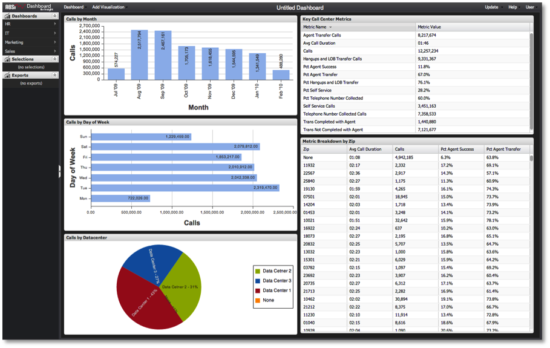

# Création d’un tableau de bord{#creating-a-dashboard}

La création d&#39;un tableau de bord est recommandée même pour les besoins analytiques ponctuels à court terme.

>[!NOTE]
>
>Les utilisateurs en lecture seule ne peuvent pas créer de tableaux de bord. Cette section s’applique uniquement aux utilisateurs et administrateurs réguliers.

Les utilisateurs peuvent décider de créer des tableaux de bord pour plusieurs raisons :

* Un nouveau tableau de bord peut être lancé à partir de zéro pour une analyse à la volée sans intention de réutiliser ou de partager le tableau de bord.
* Un nouveau tableau de bord peut être créé dans le but de réaliser votre propre analyse personnelle que vous souhaitez enregistrer et réutiliser, mais que vous ne souhaitez pas partager.
* Un nouveau tableau de bord peut être créé, enregistré et partagé pour vous et pour le reste de la population d’utilisateurs du tableau de bord à laquelle vous pouvez accéder. Quel que soit le cas, chaque scénario début au même point : un canevas de tableau de bord vide.

>[!NOTE]
>
>Avant de commencer à construire votre tableau de bord, il est recommandé de réduire votre Requête en pourcentage à quelque chose de faible, par exemple 10 ou 25 %. Ceci extrait les échantillons de données des outils de données beaucoup plus rapidement que l’exécution d’une requête complète. Comme ces résultats échantillonnés sont renvoyés beaucoup plus rapidement, ils offrent une réactivité idéale tout en encadrant votre tableau de bord et votre analyse. Une fois que vous êtes prêt à exécuter des requêtes jusqu’à leur terme, vous pouvez mettre à jour le paramètre requête à 100 %. Pour ajuster la requête terminée, voir le paramètre [Requête au paramètre](../../../home/c-adobe-data-workbench-dashboard/c-dashboards/c-query-to-parameter.md#concept-33db106e28bc4108bca9e8d0a440d323).

Pour créer un tableau de bord, sélectionnez **[!UICONTROL New]** dans le menu Tableau de bord.

Un canevas de tableau de bord vierge prêt pour l’ajout et la configuration de visualisations en fonction de vos besoins d’analyse s’affiche. Au fur et à mesure que vous travaillez, rien ne sera mis à jour sur le serveur tant que vous n’aurez pas enregistré.

Ensuite, décidez du type de données à afficher et de la manière dont vous souhaitez l’afficher. Il est généralement utile de début avec des visualisations de tableau pour afficher les données brutes, puis de créer d’autres graphiques en fonction de vos besoins. Pour plus d’informations sur la façon d’ajouter et de configurer des visualisations, voir [Création de visualisations](../../../home/c-adobe-data-workbench-dashboard/c-visualizations/t-creating-visualizations.md#task-c6f1d20fa2484aeeb9a8487625054ecf). Après avoir ajouté et configuré des visualisations pour générer le tableau de bord, vous obtenez les résultats suivants :

A partir de ce moment, vous pouvez simplement exécuter votre analyse et ignorer le tableau de bord, ou vous pouvez choisir d&#39;enregistrer le tableau de bord sur le serveur pour le réutiliser et/ou le partager. Pour plus d&#39;informations sur la façon d&#39;interagir avec un tableau de bord pour effectuer une analyse, consultez la section [Création de sélections dans le Tableau de bord](../../../home/c-adobe-data-workbench-dashboard/c-making-selections-within-the-dashboard/c-making-selections-within-the-dashboard.md#concept-0989862de0044cc4bbfd7f4441275fc4).
