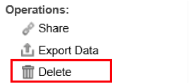

# Autres fonctions du tableau de bord{#other-dashboard-functions}

Les fonctions spéciales comprennent le partage, l’exportation et la suppression des tableaux de bord et sont exécutées à partir du panneau des détails d’un tableau de bord sélectionné.

## Sharing a Dashboard Hyperlink {#section-16b592f157de404fb25bd2c739d2e2c1}

L&#39; **[!UICONTROL Share]** opération fournit une URL qui peut être utilisée pour mettre en signet le tableau de bord ou envoyer un lien à un autre utilisateur pour accéder au tableau de bord. Une fenêtre de lien de tableau de bord s’affiche, vous donnant les informations nécessaires pour partager le lien vers le tableau de bord souhaité.

>[!NOTE]
>
>Les destinataires du lien doivent également avoir accès au tableau de bord pour pouvoir afficher le tableau de bord.

## Exportation des données du tableau de bord {#section-ace2f5f8807548ee8436f5c1dc2cd9d2}

L’ **[!UICONTROL Export Data]** opération déclenche l’exportation du tableau de bord sélectionné pour l’enregistrer dans un fichier Excel ou CSV (valeurs séparées par des virgules).

## Suppression des tableaux de bord {#section-adc10cb1b3174ff699c024ddc8f994fa}

L&#39; **[!UICONTROL Delete]** opération supprime un tableau de bord. Pour supprimer un tableau de bord, l&#39;utilisateur doit être le propriétaire du tableau de bord ou disposer d&#39;un accès administrateur. Cliquez sur l&#39;opération Supprimer pour afficher une fenêtre vous confirmant que vous souhaitez supprimer le tableau de bord.

