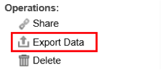

# Autres fonctions de tableau de bord{#other-dashboard-functions}

{{eol}}

Les fonctions spéciales incluent le partage, l’export et la suppression des tableaux de bord et sont exécutées à partir du panneau des détails d’un tableau de bord sélectionné.

## Partage d’un hyperlien vers un tableau de bord {#section-16b592f157de404fb25bd2c739d2e2c1}

Le **[!UICONTROL Share]** fournit une URL qui peut être utilisée pour marquer le tableau de bord ou envoyer par courrier électronique un lien permettant à un autre utilisateur d’accéder au tableau de bord. Une fenêtre Lien de tableau de bord s’affiche, vous fournissant les informations nécessaires pour partager le lien vers le tableau de bord souhaité.

>[!NOTE]
>
>Les destinataires du lien doivent également avoir accès au tableau de bord pour pouvoir visualiser le tableau de bord.

## Exportation des données d’un tableau de bord {#section-ace2f5f8807548ee8436f5c1dc2cd9d2}

Le **[!UICONTROL Export Data]** lance une exportation du tableau de bord sélectionné à enregistrer sous la forme d’un fichier Excel ou CSV (valeurs séparées par des virgules).

## Suppression de tableaux de bord {#section-adc10cb1b3174ff699c024ddc8f994fa}

Le **[!UICONTROL Delete]** supprime un tableau de bord. Pour supprimer un tableau de bord, l’utilisateur doit être le propriétaire du tableau de bord ou disposer d’un accès administrateur. Cliquez sur l’opération Supprimer pour afficher une fenêtre vous confirmant que vous souhaitez supprimer le tableau de bord.

