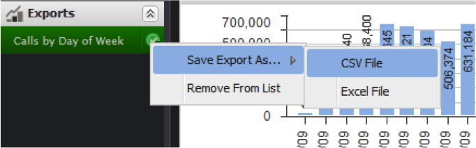

# Exportation de données{#exporting-data}

Indique trois méthodes d’exportation des données et comment récupérer les exportations.

Les données peuvent être exportées à partir du tableau de bord de trois manières différentes.

Vous pouvez tout d’abord exporter des données à partir d’une visualisation individuelle. Ensuite, vous pouvez exporter votre tableau de bord de travail actuel, y compris les configurations et les sélections que vous avez effectuées. Troisièmement, vous pouvez exporter un tableau de bord enregistré sans l’ouvrir.

Les exportations sont effectuées en deux étapes. Tout d’abord, les exportations sont mises en file d’attente sur le serveur à l’aide de l’une des trois méthodes ci-dessus. L&#39;état de l&#39;exportation s&#39;affiche dans le menu **[!UICONTROL Exports]** au moment de la préparation de l&#39;exportation. Ensuite, lorsque les exportations sont prêtes, vous pouvez télécharger les données au format CSV ou Excel.

Les exportations peuvent prendre plusieurs minutes, mais vous pouvez continuer à utiliser l’application pendant une exportation.

## Exportation des visualisations {#section-46b74b46c2eb44129c8b85a9eabd2304}

Pour exporter des données d’une visualisation, cliquez sur **[!UICONTROL Save]** dans le menu d’outils de la visualisation.

Votre exportation sera lancée sur le serveur et un indicateur d&#39;exportation sera ajouté au menu Exportations.

## Exportation de Tableaux de bord {#section-27329f2a5fed44b49deb26dc5164531f}

Pour lancer une exportation de données à partir d&#39;un tableau de bord de travail, sélectionnez **[!UICONTROL Export]** dans le menu **[!UICONTROL Dashboard]**.

Votre exportation sera lancée sur le serveur et un indicateur d&#39;exportation sera ajouté au menu Exportations.

## Exportation de Tableaux de bord enregistrés {#section-e989f7b16e25479ab77454f2c34471ba}

Pour lancer une exportation de données à partir d’un tableau de bord enregistré, utilisez l’explorateur de Tableaux de bord. Dans le navigateur de Tableaux de bord, accédez au tableau de bord de votre choix et sélectionnez-le pour que les détails du tableau de bord apparaissent. Dans le panneau des détails à droite, sous la section **[!UICONTROL Operations]**, sélectionnez **[!UICONTROL Export Data]**.

Votre exportation sera lancée sur le serveur et un indicateur d&#39;exportation sera ajouté au menu **[!UICONTROL Exports]**.
.

## Récupération des exportations {#section-0f03c5321c804867b7c72cf92f6f67d0}

Une fois l’exportation terminée, une notification contextuelle s’affiche pour vous informer que l’exportation est prête.

Pour récupérer l&#39;exportation, utilisez le menu **[!UICONTROL Exports]**. Cliquez sur la coche verte à droite de l’élément d’exportation souhaité pour afficher un menu déroulant. Dans ce menu, sous le sous-menu **[!UICONTROL Save Export As…]**, sélectionnez l&#39;option de menu appropriée pour télécharger l&#39;exportation au format CSV ou Excel.

Le processus de téléchargement de fichiers de votre navigateur est désormais début.

Les exportations ne sont pas supprimées automatiquement, vous pouvez donc facilement télécharger l’exportation dans chaque format. Vous pouvez supprimer des exportations du menu **[!UICONTROL Exports]** dans le panneau de navigation de gauche. Sinon, elles seront automatiquement supprimées lorsque vous vous déconnectez.

Pour supprimer une exportation de **[!UICONTROL Export List]**, cochez la case à droite du titre de l&#39;exportation et sélectionnez **[!UICONTROL Remove From List]**.

