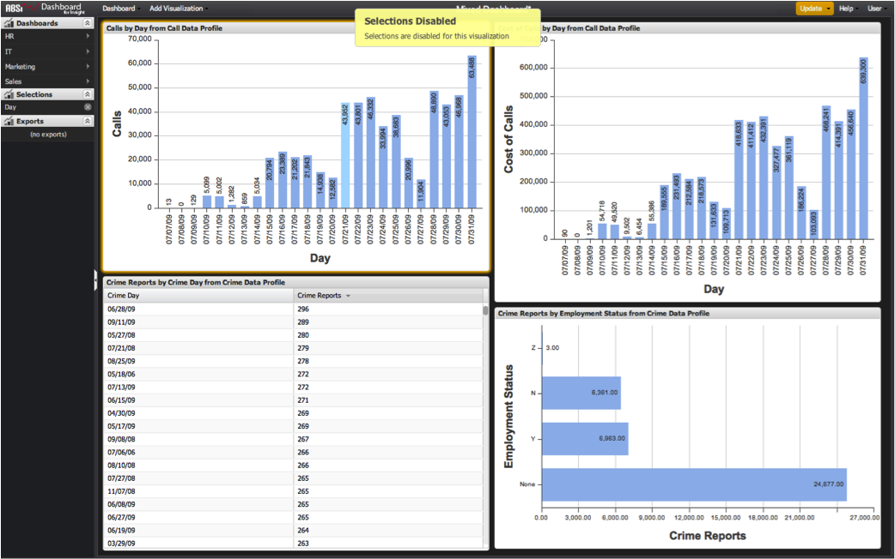

# Sélections sur plusieurs profils{#cross-profile-selections}

{{eol}}

Vous pouvez visualiser les données de plusieurs profils dans un seul tableau de bord.

Dans certains cas, les sélections d’une visualisation peuvent également être appliquées aux visualisations d’un autre profil. Par exemple, si vous créez des visualisations à partir d’un **[!UICONTROL Call Center]**profile et un **[!UICONTROL Website Traffic]** sur un tableau de bord, vous pouvez sélectionner un mois cible pour que les données de toutes les visualisations soient segmentées simultanément ce mois-ci, bien qu’il s’agisse de jeux de données entièrement différents.

Lorsque des visualisations de plusieurs profils existent dans un tableau de bord, vous pouvez effectuer une sélection dans une visualisation si la dimension de cette visualisation existe également sur tous les autres profils représentés à l’écran. Toutefois, les sélections seront désactivées si une dimension n’est pas trouvée globalement dans toutes les autres visualisations de l’écran, et si les utilisateurs verront une **[!UICONTROL Selections Disabled]** message.

>[!NOTE]
>
>Même si les dimensions peuvent partager le même nom sur plusieurs profils, elles peuvent ne pas avoir la même signification. Il est important d’étudier chaque dimension pour déterminer s’il est approprié de l’utiliser pour effectuer des sélections sur plusieurs profils.
