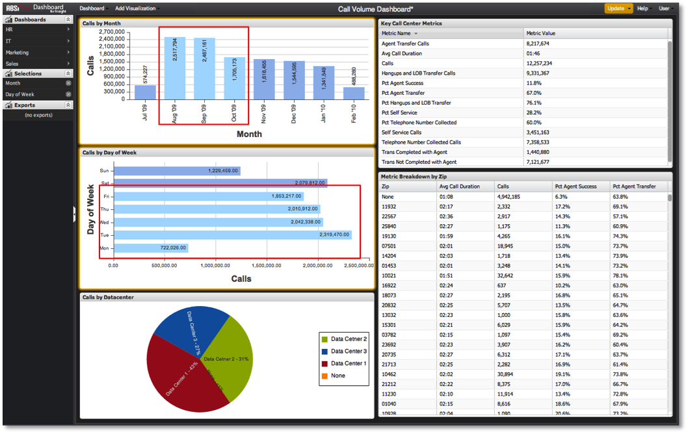

# Réalisation de sélections dans le tableau de bord{#making-selections-within-the-dashboard}

Les données d’un tableau de bord peuvent facilement être segmentées et explorées par l’utilisation de sélections.

Les sélections sont effectuées en cliquant sur certains éléments dans les visualisations afin d’identifier comment les données du tableau de bord doivent être segmentées. La sélection dans une visualisation segmente les données représentées dans les autres visualisations du tableau de bord. N’importe quel nombre de sélections peut être effectué, ajusté ou supprimé à tout moment et encourage l’utilisateur à interagir avec les données pour obtenir des informations analytiques.

Lors de l’enregistrement d’un tableau de bord, l’état des sélections est conservé au moment de l’enregistrement. De même, lorsqu’un tableau de bord est chargé, toutes les sélections qui ont été conservées pendant l’enregistrement sont rendues effectives lors du chargement du tableau de bord.

Vous pouvez effectuer des sélections en cliquant sur un ou plusieurs éléments de données dans l’une des visualisations d’un tableau de bord. Les éléments de données sont représentés par des éléments tels que des barres dans les graphiques à barres, des colonnes dans les graphiques à colonnes, des lignes dans un tableau, etc. Les sélections sont mises en surbrillance au fur et à mesure qu’elles sont effectuées, et l’exécution de sélections dans une visualisation donne à la visualisation une bordure orange. La méthode exacte de sélection dépend du type de visualisation utilisé.

Pour chaque sélection effectuée à partir d’une visualisation, une entrée apparaît également dans le menu Sélections. Cette entrée est répertoriée à l’aide du nom de dimension sélectionné, avec une entrée de sélection apparaissant par visualisation.

>[!NOTE]
>
>Les données visualisées ne sont pas automatiquement mises à jour chaque fois qu’une sélection est effectuée. Une fois que vous avez effectué les sélections souhaitées, vous devez plutôt lancer une mise à jour afin de segmenter les données et de mettre à jour vos visualisations.
