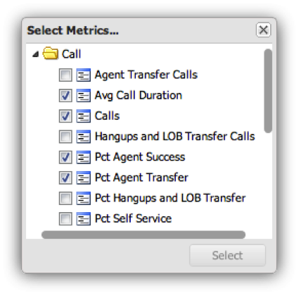

# Configuration des visualisations{#configuring-visualizations}

Indique comment configurer le titre, le profil, la dimension, la mesure, le filtre, l’affichage en haut, le tri par et la période.

Chaque visualisation sur le canevas du tableau de bord a sa propre configuration. Lorsqu’une visualisation est ajoutée pour la première fois au canevas du tableau de bord, sa fenêtre de configuration s’affiche automatiquement. Une fois configurée, la visualisation peut être modifiée à tout moment en cliquant sur l’icône d’engrenage dans la partie supérieure droite de la fenêtre de visualisation.

>[!NOTE]
>
>Les options de configuration varient légèrement selon le type de visualisation affiché.

## Titre de la visualisation {#section-0414844283d745ae912e85f8ea14a51d}

Ce champ vous permet de personnaliser le titre affiché en haut de la visualisation. Par défaut, le titre est défini sur **[!UICONTROL Automatic Title]**, ce qui génère automatiquement un titre pour la fenêtre de visualisation. En effaçant le **[!UICONTROL Automatic Title]** bouton, vous pouvez placer n’importe quel titre dans ce champ. (Ce champ s’applique à toutes les visualisations.)

## Profil {#section-16eb0def0a2d4eb289f5bb9200d14754}

Ce champ vous permet de sélectionner le profil à partir duquel vous souhaitez visualiser les données. Cliquez sur le menu déroulant pour obtenir la liste des profils auxquels vous avez accès. (Ce champ ne s’applique pas aux visualisations de texte enrichi.)

Les profils sont des ensembles de données définis dans l’outil de données qui contiennent des données sur un certain domaine, ainsi que les dimensions, les mesures et les filtres qui accompagnent les données. Un profil est souvent conçu pour répondre à un objectif spécifique (tel que le marketing ou le trafic sur le site Web).

>[!NOTE]
>
>Vous pouvez afficher uniquement les profils auxquels vous avez obtenu un accès. Pour plus d’informations, voir Contrôles d’accès.

## Dimension {#section-4ebb8c4308a146c3a35c7ac7ab6b579f}

Permet de sélectionner la dimension que vous souhaitez visualiser. La liste est renseignée à partir de la liste des dimensions disponibles dans le profil sélectionné dans le champ Profil. Cliquez sur la dimension souhaitée, puis sur le bouton Sélectionner. (Ce champ ne s’applique pas aux visualisations Légendes de mesure et Texte enrichi.)

Les dimensions sont des catégories de types de données similaires. Par exemple, la dimension Jours de la semaine est composée des éléments de données suivants : Dimanche, lundi, mardi, mercredi, jeudi, vendredi et samedi. Les dimensions indiquent ce qui est mesuré.

## Metric(s) {#section-7d46f2f1b9fe4e539b5eb0a0dc6e5ad3}

Permet de sélectionner les mesures à visualiser. Les mesures sont des objets quantitatifs et sont définies par une expression quantifiable. Par exemple, Pages vues par session est dérivé de l’expression du nombre de pages vues divisé par le nombre de sessions. Les mesures répondent à la question &quot;Combien ?&quot;

Les visualisations à mesure unique comportent une fenêtre de sélection à mesure unique :

Les visualisations multimesures comportent une fenêtre de sélection multimesure :

La liste est renseignée à partir de la liste des mesures disponibles à partir du profil sélectionné dans le champ Profil.

Cliquez sur les mesures souhaitées, puis sur **[!UICONTROL Select]**. (Ce champ ne s’applique pas aux visualisations de texte enrichi.)

## Filtres {#section-f8619ae2f8e54735a2c1b0fbb8bb1281}

Sélectionnez les filtres à appliquer à votre visualisation. La fenêtre de sélection des filtres vous permet de sélectionner plusieurs filtres dans la liste des filtres. La liste est renseignée à partir de la liste des filtres disponibles à partir du profil sélectionné dans le champ Profil. Cliquez sur le filtre souhaité, puis sur **[!UICONTROL Select]**.

>[!NOTE]
>
>Les filtres appliqués ici ne sont appliqués qu’à leur visualisation correspondante, et non à l’ensemble du tableau de bord. Cela s’avère utile pour comparer les résultats de deux visualisations différentes avec des filtres différents appliqués.

## Principaux affichages {#section-7ce71cb0fa6446998b710b427e68b133}

Les visualisations dans le tableau de bord ne sont pas conçues pour afficher l’ensemble des données. Ils vous permettent plutôt de spécifier le nombre d’enregistrements de dimension que vous souhaitez afficher dans la visualisation. Cette option affiche le nombre supérieur de dimensions en fonction de la valeur de tri donnée ci-dessous. (Ce champ ne s’applique pas aux visualisations Tableaux, Légendes de mesures et Texte enrichi.)

## Sort By {#section-f686249e20444359bff87c00cc2ba29f}

Cela vous permet de spécifier le mode de tri des données lorsqu’elles sont affichées dans la visualisation. (Ce champ ne s’applique pas aux visualisations Tableaux, Légendes de mesures et Texte enrichi.) Il existe plusieurs options de tri :

* **[!UICONTROL Default]** - Renvoyer les données non triées selon l&#39;ordre de tri stocké dans l&#39;outil de données. Il s’agit de l’option à utiliser pour les données temporelles telles que l’heure, le jour, la semaine ou le mois.
* **[!UICONTROL Dimension]** -Triez les données en fonction de la valeur de dimension alphanumérique.
* **[!UICONTROL Metric]** - Triez les données en fonction de la valeur de la mesure et permet de visualiser rapidement les dimensions supérieures.
* **[!UICONTROL Descending]** - Triez les données dans l&#39;ordre décroissant.
* **[!UICONTROL Ascending]** - Triez les données dans l&#39;ordre croissant.

## Période {#section-6220368e9e524b46ac735add6ab9edb0}

Cette visualisation vous permet de spécifier la date de début et/ou de fin souhaitée des données à afficher dans la visualisation.

La sélection de **[!UICONTROL All Dates]**affiche la plage de dates complète disponible dans le profil.

La sélection **[!UICONTROL Range]** affiche uniquement les données comprises dans une plage spécifiée. Pour entrer la plage de dates, vous pouvez saisir la date de début et/ou de fin ou utiliser une entrée de calendrier en sélectionnant l&#39;icône de calendrier.

(Ce champ ne s’applique pas aux visualisations de texte enrichi.)

>[!NOTE]
>
>Les plages de dates appliquées ici ne sont appliquées qu’à leur visualisation correspondante, et non à l’ensemble du tableau de bord. Cela s’avère utile pour comparer les résultats de deux visualisations différentes avec des plages de dates différentes appliquées.

