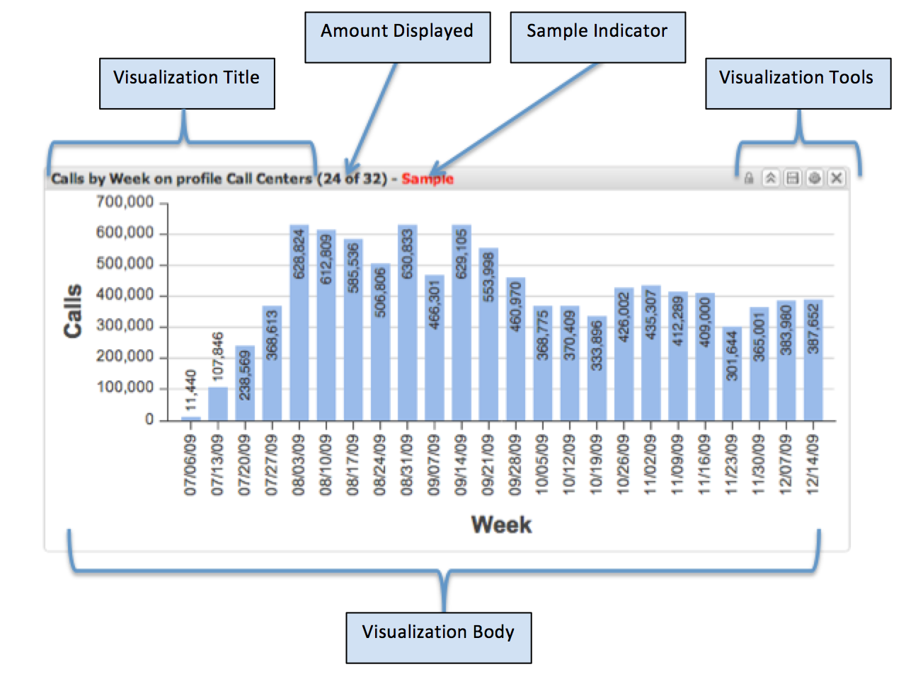

# Visualisations{#visualizations}

{{eol}}

Les visualisations sont des éléments ajoutés au canevas du tableau de bord et configurés pour afficher diverses données de mesure et de dimension.

Tous les tableaux de bord se composent d’une ou de plusieurs visualisations. Chaque visualisation peut être créée, supprimée, redimensionnée et reconfigurée indépendamment de toutes les autres visualisations du canevas du tableau de bord.

Les visualisations sont également interactives, ce qui permet aux utilisateurs de segmenter rapidement les données en effectuant des sélections sur un ou plusieurs éléments de données de la visualisation. Les sélections effectuées dans une visualisation appliqueront dynamiquement des filtres en temps réel à d’autres visualisations sur la zone de travail. Cela génère les mêmes données dans toutes les visualisations de la zone de travail.

Il existe huit types différents de visualisations. Chacun d’eux peut être ajouté, redimensionné, configuré et supprimé indépendamment de toute autre visualisation. Les visualisations affichent les données définies dans Data Workbench par un architecte de Data Workbench.

Les huit types de visualisation disponibles sont les suivants :

* Graphiques à colonnes
* Graphiques en barres
* Graphiques linéaires
* Tableaux
* Légendes des mesures
* Graphiques circulaires
* Graphiques de dispersion
* Texte enrichi

## Interface utilisateur de visualisation {#section-54a73865f00742268340cf9123d6c590}

La partie en-tête de la visualisation contient le titre de la visualisation et les outils de visualisation, qui varient selon le type et l’état de la visualisation. Le corps de la visualisation contient le contenu et dépend du type et de la configuration de la visualisation affichée. Les outils de visualisation ne s’affichent que lorsque la souris entre dans la fenêtre de visualisation. Sinon, elles sont masquées.

* Titre de la visualisation. Décrit cette visualisation. Le titre est généré automatiquement ou remplacé manuellement par un titre personnalisé.
* Quantité Affichée. Pour la dimension en cours de visualisation, affiche la quantité de données affichée par rapport à la quantité totale disponible.
* Exemple d’indicateur. Indique si les données visualisées sont un exemple et non un résultat de requête complet à 100 %.
* Outils de visualisation. Exécute des opérations spécifiques sur les visualisations. Les outils disponibles dépendent du type de visualisation, de l’état et des autorisations utilisateur actuelles.
* Corps de visualisation. Affiche les données de la visualisation telles que configurées. Cette zone est interactive et dépend du type de visualisation affiché.
