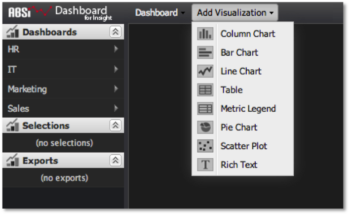

# Création de visualisations{#creating-visualizations}

{{eol}}

Procédure d’ajout d’une visualisation au canevas du tableau de bord.

1. Accédez au **[!UICONTROL Add Visualization]** dans la partie supérieure de l’interface du tableau de bord. Une liste des visualisations disponibles peut être créée.

   

1. Sélectionnez l’un de ces éléments de menu pour créer une visualisation vide et l’ajouter à la zone de travail du tableau de bord.

   La boîte de dialogue de configuration de la visualisation s’ouvre automatiquement pour vous permettre de configurer la visualisation. Voir [Configuration des visualisations](../../../home/c-adobe-data-workbench-dashboard/c-visualizations/c-configuring-visualizations.md#concept-edc3c7270ffe429c9aab8ceca429b570) pour plus d’informations sur la configuration de la visualisation.

   >[!NOTE]
   >
   >L’annulation de la fenêtre de configuration initiale supprime la visualisation du canevas du tableau de bord.
