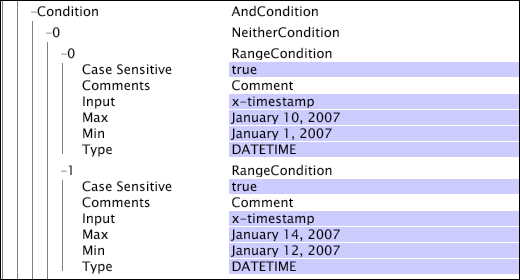

# Opérations booléennes{#boolean-operations}

Les opérations booléennes combinent les résultats des opérations de test, qui fonctionnent comme des enfants des opérations booléennes.

Pour plus d’informations sur les opérations de test, voir Opérations [de](../../../../home/c-dataset-const-proc/c-conditions/c-test-ops/c-test-ops.md#concept-c4bf6cb9e7a94cc7ac49ca9b0b1a2144)test. Lorsque vous définissez une [!DNL boolean] opération, vous pouvez définir zéro ou plusieurs enfants pour l’opération.

**Pour ajouter une condition enfant à une opération booléenne**

1. Cliquez avec le bouton droit de la souris sur le nom ou le numéro correspondant à l’ [!DNL Boolean] opération.
1. Cliquez sur **[!UICONTROL Add new child]** puis sélectionnez l’un des types de condition disponibles à ajouter.
1. Répétez les étapes 1 et 2 jusqu’à ce que vous ayez ajouté toutes les conditions enfants souhaitées pour l’ [!DNL Boolean] opération.

   >[!NOTE]
   >
   >Lorsque vous cliquez avec le bouton droit de la souris sur le nom ou le numéro correspondant à une [!DNL Boolean] opération, l’option de [!DNL Add new sibling] menu s’affiche. Un frère est une autre condition à la même position relative dans la hiérarchie de conditions que l’ [!DNL Boolean] opération sur laquelle vous avez cliqué avec le bouton droit de la souris. L’ajout d’un nouveau frère pour une [!DNL Boolean] opération équivaut à ajouter une nouvelle condition en cliquant avec le bouton droit sur le [!DNL Condition] ou [!DNL Log Entry Condition] paramètre.

**Pour supprimer une condition enfant d’une opération booléenne :**

1. Cliquez avec le bouton droit de la souris sur le nom de la condition enfant ou sur le numéro correspondant à la condition enfant que vous souhaitez supprimer de l’ [!DNL Boolean] opération.
1. Cliquez sur **[!UICONTROL Remove]** &lt;* **[!UICONTROL #number]***>, où nombre correspond au nombre correspondant à la condition enfant à supprimer.

Cette section décrit les conditions suivantes :

* [Et](../../../../home/c-dataset-const-proc/c-conditions/c-test-ops/c-boolean-ops.md#section-a14dba4b07cc4ab9aeb20868f773db7c)
* [Ni](../../../../home/c-dataset-const-proc/c-conditions/c-test-ops/c-boolean-ops.md#section-7e48b61266aa43ecbc48b979bf5e939b)
* [OU](../../../../home/c-dataset-const-proc/c-conditions/c-test-ops/c-boolean-ops.md#section-a3aa0f56b6234f2680fa81939228326b)

## Et {#section-a14dba4b07cc4ab9aeb20868f773db7c}

La [!DNL And] condition peut avoir zéro ou plusieurs conditions enfants et renvoie true si aucun de ses noeuds enfants ne renvoie false.

La [!DNL And] condition forme l’opération racine de tous les tests de condition dans le serveur de l’outil de données. Si la [!DNL And] condition ne contient aucun enfant, la condition est évaluée sur true et l’opération associée se poursuit. C’est pourquoi les actions qui ont uniquement la [!DNL And] condition comme test de condition s’exécutent toujours et pourquoi elles sont utilisées comme racine pour tous les tests de condition.

Cet exemple illustre l’utilisation d’une [!DNL And] condition pour s’assurer que la [!DNL Copy] transformation se produit uniquement lorsque la date de l’entrée du journal est survenue en 2006 et que la page demandée était [!DNL /products/purchase.asp].

## Neither {#section-7e48b61266aa43ecbc48b979bf5e939b}

La [!DNL Neither] condition peut comporter zéro ou plusieurs conditions enfants et renvoie false si l’une de ses conditions enfants est vraie. Si la [!DNL Neither] condition ne contient aucun enfant, aucun de ses enfants ne peut retourner vrai. Par conséquent, la [!DNL Neither] condition est évaluée comme vraie.

L’exemple suivant illustre une [!DNL Neither] condition avec deux [!DNL Range] conditions en tant qu’enfants. Comme défini, la [!DNL Neither] condition exclut les entrées de journal qui se sont produites entre le 1er janvier 2007 et le 10 janvier 2007 ou entre le 12 janvier 2007 et le 14 janvier 2007. Une telle condition peut être utilisée comme [!DNL Log Entry Condition] pour éliminer les transactions d&#39;un jeu de données pendant les périodes où il y avait un problème connu avec les données collectées.

## OU {#section-a3aa0f56b6234f2680fa81939228326b}

La [!DNL Or] condition peut comporter zéro ou plusieurs conditions enfants et renvoie true si au moins l’une de ses conditions enfants est vraie. Si la [!DNL Or] condition ne contient aucun enfant, aucun de ses enfants ne peut retourner vrai. Par conséquent, la [!DNL Or] condition est évaluée sur false.

Cet exemple illustre la [!DNL Or] condition avec une [!DNL String Match] condition et une [!DNL Range] condition en tant qu’enfants. La [!DNL Or] condition n’est remplie que si la [!DNL x-hasproblem] valeur de l’entrée du journal est oui ou si l’entrée du journal a eu lieu entre le 1er janvier 2007 et le 10 janvier 2007.

