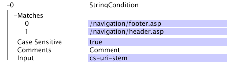

# Conditions d’opération de test{#test-operation-conditions}

{{eol}}

Informations sur les conditions d’opération de test, notamment comparer, non vide, plage, expression régulière et correspondance de chaîne.

* [Comparer](../../../../home/c-dataset-const-proc/c-conditions/c-test-ops/c-test-op-con.md#section-fb2bdb3838504099b324b9838cdeeaac)
* [Non vide](../../../../home/c-dataset-const-proc/c-conditions/c-test-ops/c-test-op-con.md#section-1decb9d887894073a1b6b3d985729ac8)
* [Plage](../../../../home/c-dataset-const-proc/c-conditions/c-test-ops/c-test-op-con.md#section-1db31583bb09418b8f49481a897b08a6)
* [Expression régulière](../../../../home/c-dataset-const-proc/c-conditions/c-test-ops/c-test-op-con.md#section-ae9c016502cb44128760c58f2d2d5297)
* [Correspondance de chaîne](../../../../home/c-dataset-const-proc/c-conditions/c-test-ops/c-test-op-con.md#section-f8d132085c6b4500bfbe4515b848142f)

## Comparer {#section-fb2bdb3838504099b324b9838cdeeaac}

Le [!DNL Compare] compare des valeurs string ou numériques. Pour les comparaisons de valeurs de chaîne, vous pouvez indiquer si la casse doit être prise en compte.

Les paramètres de la variable [!DNL Compare] Les conditions sont décrites dans le tableau suivant :

<table id="table_05B1FBB2AED242D99081E62BE2FBEC60"> 
 <thead> 
  <tr> 
   <th colname="col1" class="entry"> Paramètre </th> 
   <th colname="col2" class="entry"> Description </th> 
   <th colname="col3" class="entry"> Par défaut </th> 
  </tr> 
 </thead>
 <tbody> 
  <tr> 
   <td colname="col1"> Respect de la casse </td> 
   <td colname="col2">True ou false. Utilisé uniquement si le type est  LEXIQUE. Si la valeur est définie sur false, les lettres majuscules et minuscules sont considérées comme égales. </td> 
   <td colname="col3"> true </td> 
  </tr> 
  <tr> 
   <td colname="col1"> Commentaires </td> 
   <td colname="col2"> Facultatif. Remarques sur la condition. </td> 
   <td colname="col3"> Commentaires </td> 
  </tr> 
  <tr> 
   <td colname="col1"> Entrée A </td> 
   <td colname="col2"> La première des deux valeurs à comparer. Cette valeur représente l’opérande de gauche dans la condition. </td> 
   <td colname="col3"> </td> 
  </tr> 
  <tr> 
   <td colname="col1"> Entrée B </td> 
   <td colname="col2"> Seconde des deux valeurs à comparer. Cette valeur représente l’opérande approprié dans la condition. </td> 
   <td colname="col3"> </td> 
  </tr> 
  <tr> 
   <td colname="col1"> Opération </td> 
   <td colname="col2"> 
L’opération de comparaison. Les opérations disponibles (et leur signification) sont les suivantes : 
     <ul id="ul_74F3C298E9CC4FE89897BA0052A9EB9F"> 
      <li id="li_1605FA73474E404A84056D40E7082623"> = ou == (Entrée A = Entrée B) </li> 
      <li id="li_F694A262ED7A4787B2A68B877339620C"> &lt;&gt; ou != (L’entrée A n’est pas égale à l’entrée B) </li> 
      <li id="li_1A75437E23B64BEB92297E1C771092B0"> &lt; (l’entrée A est inférieure à l’entrée B) </li> 
      <li id="li_B80ED6BE9DEA41FE84BC6BA3B7759276"> &lt;= (l’entrée A est inférieure ou égale à l’entrée B) </li> 
      <li id="li_93148F34065F489E8E198DFB9F9F0E70"> &gt; (l’entrée A est supérieure à l’entrée B) </li> 
      <li id="li_8A98EE9AED2445429805169040BB253D"> &gt;= (l’entrée A est supérieure ou égale à l’entrée B) </li> 
     </ul> 
 </td> 
   <td colname="col3"> = </td> 
  </tr> 
  <tr> 
   <td colname="col1"> Type </td> 
   <td colname="col2">Type de comparaison à effectuer. Les types disponibles sont  LEXIQUE,  NUMÉRIQUE, et  DATETIME. Pour obtenir des descriptions des types, voir <a href="../../../../home/c-dataset-const-proc/c-conditions/c-test-ops/c-test-types.md#concept-a9fca97a2f03464cb0cbab8b5f809d0a"> Types de test pour les opérations de test</a>. </td> 
   <td colname="col3">  LEXIQUE </td> 
  </tr> 
 </tbody> 
</table>

Cet exemple utilise une [!DNL Compare] pour définir la condition [!DNL Log Entry Condition]. Lorsque le serveur Data Workbench lit chaque enregistrement de données d’événement, il compare les valeurs numériques x-age et 55. Si pour une entrée de journal donnée, x-age est inférieur ou égal à 55, l’entrée de journal est incluse dans le processus de construction du jeu de données.

## Non vide {#section-1decb9d887894073a1b6b3d985729ac8}

Le [!DNL Not Empty] La condition vérifie un champ pour déterminer s’il contient une valeur ou s’il est vide. La condition est remplie pour toute entrée de journal dont la valeur pour la variable [!DNL Input] n’est pas vide.

Les paramètres de la variable [!DNL Not Empty] Les conditions sont décrites dans le tableau suivant :

| Paramètre | Description | Par défaut |
|---|---|---|
| Commentaires | Facultatif. Remarques sur la condition. | Commentaires |
| Entrée | Nom du champ de l’entrée de journal pour vérifier le contenu. |  |

Cet exemple prend comme entrée x-some-field et teste si le champ n’est pas vide. La condition est remplie si le champ est renseigné.

## Plage {#section-1db31583bb09418b8f49481a897b08a6}

Le [!DNL Range] prend un champ d’entrée et détermine si la valeur de ce champ est incluse dans les valeurs de paramètre minimales (Min) et maximales (Max) données.

Les paramètres de la variable [!DNL Range] Les conditions sont décrites dans le tableau suivant :

<table id="table_1587D8D333804FC28024C0DFC2F2D4D3"> 
 <thead> 
  <tr> 
   <th colname="col1" class="entry"> Paramètre </th> 
   <th colname="col2" class="entry"> Description </th> 
   <th colname="col3" class="entry"> Par défaut </th> 
  </tr> 
 </thead>
 <tbody> 
  <tr> 
   <td colname="col1"> Respect de la casse </td> 
   <td colname="col2">True ou false. Utilisé uniquement si la variable  Type is  LEXIQUE. Si la valeur est définie sur false, les lettres majuscules et minuscules sont considérées comme égales. </td> 
   <td colname="col3"> true </td> 
  </tr> 
  <tr> 
   <td colname="col1"> Commentaires </td> 
   <td colname="col2"> Facultatif. Remarques sur la condition. </td> 
   <td colname="col3"> Commentaires </td> 
  </tr> 
  <tr> 
   <td colname="col1"> Entrée </td> 
   <td colname="col2"> Nom du champ de l’entrée de journal à utiliser comme entrée. </td> 
   <td colname="col3"> </td> 
  </tr> 
  <tr> 
   <td colname="col1"> min </td> 
   <td colname="col2"> 
Limite inférieure de la plage. 
 
 La valeur de ce paramètre doit être une valeur littérale ou une chaîne, et non un nom de champ. Si vous utilisez une date pour ce champ, vous devez spécifier un fuseau horaire. Pour obtenir la liste des abréviations de fuseau horaire prises en charge, voir <a href="../../../../home/c-dataset-const-proc/c-time-zone.md#concept-9b540ec3e770490d94e9d5a985765477"> Codes du fuseau horaire</a>. 
 </td> 
   <td colname="col3"> </td> 
  </tr> 
  <tr> 
   <td colname="col1"> Max </td> 
   <td colname="col2"> 
Limite supérieure de la plage. 
 
 
Remarque : La valeur de ce paramètre doit être une valeur littérale ou une chaîne, et non un nom de champ. Si vous utilisez une date pour ce champ, vous devez spécifier un fuseau horaire. Pour obtenir la liste des abréviations de fuseau horaire prises en charge, voir <a href="../../../../home/c-dataset-const-proc/c-time-zone.md#concept-9b540ec3e770490d94e9d5a985765477"> Codes du fuseau horaire</a>. 
 
 </td> 
   <td colname="col3"> </td> 
  </tr> 
  <tr> 
   <td colname="col1"> Type </td> 
   <td colname="col2">Type de comparaison à effectuer. Les types disponibles sont  LEXIQUE,  NUMÉRIQUE, et  DATETIME. Pour obtenir des descriptions des types, voir <a href="../../../../home/c-dataset-const-proc/c-conditions/c-test-ops/c-test-types.md#concept-a9fca97a2f03464cb0cbab8b5f809d0a"> Types de test pour les opérations de test</a>. </td> 
   <td colname="col3"> </td> 
  </tr> 
 </tbody> 
</table>

Cet exemple utilise une [!DNL Range] pour définir la condition [!DNL Log Entry Condition]. Lorsque le serveur Data Workbench lit chaque [!DNL event data] , il compare les valeurs numériques x-age et 55. Si pour une entrée de journal donnée, x-age est d’au moins 55 ans, l’entrée de journal est incluse dans le processus de construction du jeu de données. Cet exemple exécute la même fonction que la fonction [!DNL Compare] exemple de condition. Voir [Comparer](../../../../home/c-dataset-const-proc/c-conditions/c-test-ops/c-test-op-con.md#section-fb2bdb3838504099b324b9838cdeeaac).

>[!NOTE]
>
>Si le paramètre Min ou Max n’est pas renseigné, le serveur Data Workbench remplace les valeurs entières minimales ou maximales disponibles. La valeur minimale est zéro (0) et la valeur maximale est infinity.

## Expression régulière {#section-ae9c016502cb44128760c58f2d2d5297}

Le [!DNL Regular Expression] le test de condition utilise une correspondance de modèle d’expressions régulières (voir [Expressions régulières](../../../../home/c-dataset-const-proc/c-reg-exp.md#concept-070077baa419475094ef0469e92c5b9c)) pour déterminer si la valeur du champ d’entrée spécifié contient une chaîne correspondant à l’un des modèles spécifiés dans le paramètre Correspond à.

Si l’entrée est un vecteur de chaînes, seule la première valeur du vecteur est utilisée pour le test. Le [!DNL Regular Expression] condition effectue des comparaisons de chaîne complètes. Si vous souhaitez identifier les sous-chaînes, vous devez ajouter en préfixe et en suffixe &quot;.&#42;&quot; à la chaîne.

Les paramètres de la variable [!DNL Regular Expression] Les conditions sont décrites dans le tableau suivant :

<table id="table_0BF5F89F87C9493B8DABA97620074FAD"> 
 <thead> 
  <tr> 
   <th colname="col1" class="entry"> Paramètre </th> 
   <th colname="col2" class="entry"> Description </th> 
   <th colname="col3" class="entry"> Par défaut </th> 
  </tr> 
 </thead>
 <tbody> 
  <tr> 
   <td colname="col1"> Respect de la casse </td> 
   <td colname="col2"> True ou false. Si la valeur est définie sur false, les lettres majuscules et minuscules sont considérées comme égales. </td> 
   <td colname="col3"> true </td> 
  </tr> 
  <tr> 
   <td colname="col1"> Commentaires </td> 
   <td colname="col2"> Facultatif. Remarques sur la condition. </td> 
   <td colname="col3"> Commentaires </td> 
  </tr> 
  <tr> 
   <td colname="col1"> Entrée </td> 
   <td colname="col2"> Nom du champ de l’entrée de journal à utiliser comme entrée. </td> 
   <td colname="col3"> </td> 
  </tr> 
  <tr> 
   <td colname="col1"> Correspond à </td> 
   <td colname="col2"> 
Modèle(s) d’expression régulière à faire correspondre à la valeur du champ de saisie. 
 
 <b> Pour ajouter un modèle d’expression régulière</b> 
     <ol id="ol_6D6467FF74334DEA8E8625C3B155D11D"> 
      <li id="li_9E13A63558FF44749C2E49BD50B7F770">Clic droit  Correspond à. </li> 
      <li id="li_195A2F3B6B9442F5B1DACDE0FC96CE5C">Cliquez sur  Ajouter &gt;  Expression régulière. </li> 
      <li id="li_225E98F8EF39426A9483B86EA2CFE6DF">Saisissez l’expression régulière souhaitée dans la zone de texte. </li> 
     </ol> 
 </td> 
   <td colname="col3"> </td> 
  </tr> 
 </tbody> 
</table>

Cet exemple illustre l’utilisation de la fonction [!DNL Regular Expression] pour correspondre à un champ de données collectées à partir du trafic du site web. La condition renvoie true uniquement si le champ cs(referrer-query) contient une chaîne correspondant à l’expression régulière `campaign=C[1-9][0-9]{4}`. Cette expression régulière correspond à toute chaîne contenant `campaign=C12345`. Cependant, le modèle ne correspondrait pas à la chaîne. `campaign=C0123&` car le premier caractère suivant la fonction `C` ne se trouve pas dans la plage `1-9`.

## Correspondance de chaîne {#section-f8d132085c6b4500bfbe4515b848142f}

Le [!DNL String Match] tests de condition pour l’égalité des chaînes. Il prend un champ spécifié comme entrée et teste la valeur de ce champ dans chaque entrée de journal par rapport aux chaînes spécifiées dans le paramètre Matches de l’opération. Si l’une de ces chaînes de correspondance sensibles à la casse est identique à la valeur du champ d’entrée fourni, l’opération renvoie true. Dans le cas où la variable [!DNL StringCondition] ne contient aucune chaîne de correspondance, la condition renvoie false (faux). Si l’entrée est un vecteur de chaînes, seule la première valeur (chaîne) du vecteur est utilisée pour le test.

<table id="table_BD599BAA5DD54B278813B6C38AC8DE6B"> 
 <thead> 
  <tr> 
   <th colname="col1" class="entry"> Paramètre </th> 
   <th colname="col2" class="entry"> Description </th> 
   <th colname="col3" class="entry"> Par défaut </th> 
  </tr> 
 </thead>
 <tbody> 
  <tr> 
   <td colname="col1"> Respect de la casse </td> 
   <td colname="col2"> True ou false. Si la valeur est définie sur false, les lettres majuscules et minuscules sont considérées comme égales. </td> 
   <td colname="col3"> true </td> 
  </tr> 
  <tr> 
   <td colname="col1"> Commentaires </td> 
   <td colname="col2"> Facultatif. Remarques sur la condition. </td> 
   <td colname="col3"> Commentaires </td> 
  </tr> 
  <tr> 
   <td colname="col1"> Entrée </td> 
   <td colname="col2"> Nom du champ de l’entrée de journal à utiliser comme entrée. </td> 
   <td colname="col3"> </td> 
  </tr> 
  <tr> 
   <td colname="col1"> Correspond à </td> 
   <td colname="col2"> 
Chaîne(s) à associer à la valeur du champ de saisie. 
 
 <b>Pour ajouter une chaîne</b> 
     <ol id="ol_9E32218C771445D88357960475FAD6EB"> 
      <li id="li_A700747858D0470491783E9B3933DAFE">Clic droit  Correspond à. </li> 
      <li id="li_9D1A2462EA404B0F84426176737CAFED">Cliquez sur  Ajouter &gt;  Chaîne. </li> 
      <li id="li_E84D2439B59548E5B1803C64A295A18E">Entrez la chaîne de votre choix dans la zone de texte. </li> 
     </ol> 
 </td> 
   <td colname="col3"> </td> 
  </tr> 
 </tbody> 
</table>

Cet exemple utilise les données collectées à partir du trafic du site web pour illustrer l’utilisation de la variable [!DNL String Match] condition. La condition vérifie si le champ d’entrée (cs-uri-stem) correspond à l’une des deux chaînes spécifiées dans le paramètre Matches , et si le champ cs-uri-stem est la chaîne exacte. [!DNL /navigation/footer.asp] ou la chaîne exacte [!DNL /navigation/header.asp].

