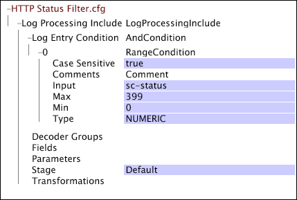

# Paramètres spécifiques web pour le traitement des fichiers journaux{#web-specific-settings-for-log-processing}

{{eol}}

Informations sur les paramètres spécifiques au web définis dans Jeu de données de traitement du journal Inclure les fichiers distribués avec des profils d’Adobe pour le site.

Le filtrage défini par ces paramètres se produit une fois que les entrées du journal ont quitté les décodeurs et que les transformations ont été appliquées, mais avant évaluation par [!DNL Log Entry Condition].

* [Filtrage de l’état HTTP](../../../home/c-dataset-const-proc/c-config-web-data/c-web-spec-log-proc.md#section-ac66acdcb6aa467d81c3721199e540fd)
* [Filtrage robotisé](../../../home/c-dataset-const-proc/c-config-web-data/c-web-spec-log-proc.md#section-7f43681dfbc64b969619cb88f97d5ad5)

## Filtrage de l’état HTTP {#section-ac66acdcb6aa467d81c3721199e540fd}

Vous pouvez configurer votre mise en oeuvre de [!DNL Site] pour supprimer du jeu de données les entrées de journal dont le code sc-status est supérieur ou égal à 400. Les demandes réussies comportent des codes d’état inférieurs à 400. Votre mise en oeuvre par défaut comprend un [!DNL Log Processing Dataset Include] dans lequel le filtrage de l’état HTTP est configuré.

**Modification des paramètres de configuration pour le filtrage de l’état HTTP**

1. Ouvrez le [!DNL Profile Manager] dans votre profil de jeu de données et ouvrez la variable [!DNL Dataset\Log Processing\Traffic\HTTP Status Filter.cfg] fichier .

   >[!NOTE]
   >
   >Si vous avez personnalisé votre implémentation de [!DNL Site], le fichier dans lequel ces paramètres de configuration existent peut différer de l’emplacement décrit.

1. Vérifiez ou modifiez les valeurs des paramètres du fichier selon vos besoins. Utilisez l’exemple suivant comme guide.

   

   Pour plus d’informations sur la variable [!DNL Range] condition, voir [Conditions](../../../home/c-dataset-const-proc/c-conditions/c-abt-cond.md).

1. Enregistrez le [!DNL HTTP Status Filter.cfg] en cliquant avec le bouton droit de la souris **[!UICONTROL (modified)]** en haut de la fenêtre et en cliquant sur **[!UICONTROL Save]**.

1. Pour que les modifications apportées localement prennent effet, dans la variable [!DNL Profile Manager], cliquez avec le bouton droit de la souris sur la coche du fichier dans la variable [!DNL User] , puis cliquez sur **[!UICONTROL Save to]** > *&lt;**[!UICONTROL profile name]**>*, où nom du profil est le nom du profil du jeu de données ou du profil hérité auquel appartient le fichier d’inclusion du jeu de données.

   >[!NOTE]
   >
   >N&#39;enregistrez le fichier de configuration modifié dans aucun des profils internes fournis par Adobe, car vos modifications sont écrasées lorsque vous installez des mises à jour sur ces profils.

## Filtrage robotisé {#section-7f43681dfbc64b969619cb88f97d5ad5}

Vous pouvez configurer votre mise en oeuvre de [!DNL Site] pour utiliser des fichiers de recherche afin de supprimer des entrées de journal générées par des robots connus, des scripts de test et des adresses IP pour les utilisateurs internes de votre jeu de données. Votre mise en oeuvre par défaut comprend un [!DNL Log Processing Dataset Include] fichier dans lequel le filtrage des robots est configuré.

**Pour modifier les paramètres de configuration pour le filtrage robotique**

1. Ouvrez le [!DNL Profile Manager] dans votre profil de jeu de données et ouvrez la variable [!DNL Dataset\Log Processing\Traffic\Robot Filter.cfg] fichier .

   >[!NOTE]
   >
   >Si vous avez personnalisé votre implémentation de [!DNL Site], le fichier dans lequel ces paramètres de configuration existent peut différer de l’emplacement décrit.

1. Vérifiez ou modifiez les paramètres du fichier à l’aide de l’exemple suivant et des informations sous forme de guides :

   

   Le fichier comprend un [!DNL NotRobotCondition] qui est défini par les trois paramètres suivants :

   * **Filtrage des robots non sensible à la casse :** True ou false. Si la valeur est true, la casse de lettre (supérieure/inférieure) n’est pas prise en compte dans le filtrage par robot.
   * **Fichier de recherche robot, ligne de base :** Chemin d’accès et nom de fichier du fichier texte qui contient une liste des agents utilisateur de navigateur qui sont des robots connus et qui doivent être filtrés hors du jeu de données. Adobe fournit le fichier de recherche de robot de base. Si vous ne spécifiez pas de chemin d’accès, le serveur Data Workbench recherche ce fichier dans le répertoire Lookups du répertoire d’installation du serveur Data Workbench.
   * **Robot Lookup File, Extended :** Chemin d’accès et nom de fichier d’un fichier texte facultatif qui contient une liste d’agents utilisateur ou d’adresses IP de navigateur qui définissent des robots spécifiques à votre mise en oeuvre. Cette liste peut inclure des robots de surveillance internes, des scripts de test et des adresses IP pour les utilisateurs internes qui doivent être filtrés hors du jeu de données. Si vous ne spécifiez pas de chemin d’accès, le serveur Data Workbench recherche ce fichier dans le répertoire Lookups du répertoire d’installation du serveur Data Workbench.

   Si l’agent utilisateur du navigateur d’une entrée de journal n’est répertorié dans aucun fichier de recherche, l’entrée de journal est considérée comme générée par un visiteur réel et n’est pas filtrée du jeu de données.

   >[!NOTE]
   >
   >La correspondance dans les fichiers de recherche de robot utilise les sous-chaînes à comparer aux champs c-ip et cs(user-agent) log . Si la chaîne de recherche commence par &quot;$&quot;, elle doit correspondre à l’avant de la chaîne en cours de test et si elle se termine par &quot;$&quot;, la chaîne de recherche doit correspondre à la fin de la chaîne en cours de test. Si la chaîne de recherche commence par et se termine par &quot;$&quot;, les chaînes doivent correspondre exactement pour que l’entrée du journal soit filtrée. Par exemple, pour tester toutes les adresses IP d’un bloc de classe C, utilisez une chaîne telle que $231.78.123. pour forcer une correspondance au début de la chaîne. Cela correspondrait aux adresses 231.78.123.0 à 231.78.123.255.

1. Enregistrez le fichier en cliquant avec le bouton droit de la souris **[!UICONTROL (modified)]** en haut de la fenêtre et en cliquant sur **[!UICONTROL Save]**.

1. Pour que les modifications apportées localement prennent effet, dans la variable [!DNL Profile Manager], cliquez avec le bouton droit de la souris sur la coche du fichier dans la variable [!DNL User] , puis cliquez sur **[!UICONTROL Save to]** > *&lt;**[!UICONTROL profile name]**>*, où nom du profil est le nom du profil du jeu de données ou du profil hérité auquel appartient le fichier d’inclusion du jeu de données.

   N&#39;enregistrez le fichier de configuration modifié dans aucun des profils internes fournis par Adobe, car vos modifications sont écrasées lorsque vous installez des mises à jour sur ces profils.

   >[!NOTE]
   >
   >S’il est essentiel que les entrées de journal sous-jacentes utilisées pour construire un jeu de données ne changent pas (même si les transformations utilisées pour construire et mettre à jour le jeu de données et ses dimensions changent), le fichier de recherche robotique, la ligne de base et le fichier de recherche robotisé, étendu, doivent être contrôlés par version. En plaçant un numéro de version sur ces fichiers, vous avez la garantie que les mises à jour des fichiers de recherche de robot par défaut ne modifient pas involontairement les jeux de données de rapports construits précédemment en ajoutant ou en supprimant des entrées dans ces fichiers.
