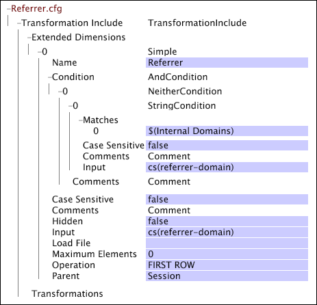

# Paramètres spécifiques web pour la transformation{#web-specific-settings-for-transformation}

Informations sur les paramètres spécifiques au Web définis dans le jeu de données de transformation Incluez les fichiers distribués avec les profils d&#39;Adobe pour le site.

Les conditions, dimensions et paramètres définis par ces paramètres sont créés pendant la phase de transformation de la construction du jeu de données.

* [Condition de page vue](../../../home/c-dataset-const-proc/c-config-web-data/c-web-spec-transf.md#section-cc2807a12a88492f8b64a43234a1f835)
* [Dimension URI](../../../home/c-dataset-const-proc/c-config-web-data/c-web-spec-transf.md#section-348f7e9099d049d197a7cdcbc8a6c234)
* [Dimension parrain](../../../home/c-dataset-const-proc/c-config-web-data/c-web-spec-transf.md#section-8a97ec34d18b4814b5f95495ac4f8638)
* [Paramètres de session](../../../home/c-dataset-const-proc/c-config-web-data/c-web-spec-transf.md#section-0a209b0c504041a5801f7f71a963c8b1)

## Condition de page vue {#section-cc2807a12a88492f8b64a43234a1f835}

[!DNL Page View Condition] est une opération de condition qui détermine si une entrée de journal spécifique (c&#39;est-à-dire une requête de page) doit être incluse dans les données collectées sur l&#39;historique des vues d&#39;un visiteur. Lorsque l&#39;entrée de journal satisfait à l&#39;[!DNL Page View Condition], elle devient un élément de la dimension dénombrable de la Vue de pages. Si une entrée de journal ne satisfait pas à [!DNL Page View Condition], ses champs de données sont toujours accessibles par d&#39;autres dimensions. Outre la dimension Vue de page, les dimensions suivantes peuvent être affectées par les résultats de l&#39;[!DNL Page View Condition] :

* **[!DNL URI]et  [!DNL Page]:** Ces dimensions sont directement affectées par le  [!DNL Page View Condition]. Si la page donnée ne transmet pas la balise [!DNL Page View Condition,], elle n&#39;est pas incluse dans l&#39;URI ou les dimensions Page.

* **[!DNL Visitor Page Views]et  [!DNL Session Page Views]:** Les dimensions Vues de page de Visiteur et Vues de page de session représentent le nombre de pages consultées par un visiteur ou au cours d’une session donnée, respectivement. Les pages filtrées par [!DNL Page View Condition] ne font pas partie de ce décompte.

* **Numéro de session :** cet élément  [!DNL Page View Condition] a un effet indirect sur la dimension Numéro de session. La dimension Numéro de session est créée avant [!DNL Page View Condition]; par conséquent, lorsqu&#39;on considère [!DNL Session Number] par rapport à [!DNL Page Views], il est possible d&#39;avoir des sessions sans vue de page.

Votre implémentation par défaut de [!DNL Site] comprend un fichier [!DNL Transformation Dataset Include] dans lequel la dimension dénombrable de la Vue de page et la dimension [!DNL Page View Condition] associée sont définies.

Pour plus d’informations sur les dimensions dénombrables, voir [Dimensions étendues](../../../home/c-dataset-const-proc/c-ex-dim/c-abt-ex-dim.md).

**Pour modifier les paramètres de configuration de la condition de Vue de page**

1. Ouvrez [!DNL Profile Manager] dans votre profil de jeux de données et ouvrez le fichier [!DNL Dataset\Transformation\Traffic\Page View.cfg].

   >[!NOTE]
   >
   >Si vous avez personnalisé l&#39;implémentation de [!DNL Site], le fichier dans lequel ces paramètres de configuration existent peut différer de l&#39;emplacement décrit.

1. Examinez ou modifiez les valeurs des paramètres de [!DNL Page View Condition] selon les besoins. Utilisez l’exemple suivant comme guide. Dans ce fichier, [!DNL Page View Condition] est défini par une transformation [!DNL Copy]. Notez que ce fichier contient également la définition de la dimension dénombrable Vue de page.

   

   >[!NOTE]
   >
   >Pour plus d’informations sur les dimensions dénombrables, voir [Dimensions étendues](../../../home/c-dataset-const-proc/c-ex-dim/c-abt-ex-dim.md). Pour plus d&#39;informations sur la transformation [!DNL Copy], voir [Transformations de données](../../../home/c-dataset-const-proc/c-data-trans/c-abt-transf.md).

1. Enregistrez le fichier en cliquant avec le bouton droit **[!UICONTROL (modified)]** en haut de la fenêtre, puis en cliquant sur **[!UICONTROL Save]**.

1. Pour que les modifications apportées localement prennent effet, dans [!DNL Profile Manager], cliquez avec le bouton droit de la souris sur la coche du fichier dans la colonne [!DNL User], puis cliquez sur **[!UICONTROL Save to]** > *&lt;**[!UICONTROL profile name]***, où le nom du profil correspond au nom du profil du jeu de données ou au profil hérité auquel appartient le fichier d&#39;inclusion du jeu de données.

   >[!NOTE]
   >
   >N&#39;enregistrez le fichier de configuration modifié dans aucun des profils internes fournis par Adobe, car vos modifications sont remplacées lorsque vous installez des mises à jour de ces profils.

## Dimension URI {#section-348f7e9099d049d197a7cdcbc8a6c234}

Si vous utilisez [!DNL Site], vous devez définir la dimension URI dont les éléments sont les racines URI des pages de site Web affichées. Votre implémentation par défaut comprend un fichier [!DNL Transformation Dataset Include] dans lequel la dimension simple URI est définie.

Pour plus d’informations sur les dimensions simples, voir [Dimensions étendues](../../../home/c-dataset-const-proc/c-ex-dim/c-abt-ex-dim.md).

**Pour modifier les paramètres de configuration de la dimension URI**

1. Ouvrez [!DNL Profile Manager] dans votre profil de jeux de données et ouvrez le fichier [!DNL Dataset\Transformation\Traffic\URI.cfg].

   >[!NOTE]
   >
   >Si vous avez personnalisé l&#39;implémentation de [!DNL Site], le fichier dans lequel ces paramètres de configuration existent peut différer de l&#39;emplacement décrit.

1. Vérifiez ou modifiez les valeurs des paramètres du fichier selon vos besoins. Utilisez l’exemple et les informations suivants comme guides.

Les paramètres de configuration de la dimension URI incluent les deux paramètres suivants :

* **Respect de la casse :** True ou False. Si la valeur est true, la casse de la lettre (supérieure/inférieure) est prise en compte lors de l’identification de pages uniques. La valeur par défaut est true.
* **Eléments maximaux :** nombre maximal d’éléments (URI) pour la dimension URI. La valeur par défaut est 32768.

   >[!NOTE]
   >
   >La modification de cette valeur peut entraîner de sérieux problèmes de performances. Ne modifiez pas cette valeur sans consulter l’Adobe.

* Enregistrez le fichier [!DNL URI.cfg] en cliquant avec le bouton droit de la souris sur **[!UICONTROL (modified)]** en haut de la fenêtre, puis en cliquant sur **[!UICONTROL Save]**.

* Pour que les modifications apportées localement prennent effet, dans [!DNL Profile Manager], cliquez avec le bouton droit de la souris sur la coche du fichier dans la colonne [!DNL User], puis cliquez sur **[!UICONTROL Save to]** > *&lt;**[!UICONTROL profile name]***, où le nom du profil correspond au nom du profil du jeu de données ou au profil hérité auquel appartient le fichier d&#39;inclusion du jeu de données.

   >[!NOTE]
   >
   >N&#39;enregistrez le fichier de configuration modifié dans aucun des profils internes fournis par Adobe, car vos modifications sont remplacées lorsque vous installez des mises à jour de ces profils.

## Dimension de parrain {#section-8a97ec34d18b4814b5f95495ac4f8638}

Si vous utilisez [!DNL Site], vous devez définir la dimension de Parrain dont les éléments se composent des domaines de deuxième niveau des parrains des premières entrées de journal dans toutes les sessions. Votre implémentation par défaut comprend un fichier [!DNL Transformation Dataset Include] dans lequel la dimension simple Parrain est définie.

Pour plus d’informations sur les dimensions simples, voir [Dimensions étendues](../../../home/c-dataset-const-proc/c-ex-dim/c-abt-ex-dim.md).

**Pour modifier les paramètres de configuration de la dimension Parrain**

1. Ouvrez [!DNL Profile Manager] dans votre profil de jeux de données et ouvrez le fichier [!DNL Dataset\Transformation\Traffic\Referrer.cfg].

   >[!NOTE]
   >
   >Si vous avez personnalisé l&#39;implémentation de [!DNL Site], le fichier dans lequel ces paramètres de configuration existent peut différer de l&#39;emplacement décrit.

1. Vérifiez ou modifiez les valeurs des paramètres du fichier selon vos besoins. Utilisez l’exemple et les informations suivants comme guides.

   

   Les paramètres de configuration de la dimension Parrain incluent le paramètre Eléments maximaux, qui spécifie le nombre maximal d’éléments (c’est-à-dire de parrains) pour la dimension Parrain. La valeur par défaut est 32768.

   >[!NOTE]
   >
   >Dans l’exemple ci-dessus, le paramètre [!DNL Maximum Elements] est défini sur 0. Lorsque ce paramètre est défini sur 0, le serveur de l’outil de données utilise la valeur par défaut interne 32768.

1. Enregistrez le fichier [!DNL Referrer.cfg] en cliquant avec le bouton droit de la souris sur **[!UICONTROL (modified)]** en haut de la fenêtre, puis en cliquant sur **[!UICONTROL Save]**.

1. Pour que les modifications apportées localement prennent effet, dans [!DNL Profile Manager], cliquez avec le bouton droit de la souris sur la coche du fichier dans la colonne [!DNL User], puis cliquez sur **[!UICONTROL Save to]** > *&lt;**[!UICONTROL profile name]***, où le nom du profil correspond au nom du profil du jeu de données ou au profil hérité auquel appartient le fichier d&#39;inclusion du jeu de données.

   >[!NOTE]
   >
   >N&#39;enregistrez le fichier de configuration modifié dans aucun des profils internes fournis par Adobe, car vos modifications sont remplacées lorsque vous installez des mises à jour de ces profils.

## Paramètres de session {#section-0a209b0c504041a5801f7f71a963c8b1}

Si vous utilisez [!DNL Site], vous pouvez spécifier des paramètres qui définissent les limites d’une session de visiteur sur un site Web. Ces paramètres ne sont valides que lorsqu&#39;ils sont définis dans un fichier [!DNL Transformation Dataset Include] au sein de votre implémentation [!DNL Site].

Les paramètres suivants sont uniques en ce sens qu&#39;ils peuvent être membres du vecteur [!DNL Parameters] du fichier [!DNL Transformation Dataset Include], ou qu&#39;ils peuvent être répertoriés en tant que paramètres individuels dans le fichier [!DNL Transformation.cfg]. Un paramètre peut être défini exactement une fois, de sorte que ces paramètres sont définis soit dans le fichier [!DNL Transformation.cfg]soit dans le vecteur [!DNL Parameters] du fichier d&#39;inclusion du jeu de données, et non dans les deux fichiers.
**Durée maximale de session et expiration de session**

Durée maximale de session et Délai d’expiration de session sont des paramètres de chaîne qui définissent la durée d’une session d’un visiteur. Ces paramètres fonctionnent avec le paramètre Domaines internes pour déterminer la durée de session.

Durée maximale de session indique la durée de session la plus longue avant le démarrage d’une nouvelle session. Cela évite aux pages Web dont le contenu est automatiquement actualisé de créer des sessions qui sont arbitrairement longues. Si le parrain d&#39;un clic est défini sur l&#39;une des entrées du paramètre Domaines internes, ce délai d&#39;attente est utilisé pour définir la fin d&#39;une session. Aucune session ne peut être plus longue que la durée maximale de session spécifiée, quel que soit le nombre de clics qu’elle contient. La valeur recommandée est de 48 heures.

Le délai d’expiration de la session indique le délai qui doit s’écouler entre les entrées de journal d’un visiteur donné pour déterminer la fin d’une session et le début d’une nouvelle session (c’est-à-dire le délai d’expiration habituel utilisé pour définir une session utilisateur). La valeur recommandée de ce paramètre est de 30 minutes. Si le parrain d&#39;un clic n&#39;est pas défini sur l&#39;un des parrains du paramètre Domaines internes, ce délai d&#39;attente est utilisé pour définir la session. Si cs(domaine-parrain) pour une entrée de journal se trouve dans la liste des domaines internes, la durée maximale de session détermine si l&#39;entrée de journal active fait partie d&#39;une session existante ou du début d&#39;une nouvelle session.

Supposons qu’un visiteur soit appelé hors de son ordinateur pendant une période plus longue que le délai d’expiration de la session alors qu’il naviguait sur le site. À son retour, il continue de naviguer là où il s&#39;est arrêté. Comme le visiteur ne quitte jamais le site ou ne ferme jamais son navigateur, le cs(domaine-parrain) de son prochain clic est identique au domaine interne et sa session initiale reste principale tant que le paramètre Durée maximale de session n’est pas atteint. Si le domaine du site est répertorié comme domaine interne et que le délai maximal d’expiration n’est pas atteint, l’interaction de l’visiteur s’affiche sous la forme d’une session unique et non de deux sessions distinctes. Cependant, si le visiteur revient sur son ordinateur et que son prochain clic comporte un parrain externe (ou vide), une nouvelle session commence.

>[!NOTE]
>
>La transformation [!DNL Sessionize] [!DNL Timeout Condition] joue également un rôle dans la détermination de la durée de la session d&#39;un visiteur. Si le délai d’expiration de la session et la durée maximale de la session ne s’appliquent pas, [!DNL Timeout Condition] est vérifié pour déterminer si une entrée de journal doit être considérée comme le début d’une nouvelle session. Pour plus d’informations, voir [Transformations de données](../../../home/c-dataset-const-proc/c-data-trans/c-abt-transf.md).

**Pour modifier les paramètres Durée maximale de session et Délai d’expiration de session**

Si vous utilisez [!DNL Site], votre implémentation par défaut comprend probablement un fichier [!DNL Transformation Dataset Include] dans lequel les noms et les valeurs recommandées de ces paramètres sont spécifiés.

1. Ouvrez [!DNL Profile Manager] dans votre profil de jeux de données et accédez à [!DNL Dataset\Transformation\Traffic\Session Parameters.cfg].

   >[!NOTE]
   >
   >Si vous avez personnalisé l&#39;implémentation de [!DNL Site], le fichier dans lequel ces paramètres sont définis peut différer de l&#39;emplacement décrit.

1. Modifiez les valeurs des paramètres selon vos besoins. Veillez à spécifier les unités souhaitées (minutes, heures, etc.).

   

1. Enregistrez le fichier [!DNL Session Parameters.cfg] en cliquant avec le bouton droit de la souris sur **[!UICONTROL (modified)]** en haut de la fenêtre et en cliquant sur **[!UICONTROL Save]**.

1. Pour que les modifications apportées localement prennent effet, dans [!DNL Profile Manager], cliquez avec le bouton droit de la souris sur la coche du fichier dans la colonne [!DNL User], puis cliquez sur **[!UICONTROL Save to]** > **[!UICONTROL profile name]**, où nom du profil est le nom du profil de données ou le profil hérité auquel appartient le fichier inclus dans le jeu de données.

   >[!NOTE]
   >
   >N&#39;enregistrez le fichier de configuration modifié dans aucun des profils internes fournis par Adobe, car vos modifications sont remplacées lorsque vous installez des mises à jour de ces profils.

**[!DNL Internal Domains]**

[!DNL Internal Domains] est un paramètre vectoriel qui liste les hôtes au niveau du domaine (parrains internes) qui doivent être traités comme faisant partie d’un site Web particulier. Ces hôtes sont supprimés de la dimension de parrain (qui est une liste des informations de parrain externe). Lorsque cs(parrain-domain) correspond à l’une des chaînes répertoriées dans l’ensemble de domaines internes, le délai d’expiration de la session est ignoré et la durée maximale de la session est utilisée pour déterminer la durée de la session.

Le paramètre Domaines internes peut également être utilisé pour empêcher le début d’une nouvelle session lorsque des visiteurs se déplacent entre plusieurs domaines d’une société associés d’une manière qui dépasse le délai d’expiration de la session. Prenons l’exemple d’une société dont certaines parties de son site sont réparties sur deux domaines : l&#39;un est connecté ( [!DNL xyz.com]) et l&#39;autre n&#39;est pas connecté ( [!DNL xyz-unlogged.com]). Si ces sites sont intégrés de manière à faciliter le déplacement fluide du trafic entre les deux domaines, il n&#39;est pas souhaitable de générer une session différente chaque fois que le visiteur passe du domaine [!DNL xyz-unlogged.com] au domaine [!DNL xyz.com]. L&#39;énumération de [!DNL xyz-unlogged.com] en tant que domaine interne empêche la division des sessions en plusieurs sessions en raison du trafic entre ces deux domaines tant que le paramètre Durée maximale de session n&#39;est pas atteint.

**Pour ajouter un domaine interne**

Si vous utilisez [!DNL Site], votre implémentation par défaut comprend un fichier [!DNL Transformation Dataset Include] pour la définition du paramètre Domaines internes. Dans ce fichier, le paramètre est nommé ; il vous suffit de saisir les domaines internes que vous souhaitez inclure et d&#39;enregistrer le fichier mis à jour.

1. Ouvrez [!DNL Profile Manager] dans le profil de votre jeu de données et accédez à [!DNL Dataset\Transformation\Traffic\Internal Domains.cfg.]

   >[!NOTE]
   >
   >Si vous avez personnalisé votre implémentation de [!DNL Site], le fichier dans lequel le paramètre Domaines internes est défini peut différer de l&#39;emplacement décrit.

1. Cliquez avec le bouton droit de la souris sur **[!UICONTROL Value]** pour le paramètre vectoriel Domaines internes et cliquez sur **[!UICONTROL Add new]** > **[!UICONTROL Value]**.

1. Modifiez les valeurs selon vos besoins.

   

1. Enregistrez le fichier [!DNL Internal Domains.cfg] en cliquant avec le bouton droit de la souris sur **[!UICONTROL (modified)]** en haut de la fenêtre et en cliquant sur **[!UICONTROL Save]**.

1. Pour que les modifications apportées localement prennent effet, dans [!DNL Profile Manager], cliquez avec le bouton droit de la souris sur la coche du fichier dans la colonne [!DNL User], puis cliquez sur **[!UICONTROL Save to]** > *&lt;**[!UICONTROL profile name]***, où le nom du profil correspond au nom du profil du jeu de données ou au profil hérité auquel appartient le fichier d&#39;inclusion du jeu de données.

   >[!NOTE]
   >
   >N&#39;enregistrez le fichier de configuration modifié dans aucun des profils internes fournis par Adobe, car vos modifications sont remplacées lorsque vous installez des mises à jour de ces profils.
