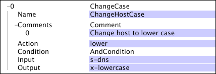

# ChangeCase{#changecase}

La transformation ChangeCase modifie la casse de la chaîne dans le paramètre Input tel que spécifié par le paramètre Action.

| Paramètre | Description | Par défaut |
|---|---|---|
| Nom | Nom descriptif de la transformation. Vous pouvez entrer n&#39;importe quel nom ici. |  |
| Action | Supérieur ou inférieur. Indique si la casse doit être remplacée par la valeur supérieure ou inférieure. | lower |
| Commentaires | Facultatif. Remarques sur la transformation. |  |
| Condition | Conditions d&#39;application de cette transformation. |  |
| Entrée | Nom du champ de l&#39;entrée de journal à utiliser comme entrée. |  |
| Sortie | Nom du champ de sortie. |  |

Dans cet exemple, qui utilise les champs de données collectées à partir du trafic du site Web, la casse de la chaîne dans le champ s-dns est changée en minuscules et la nouvelle valeur est générée dans le nouveau champ, x-lowercase-dns.

