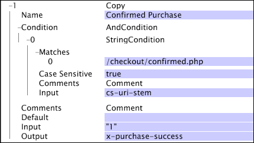

# Copier{#copy}

La transformation Copier copie simplement la valeur du champ d’entrée dans le champ de sortie donné. Si le champ d’entrée peut être un vecteur de chaînes, le champ de sortie doit être début avec &quot;x-&quot;.

| Paramètre | Description | Par défaut |
|---|---|---|
| Nom | Nom descriptif de la transformation. Vous pouvez entrer n&#39;importe quel nom ici. |  |
| Commentaires | Facultatif. Remarques sur la transformation. |  |
| Condition | Conditions d&#39;application de cette transformation. |  |
| Par défaut | Utilisé si le test de condition est true et que la valeur d’entrée n’est pas disponible dans l’entrée de journal donnée. |  |
| Entrée | Nom du champ à partir duquel copier. |  |
| Sortie | Nom du champ de sortie. |  |

Dans cet exemple, qui utilise les champs de données collectées à partir du trafic du site Web, le champ de sortie, x-purchase-success, reçoit la valeur littérale de &quot;1&quot; chaque fois que cs-uri-stem correspond à [!DNL /checkout/confirmed.php]. Si [!DNL Condition] n&#39;est pas satisfait (c&#39;est-à-dire que cs-uri-stem ne correspond pas à [!DNL /checkout/confirmed.php]), x-purchase-success n&#39;est pas modifié.

