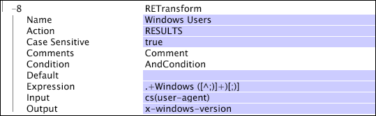

# RETransform{#retransform}

La transformation RETransform (expression régulière) est une transformation qui correspond à un modèle et qui utilise des expressions régulières pour spécifier un modèle à rechercher et à capturer dans l&#39;entrée et stocke la chaîne capturée dans un champ de sortie désigné.

Les expressions régulières sont évaluées par rapport à la chaîne d’entrée complète. Si l’entrée ne correspond pas au modèle spécifié dans l’expression régulière, aucune donnée n’est capturée. Pour un bref guide sur l&#39;utilisation des expressions régulières, voir [Expressions régulières](../../../../../home/c-dataset-const-proc/c-reg-exp.md#concept-070077baa419475094ef0469e92c5b9c).

>[!NOTE]
>
>La transformation [!DNL RETransform] fonctionne de la même manière que la transformation [!DNL REMatch] (voir [REMatch](../../../../../home/c-dataset-const-proc/c-data-trans/c-transf-types/c-standard-transf/c-rematch.md#concept-7f0b1caad1df46aabef4448f88261a8e)), qui construit un champ de sortie pour chaque sous-modèle capturé dans l&#39;expression régulière. Vous pouvez considérer [!DNL RETransform] comme une combinaison de transformations [!DNL REMatch] et [!DNL Format]. Si le paramètre Action (voir Action dans le tableau suivant) est défini sur &quot;RESULTS&quot;, [!DNL RETransform] fonctionne comme une combinaison de transformations [!DNL REMatch] et [!DNL Union].

<table id="table_51B7342E6A5E4E31913BD0F6A6ACC424"> 
 <thead> 
  <tr> 
   <th colname="col1" class="entry"> Paramètre </th> 
   <th colname="col2" class="entry"> Description </th> 
   <th colname="col3" class="entry"> Par défaut </th> 
  </tr> 
 </thead>
 <tbody> 
  <tr> 
   <td colname="col1"> Nom </td> 
   <td colname="col2"> Nom descriptif de la transformation. Vous pouvez entrer n'importe quel nom ici. </td> 
   <td colname="col3"></td> 
  </tr> 
  <tr> 
   <td colname="col1"> Commentaires </td> 
   <td colname="col2"> Facultatif. Remarques sur la transformation. </td> 
   <td colname="col3"></td> 
  </tr> 
  <tr> 
   <td colname="col1"> Condition </td> 
   <td colname="col2"> Conditions d'application de cette transformation. </td> 
   <td colname="col3"></td> 
  </tr> 
  <tr> 
   <td colname="col1"> Par défaut </td> 
   <td colname="col2"> Valeur par défaut à utiliser si la condition est remplie et que la valeur d’entrée n’est pas disponible ou que l’expression régulière ne correspond pas à la valeur d’entrée. </td> 
   <td colname="col3"></td> 
  </tr> 
  <tr> 
   <td colname="col1"> Action </td> 
   <td colname="col2"> 
Indique comment le résultat est traité. Le paramètre par défaut RESULTS prend simplement les modèles correspondants et crée un vecteur de chaînes à partir des modèles en cours d'extraction. 
 
 Il peut également s’agir d’une chaîne de formatage permettant de créer une sortie de chaîne simple d’un format particulier. Cette technique permet de spécifier le nombre correspondant à l’emplacement de chaque modèle de correspondance entre les signes %. Par exemple, le premier modèle apparié serait %1 % et le troisième modèle apparié serait %3 %. Vous pouvez spécifier d’autres caractères dans la chaîne de formatage littéralement. 
 </td> 
   <td colname="col3"> RÉSULTATS </td> 
  </tr> 
  <tr> 
   <td colname="col1"> Expression </td> 
   <td colname="col2"> Expression régulière utilisée pour la correspondance. </td> 
   <td colname="col3"></td> 
  </tr> 
  <tr> 
   <td colname="col1"> Entrée </td> 
   <td colname="col2"> Champ par rapport auquel l’expression régulière est évaluée. </td> 
   <td colname="col3"></td> 
  </tr> 
  <tr> 
   <td colname="col1"> Sortie </td> 
   <td colname="col2"> Nom de la chaîne de sortie. </td> 
   <td colname="col3"></td> 
  </tr> 
 </tbody> 
</table>

>[!NOTE]
>
>[!DNL RETransform] les transformations peuvent être très lentes et prendre en compte une grande partie du temps de traitement des données.

Cet exemple montre comment isoler la version du système d&#39;exploitation Windows utilisée par un visiteur de site Web et créer un champ x-windows-version à partir de cette valeur. Dans ce cas, la valeur de sortie serait simplement le numéro de version.

Si vous souhaitez inclure la chaîne &quot;Version&quot; devant le numéro de version pour plus de lisibilité, vous devez modifier le paramètre Action de &quot;RESULTS&quot; en &quot;Version %1%&quot;. Pour inclure un signe de pourcentage littéral (%) dans votre sortie, évitez-le avec un signe de pourcentage de seconde, comme dans &quot;%%&quot;.
