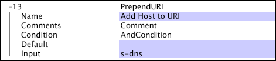

# PrependURI{#prependuri}

Tout comme la transformation AppendURI, la transformation PrependURI affecte le champ interne utilisé par le serveur de l’outil de données pour construire la dimension URI.

La [!DNL PrependURI] transformation fonctionne en ajoutant la valeur dans le champ d’entrée identifié au début de la valeur actuellement dans l’URI.

| Paramètre | Description | Par défaut |
|---|---|---|
| Nom | Nom descriptif de la transformation. Vous pouvez saisir n’importe quel nom ici. |  |
| Commentaires | Facultatif. Remarques sur la transformation. |  |
| Condition | Conditions d’application de cette transformation. |  |
| Par défaut | Valeur par défaut à utiliser si la condition est remplie et que la valeur d’entrée n’est pas disponible. |  |
| Entrée | Nom du champ dont la valeur est précédée de l’URI. |  |

L’exemple suivant montre comment placer le champ s-dns en préfixe sur l’URI, en étendant la représentation de la dimension URI pour inclure le domaine demandé par le périphérique client.

Dans cet exemple, le préfixe du champ s-dns sur l’URI

* [!DNL /modelview.asp&id=login]

renvoie l’URL suivante :

* [!DNL www.adobe.com/modelview.asp?id=login]

L’URI est maintenant étendu pour inclure le domaine demandé.
