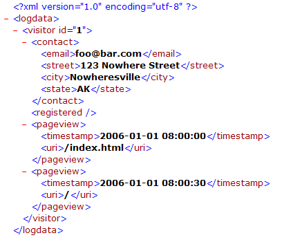

# Groupes de décodeurs XML{#xml-decoder-groups}

Traitement des fichiers XML en tant que sources de journaux pour définir les décodeurs permettant d’extraire des données du fichier XML.

>[!NOTE]
>
>La définition de groupes de décodeurs XML pour les sources de journaux XML nécessite une connaissance de la structure et du contenu du fichier XML, des données à extraire et des champs dans lesquels ces données sont stockées. Cette section fournit des descriptions de base des paramètres que vous pouvez spécifier pour les décodeurs. La manière dont vous utilisez un décodeur dépend du fichier XML contenant vos données source.

Pour plus d’informations sur la configuration requise pour les sources de journaux XML, voir Sources [de](../../../../../home/c-dataset-const-proc/c-log-proc-config-file/c-log-sources.md#concept-6714c720fac044cbb9af003bf401b2ea)journaux. Pour obtenir de l’aide sur la définition de décodeurs XML, contactez Adobe.

Le niveau supérieur d’un décodeur XML est un groupe de décodeurs (XMLDecoderGroup), qui est un ensemble de tables de décodeurs que vous utilisez pour extraire des données d’un fichier XML d’un format particulier. Si vous disposez de fichiers XML de formats différents, vous devez définir un groupe de décodeurs pour chaque format. Chaque groupe de décodeurs se compose d’une ou de plusieurs tables de décodeurs.

Le tableau suivant décrit le paramètre Tables et tous les sous-paramètres que vous devez spécifier pour définir un groupe de décodeurs XML.

<table id="table_06C40C5149E94548A1B0C2ED4397624B"> 
 <thead> 
  <tr> 
   <th colname="col1" class="entry"> Paramètre </th> 
   <th colname="col2" class="entry"> Description </th> 
  </tr> 
 </thead>
 <tbody> 
  <tr> 
   <td colname="col1"> Tableaux </td> 
   <td colname="col2"> <p>Chaque tableau d’un groupe de décodeurs représente un niveau de données à extraire du fichier XML. Par exemple, si vous souhaitez extraire des données sur les visiteurs, vous devez créer un tableau de décodeur contenant les informations que vous souhaitez extraire pour chaque visiteur. Vous pouvez également créer des tableaux de décodeur dans les tableaux de décodeur (voir la section Enfants). </p> <p> <b>Pour ajouter un tableau à un groupe de décodeurs</b> 
     <ul id="ul_C73CAD77440B4465B9FCE08BF4FA0749"> 
      <li id="li_C4B8CC5A85D942898F1EB76778105818"> Cliquez avec le bouton droit de la souris sur <span class="uicontrol"> Tableaux </span> , puis cliquez sur <span class="uicontrol"> Ajouter un nouveau </span> &gt; <span class="uicontrol"> XMLDecoderTable </span>. </li> 
     </ul> </p> </td> 
  </tr> 
  <tr> 
   <td colname="col1"> Champs </td> 
   <td colname="col2"> <p>Champs étendus (par exemple, x-trackingid, x-email) dans lesquels les données sont stockées. Les données à stocker dans le champ sont déterminées par les sous-champs Chemin et/ou Opération. </p> <p> Le chemin d’accès correspond au niveau du champ dans le fichier XML structuré. Le chemin d’un champ est relatif au chemin du tableau dans lequel il est défini. Par exemple, <span class="filepath"> tag.tag.tag </span> ou <span class="filepath"> .tag.tag.tag.@attribute </span>. Notez que les chemins sont sensibles à la casse. </p> <p> Une opération est appliquée à chaque ligne du chemin spécifié pour produire une sortie. Les opérations suivantes sont disponibles : 
     <ul id="ul_B264A411D7E3446288E7E69D62150B8B"> 
      <li id="li_5936E81C0EEF46AFB780E451A04A88E4"><b>DERNIÈRE :</b> Le champ prend la valeur de la dernière occurrence du chemin d’accès dans le fichier XML. </li> 
      <li id="li_7BC4F24F2CA84C2EB64B06FE09B4CAF6"><b>RANDOM :</b> Attribue une valeur aléatoire au champ. Cette opération est utile si vous devez générer un identifiant unique, par exemple pour le champ x-trackingid. </li> 
      <li id="li_C1D34EA11BFB4859A25A275A9B63FB56"><b>HÉRITE :</b> Le champ défini hérite de sa valeur du champ correspondant de la table parente. </li> 
      <li id="li_F62FB8CD962E4E1495D9A2D5B7A78E2A"><b>"<i>constant </i>" :</b> La constante doit être entourée de guillemets. Vous pouvez utiliser une opération constante pour vérifier l’existence d’un chemin particulier ; si le chemin existe, la valeur de la constante est affectée au champ. </li> 
     </ul> </p> <p> <b>Pour ajouter un champ à un tableau de décodeur</b> </p> <p> 
     <ul id="ul_91D104D927424DEA9E788E43B2F6FEA9"> 
      <li id="li_5448B01EE82349569BBFC99C9604D7B8"> Cliquez avec le bouton droit sur <span class="uicontrol"> Champs </span>, puis cliquez sur <span class="uicontrol"> Ajouter un nouveau </span> &gt; <span class="uicontrol"> XMLDecoderField </span>. Définissez le champ, l’opération et le chemin d’accès selon les besoins. </li> 
     </ul> </p> </td> 
  </tr> 
  <tr> 
   <td colname="col1"> Chemin d’accès </td> 
   <td colname="col2"> <p>Niveau du fichier XML structuré pour lequel le tableau du décodeur contient des informations. Pour un tableau de décodeur XML enfant, le chemin d’accès est relatif au chemin d’accès du tableau parent. Notez que les chemins sont sensibles à la casse. </p> <p> Par exemple, si votre fichier XML contient la structure : </p> 

    &amp;lt;visitor&amp;gt;
    
    &amp;nbsp;
    
    ...
    
    &amp;nbsp;
    
    &amp;lt;/visitor&amp;gt;
    
    &amp;lt;/logdata&amp;gt;&amp;nbsp; &lt;/code> &lt;p> alors le chemin serait &lt;span class=&quot;filepath&quot;> logdata.visitor &lt;/span>. &lt;/p> &lt;/td>
</tr> 
  <tr> 
   <td colname="col1"> Tableau </td> 
   <td colname="col2"> <p>La valeur de ce paramètre doit toujours être "Log Entry". </p> <p> <p>Remarque :  Ne modifiez pas cette valeur sans consulter Adobe. </p> </p> </td> 
  </tr> 
  <tr> 
   <td colname="col1"> Enfants </td> 
   <td colname="col2"> <p>Facultatif. Une ou plusieurs tables de décodeur incorporées. Chaque enfant comprend les paramètres Champs, Chemin et Tableau décrits ci-dessus. </p> <p> <b>Pour ajouter un enfant à une table de décodeur</b> </p> <p> 
     <ul id="ul_902AC6CA5D66457D84CBA3194FF49BBE"> 
      <li id="li_07B4D60E7E2E4630B4878691E575936A"> Cliquez avec le bouton droit de la souris sur <span class="uicontrol"> Enfants </span> et cliquez sur <span class="uicontrol"> Ajouter un nouveau </span> &gt; <span class="uicontrol"> XMLDecoderTable </span>. Définissez le champ, l’opération et le chemin d’accès selon les besoins. </li> 
     </ul> </p> </td> 
  </tr> 
 </tbody> 
</table>

Pour utiliser un fichier XML comme source de journal pour un jeu de données, les groupes de décodeurs XML et les tableaux doivent être définis pour extraire les informations à traiter dans le jeu de données. Dans cet exemple, vous pouvez voir comment définir des groupes de décodeurs et des tableaux pour un exemple de source de journal XML pour un jeu de données Web.

Le fichier XML suivant contient des informations sur un visiteur de site Web, notamment un ID Experience Cloud, une adresse électronique, une adresse physique et des informations sur les pages vues par le visiteur.



Puisque nous disposons d’un seul fichier XML, nous n’avons besoin que d’un seul groupe de décodeurs, que nous appelons &quot;Exemple de format XML&quot;. Ce groupe de décodeurs s’applique à tous les autres fichiers XML du même format que ce fichier. Pour commencer à construire des tables de décodeur XML dans ce groupe de décodeurs, nous devons d’abord déterminer les informations que nous voulons extraire et les champs dans lesquels les données seront stockées.

Dans cet exemple, nous extrayons des informations sur le visiteur et les pages vues associées à ce visiteur. Pour ce faire, nous créons une table de décodeur XML de niveau supérieur (parent) avec des informations sur le visiteur et une table de décodeur XML (enfant) incorporée avec des informations sur les pages vues de ce visiteur.

**Les informations du tableau parent (visiteur) sont les suivantes :**

* Identifiant de type de données pour chaque ligne de données dans le fichier XML. Nous utilisons VISITOR comme identifiant afin de pouvoir identifier rapidement les lignes de données relatives au visiteur et non aux pages vues. Nous pouvons stocker cette valeur dans le champ x-rowtype.
* Identifiant du visiteur, que nous stockons dans le champ x-trackingid.
* Adresse électronique du visiteur (contact.email), que nous stockons dans le champ x-email.
* Statut d’enregistrement du visiteur. Si le visiteur est un utilisateur enregistré, nous pouvons stocker la valeur &quot;1&quot; dans le champ x-is-register.
* La valeur Chemin est [!DNL logdata.visitor], et la valeur Table [!DNL Log Entry]. Pour plus d’informations sur ces paramètres, voir le tableau XMLDecoderGroup ci-dessus.

**Les informations relatives au tableau enfant (pages vues) sont les suivantes :**

* Identifiant de type de données pour chaque ligne de données dans le fichier XML. Nous utilisons &quot;PAGEVIEW&quot; comme identifiant afin que nous puissions identifier rapidement les lignes de données relatives aux pages vues du visiteur et non pas seulement au visiteur. Cette valeur est stockée dans le champ x-rowtype.
* Identifiant du visiteur. Cette valeur est héritée de la table parente et stockée dans le champ x-trackingid.
* Horodatage de chaque page vue, qui est stocké dans le champ x-event-time.
* URI de chaque page vue, stockée dans le champ cs-uri-tige.
* La valeur Chemin est pageview et la valeur Table est &quot;Log Entry&quot;. Pour plus d’informations sur ces paramètres, voir le tableau XMLDecoderGroup ci-dessus.

La capture d’écran suivante montre une partie du [!DNL Log Processing Dataset Include] fichier avec le groupe de décodeurs XML résultant pour l’exemple de fichier XML en fonction de la structure discutée des tableaux de décodeurs XML parent et enfant.


Un tableau présentant la sortie de ce décodeur pour notre exemple de fichier XML ressemble à ce qui suit :

| x-rowtype | cs—uri-stem | x-email | x-is-register | x-event-time | x-tracking-id |
|---|---|---|---|---|---|
| VISITEUR |  | foo@bar.com | 1 |  | 1 |
| PAGEVIEW | /index.html |  |  | 2006-01-01 08:00:00 | 1 |
| PAGEVIEW | / |  |  | 2006-01-01 08:00:30 | 1 |

Vous pouvez créer un tableau comme celui ci-dessus dans l’outil de données à l’aide d’une interface de lecteur de champ. Pour plus d’informations sur l’interface du lecteur de champ, voir Outils [de configuration des jeux de](../../../../../home/c-dataset-const-proc/c-dataset-config-tools/c-dataset-config-tools.md#concept-6e058b7691834cf79dcfd1573f78d4f5)données.

## Utilisation de #value sur un élément XML pour lire sa valeur d’attribut {#section-88758428afb94f0baa5a986604d53bc1}

You can now use the **[!DNL #value]** tag in XML paths to pull the value of an XML element.

Par exemple, si vous spécifiez précédemment un chemin d’accès de **`<Hit><Page name="Home Page" index="20">home.html</Page></Hit>`** sorte que vous ne puissiez pas lire la valeur de la `<Page>` balise . Pour lire la valeur d’une `<Page>` balise et ses attributs, vous pouvez utiliser [!DNL Hit.Page.@name] et [!DNL Hit.Page.@index] respectivement. Vous pouvez également extraire la valeur de la balise à l’aide de **`Hit.Page.#value`** l’expression.

Par exemple, vous pouvez lire la valeur de la balise `<varValue>` en ajoutant le champ suivant dans le décodeur :

```
7 = XMLDecoderField: 
Field = string: x-varvalue-name-added 
Operation = string: LAST 
Path = string:  
<b>#value</b> 
Path = string: varValue 
Table = string: Log Entry
```

De même, vous pouvez lire la valeur de la balise `<Rep>` en ajoutant le champ suivant dans le décodeur :

```
7 = XMLDecoderField: 
Field = string: x-rep-name-added 
Operation = string: LAST 
Path = string: Rep.# 
<b>value</b> 
Path = string: Reps 
Table = string: Log Entry
```

En revanche, pour lire la valeur de la balise d’élément sans attribut, une balise `<text>` sous une `<line>` balise et sa valeur peuvent être lues directement en donnant &quot; [!DNL text]&quot; dans un chemin d’accès ou en utilisant [!DNL line.text], selon la manière dont vous avez créé le décodeur.

```
2 = XMLDecoderField: 
Field = string: x-chat-text 
Operation = string: LAST 
Path = string:  
<b>text</b> 
Path = string:  
<b>line</b> 
Table = string: Log Entry
```

