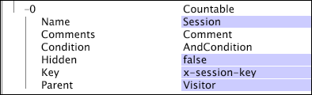

# Dimensions dénombrables{#countable-dimensions}

Les éléments d’une dimension dénombrable peuvent être comptabilisés par le système.

Les dimensions dénombrables sont généralement utilisées pour créer des mesures de somme, qui renvoient le nombre, ou la somme, de tous les éléments de la dimension. Vous pouvez définir des dimensions dénombrables pour comptabiliser des instances telles que les réservations ou les commandes de produits. Par exemple, vous pouvez définir la dimension dénombrable Commandes dont les éléments (entrées de journal correspondant aux commandes de votre boutique en ligne) peuvent être comptabilisés. Si vous souhaitez afficher un nombre de commandes dans une visualisation, vous pouvez définir la mesure Somme des commandes , qui peut être évaluée sur une dimension ou pour laquelle des filtres sont appliqués.

Les dimensions dénombrables peuvent entretenir des relations de type parents/enfants.

>[!NOTE]
>
>Si vous avez besoin d’une dimension qui ne fournit qu’un décompte de quelque chose, vous devez utiliser une dimension numérique avec une opération COUNT. Voir [Dimensions numériques](../../../../home/c-dataset-const-proc/c-ex-dim/c-types-ex-dim/c-num-dim.md#concept-8513b9afaff447c8b334410b565b91ed).

Les dimensions dénombrables sont définies par les paramètres suivants :

<table id="table_9F3F093F5B074EA68CA4DCE731161F6C"> 
 <thead> 
  <tr> 
   <th colname="col1" class="entry"> Paramètre </th> 
   <th colname="col2" class="entry"> Description </th> 
   <th colname="col3" class="entry"> Par défaut </th> 
  </tr> 
 </thead>
 <tbody> 
  <tr> 
   <td colname="col1"> Nom </td> 
   <td colname="col2"> Nom descriptif de la dimension tel qu’il apparaît à l’utilisateur dans Data Workbench. Le nom de la dimension ne peut pas contenir de trait d’union (-). </td> 
   <td colname="col3"> </td> 
  </tr> 
  <tr> 
   <td colname="col1"> Commentaires </td> 
   <td colname="col2"> Facultatif. Remarques sur la dimension étendue. </td> 
   <td colname="col3"> </td> 
  </tr> 
  <tr> 
   <td colname="col1"> Condition </td> 
   <td colname="col2"> Les conditions dans lesquelles le champ de saisie contribue à la création de la dimension dénombrable. Si elle est spécifiée, une condition limite l’ensemble des entrées de journal visibles pour la dimension et tous ses enfants dans le schéma du jeu de données. </td> 
   <td colname="col3"> </td> 
  </tr> 
  <tr> 
   <td colname="col1"> Masqué </td> 
   <td colname="col2"> Détermine si la dimension apparaît dans l’interface de Data Workbench. Par défaut, ce paramètre est défini sur false. Si, par exemple, la dimension doit être utilisée uniquement comme base d’une mesure, vous pouvez définir ce paramètre sur true pour masquer la dimension de l’affichage Data Workbench. </td> 
   <td colname="col3"> false </td> 
  </tr> 
  <tr> 
   <td colname="col1"> Clé </td> 
   <td colname="col2"> 
Facultatif. Nom du champ à utiliser comme clé. Si vous définissez ce paramètre, il existe un élément de la dimension dénombrable pour chaque combinaison d’un élément du parent de la dimension dénombrable et une valeur distincte du champ spécifié comme clé. 
 
 Chaque élément de la dimension dénombrable doit être associé à un ensemble contigu d’entrées de journal. Par conséquent, si les entrées du journal ne sont pas triées par la clé, un élément de la dimension dénombrable est créé chaque fois que le champ clé change. Pour éviter cette situation, Adobe vous recommande d’utiliser une clé unique contiguë dans l’ordre du temps. 
 </td> 
   <td colname="col3"> </td> 
  </tr> 
  <tr> 
   <td colname="col1"> Parent </td> 
   <td colname="col2"> 
Nom de la dimension parent. Toute dimension dénombrable peut être une dimension parente. Pour faire d’une dimension la dimension de niveau supérieur dans le schéma du jeu de données, définissez le paramètre sur "root". La dimension définie devient la dimension dénombrable racine du jeu de données. Par exemple, si vous utilisez Site, la dimension Visiteur est la dimension dénombrable racine de votre jeu de données. 
 
 
Remarque :  Bien que la dimension dénombrable racine n’ait pas à être associée aux ID de suivi dans les données, Adobe vous recommande de configurer la dimension dénombrable racine du jeu de données afin d’utiliser le champ ID de suivi (x-trackingid) comme clé. Par conséquent, chaque élément du dénombrable racine est associé à une valeur unique de x-trackingid, et toutes les données de chaque élément sont regroupées. Si vous souhaitez configurer votre jeu de données différemment, contactez Adobe. 
 
 </td> 
   <td colname="col3"> </td> 
  </tr> 
 </tbody> 
</table>

Cet exemple illustre la définition d’une dimension dénombrable à l’aide des données d’événement collectées à partir du trafic du site web. La dimension dénombrable comptabilise les événements de campagne web au cours d’une session donnée. Il est supposé que toutes les ressources de campagne par e-mail sont demandées au serveur web avec &quot;email=&quot; dans le cadre de la requête cs-uri. Dans cet exemple, le nombre de fois où le visiteur répond à une campagne par courrier électronique au cours d’une session donnée est intéressant, et non la valeur réelle du champ cs-uri-query(email) .

Cet exemple illustre également la définition d’une dimension dénombrable à l’aide des données d’événement collectées à partir du trafic du site web, mais avec un paramètre Clé défini. La dimension dénombrable Session utilise le champ x-session-key comme clé. (Le champ x-session-key est la sortie de la transformation [!DNL Sessionize] et a une valeur unique pour chaque session.) Chaque combinaison unique d’un élément de la dimension Visiteur (le parent) et du champ x-session-key est un élément de la dimension Session .

