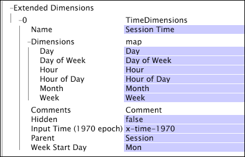

# Dimensions Heure{#time-dimensions}

{{eol}}

Une dimension temporelle vous permet de créer un ensemble de dimensions temporelles locales absolues ou périodiques (telles que Jour, Jour de la semaine, Heure du jour, Heure de la réservation, etc.) en fonction de n’importe quel champ d’horodatage que vous spécifiez pour le paramètre Heure d’entrée (époque de 1970).

Lorsque vous définissez ces dimensions, vous pouvez également faire débuter la semaine par un autre jour que le lundi en indiquant le paramètre Premier jour de la semaine. Vous pouvez définir plusieurs jeux de dimensions temporelles dans votre jeu de données tant que les dimensions portent des noms différents.

Les dimensions temporelles sont définies par les paramètres suivants :

<table id="table_9734F6CD7ABA4661A2F9A5FB948A7282"> 
 <thead> 
  <tr> 
   <th colname="col1" class="entry"> Paramètre </th> 
   <th colname="col2" class="entry"> Description </th> 
   <th colname="col3" class="entry"> Par défaut </th> 
  </tr> 
 </thead>
 <tbody> 
  <tr> 
   <td colname="col1"> Nom </td> 
   <td colname="col2"> Nom descriptif de la dimension tel qu’il apparaît dans Data Workbench. Le nom de la dimension ne peut pas contenir de trait d’union (-). </td> 
   <td colname="col3"> </td> 
  </tr> 
  <tr> 
   <td colname="col1"> Commentaires </td> 
   <td colname="col2"> Facultatif. Remarques sur la dimension étendue. </td> 
   <td colname="col3"> </td> 
  </tr> 
  <tr> 
   <td colname="col1"> Dimensions </td> 
   <td colname="col2"> 
Vous pouvez spécifier des noms de dimension pour l’une des périodes suivantes : 
 
 
     <ul id="ul_EB0837DD66BE4004A615A6029EEF4CD5"> 
      <li id="li_2E46E6DB004E443C8CC831DCEE743D60"> Jour </li> 
      <li id="li_F59A27779EBE4E2A84E0972EE8BCDFA7"> Jour de la semaine </li> 
      <li id="li_7D74CD547ED1449091EF7B2E0E8C46DE"> Heure </li> 
      <li id="li_706AF9D385CB44C098DEBACA3BA2CD4B"> Heure du jour </li> 
      <li id="li_76FBF69B25954885A0192D308A155E41"> Mois </li> 
      <li id="li_3C16955BE5C54291A25E25CD31259661"> Semaine </li> 
     </ul> 
 
 Les noms que vous saisissez ici sont ceux qui apparaissent dans les menus des dimensions et dans les visualisations dans Data Workbench. Si vous laissez le nom d’une dimension temporelle vide, la dimension n’est pas créée dans le jeu de données. 
 </td> 
   <td colname="col3"> </td> 
  </tr> 
  <tr> 
   <td colname="col1"> Masqué </td> 
   <td colname="col2"> Détermine si la dimension apparaît dans l’interface de Data Workbench. Par défaut, ce paramètre est défini sur false. Si, par exemple, la dimension doit être utilisée uniquement comme base d’une mesure, vous pouvez définir ce paramètre sur true pour masquer la dimension de l’affichage Data Workbench. </td> 
   <td colname="col3"> true </td> 
  </tr> 
  <tr> 
   <td colname="col1"> Temps d’entrée (époque 1970) </td> 
   <td colname="col2"> 
Nom du champ d’horodatage à utiliser comme entrée. 
 
 
Remarque : Les valeurs du champ doivent représenter le nombre de secondes écoulées depuis le 1er janvier 1970, à 00:00:01. Si l’heure d’entrée n’est pas une heure valide (de 1970 à 2037), le processus de transformation échoue et le serveur Data Workbench génère une erreur. 
 
 </td> 
   <td colname="col3"> </td> 
  </tr> 
  <tr> 
   <td colname="col1"> Parent </td> 
   <td colname="col2"> Nom de la dimension parent. Toute dimension dénombrable peut être une dimension parente. Pour les données web, le parent est Session. </td> 
   <td colname="col3"> </td> 
  </tr> 
  <tr> 
   <td colname="col1"> Jour de début de semaine </td> 
   <td colname="col2"> 
Jour à utiliser comme premier jour d’une semaine. 
 
 Ce paramètre affecte la dimension Semaine, la dimension Jour de la semaine et les dimensions de temps de création de rapports définies en termes de semaines. 
 </td> 
   <td colname="col3"> Lun </td> 
  </tr> 
 </tbody> 
</table>

Cet exemple crée un ensemble de dimensions temporelles en fonction du champ de saisie défini par l’utilisateur x-time-1970. Le jeu de dimensions temporelles est appelé &quot;Session Time&quot; (Durée de la session). Comme le parent de chaque dimension est la dimension Session , chaque élément des dimensions temporelles correspond à l’heure à laquelle une session a commencé. Le paramètre Jour de début de semaine indique que chaque semaine de la dimension Semaine commence le lundi.

