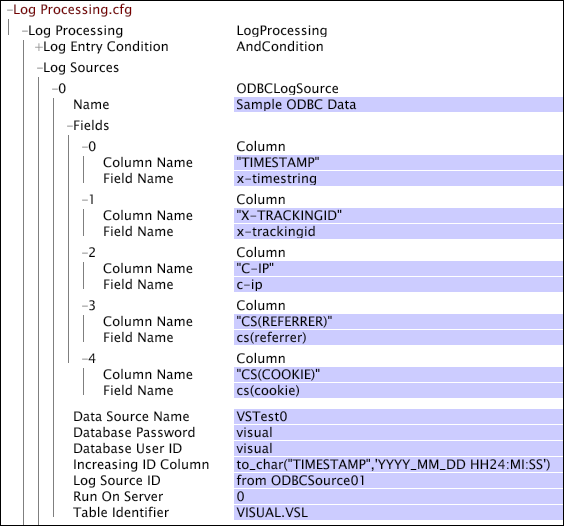

# Sources de données ODBC{#odbc-data-sources}

Le serveur Data Workbench (InsightServer64.exe) peut lire les données d’événement de toute base de données SQL (par exemple, Oracle ou Microsoft SQL Server) qui possède un pilote compatible ODBC 3.0.

La prise en charge ODBC du serveur Data Workbench est similaire à la prise en charge existante pour le chargement de données à partir de Capteurs ou de fichiers journaux générés par des processus externes. Il existe toutefois d’autres considérations et limitations :

* La prise en charge ODBC du serveur Data Workbench est compatible avec les fonctionnalités de mise en grappe. Les données sont réparties entre tous les serveurs de traitement et tous les traitements ultérieurs (y compris le traitement des requêtes) bénéficient entièrement de la mise en grappe.
* La prise en charge d’ODBC dépend de pilotes ODBC tiers. Pour que la prise en charge d’ODBC fonctionne, ces pilotes doivent être configurés sur l’ordinateur sur lequel le serveur Data Workbench s’exécute, à l’aide d’outils externes à la plateforme Adobe. Les machines Data Workbench ne nécessitent aucune configuration supplémentaire.
* La table ou la vue à partir de laquelle les données sont chargées doit comporter une colonne d’identifiant croissante. Pour toute ligne, la valeur de cette colonne (qui peut être une colonne réelle dans le tableau ou toute expression de colonne SQL) ne doit pas diminuer lorsque de nouvelles lignes sont insérées dans la base de données. Si cette contrainte est enfreinte, les données sont perdues. Pour des performances adéquates, un index est requis sur cette expression de colonne ou de colonne.

   >[!NOTE]
   >
   >Il est possible que plusieurs lignes aient la même valeur dans la colonne [!DNL Increasing ID]. Une possibilité est une colonne d’horodatage avec une précision moins que parfaite.

* Le serveur Data Workbench ne peut pas charger de colonnes avec des données longues (données supérieures à une certaine longueur, comme déterminé par l’application de base de données spécifique en cours d’utilisation).
* La récupération des données d’une base de données est plus lente que la lecture d’un fichier de disque. Le traitement des jeux de données qui chargent des données à partir d’une source ODBC prend beaucoup plus de temps (en particulier lors du retraitement) que les jeux de données de taille équivalente dont les données proviennent de Capteurs ou d’autres fichiers de disque.

Pour plus d’informations sur le retraitement de vos données, voir [Retraitement et retransformation](../../../home/c-dataset-const-proc/c-reproc-retrans/c-unst-reproc-retrans.md).

**Pour configurer le serveur Insight pour ODBC[!DNL event data]**

La configuration du serveur Data Workbench pour charger les données d’une base de données SQL requiert d’abord les étapes suivantes dans l’ordre :

1. Installez le logiciel client de base de données approprié, y compris un pilote ODBC, sur l’ordinateur serveur Data Workbench sur lequel le jeu de données est traité.

   >[!NOTE]
   >
   >Si vous chargez des données d’événement ODBC à des fins de traitement sur une grappe de serveurs Data Workbench, vous devez installer le logiciel client de base de données sur tous les serveurs de traitement de la grappe. Pour plus d’informations sur la spécification des serveurs de traitement dans une grappe, consultez le *Guide d’installation et d’administration des produits serveur*.

1. Configurez une source de données à l’aide de l’administrateur de source de données ODBC pour Windows.

   Il est important de noter que le serveur Data Workbench (InsightServer64.exe) s’exécute en tant que service Windows. Par conséquent, la source de données doit généralement être configurée en tant que DSN système plutôt qu’en tant que DSN utilisateur pour que le serveur Data Workbench puisse l’utiliser. Vous trouverez plus d’informations sur cette étape de configuration dans la documentation de votre logiciel de base de données.

Après avoir installé le logiciel client de base de données sur l’ordinateur serveur approprié de Data Workbench, vous pouvez configurer le jeu de données pour utiliser la source de données ODBC en modifiant les paramètres appropriés dans le fichier de configuration [!DNL Log Processing] pour le profil souhaité.

## Paramètres {#section-15c0218d93364693a565f2609a12f73e}

Pour les données de bases de données utilisant la norme ODBC (Open Database Connectivity), les paramètres suivants sont disponibles :

<table id="table_606D8A90DA4A43C29F2C6130F8C753F8"> 
 <thead> 
  <tr> 
   <th colname="col1" class="entry"> Paramètre </th> 
   <th colname="col2" class="entry"> Description </th> 
  </tr> 
 </thead>
 <tbody> 
  <tr> 
   <td colname="col1"> Nom </td> 
   <td colname="col2"> Identifiant de la source ODBC. </td> 
  </tr> 
  <tr> 
   <td colname="col1"> Nom de la source de données </td> 
   <td colname="col2"> Un DSN, fourni par un administrateur de l’ordinateur serveur Data Workbench sur lequel le jeu de données est traité, qui fait référence à la base de données à partir de laquelle les données doivent être chargées. </td> 
  </tr> 
  <tr> 
   <td colname="col1"> Mot de passe de la base de données </td> 
   <td colname="col2"> mot de passe à utiliser lors de la connexion à la base de données. Si un mot de passe a été configuré pour le DSN dans  Administrateur de source de données, il peut rester vide. Tout mot de passe fourni ici remplace le mot de passe configuré pour le DSN dans  Administrateur de source de données. </td> 
  </tr> 
  <tr> 
   <td colname="col1"> Identifiant utilisateur de base de données </td> 
   <td colname="col2"> Identifiant utilisateur à utiliser lors de la connexion à la base de données. Si un ID utilisateur a été configuré pour le DSN dans  Administrateur de source de données, ce champ peut rester vide. Tout ID utilisateur fourni ici remplace l’ID utilisateur configuré pour le DSN dans  Administrateur de source de données. </td> 
  </tr> 
  <tr> 
   <td colname="col1"> Champs </td> 
   <td colname="col2"> Un vecteur d’objets column qui spécifie un mappage entre les colonnes de données de la base de données et les champs de données dans le moteur d’exécution du serveur Data Workbench. Chaque colonne contient des entrées  Nom de colonne et  Nom de champ.  Le  nom de colonne est une expression de colonne SQL qui doit être valide dans le contexte du tableau identifié par l’  identifiant de tableau  décrit ci-dessus. Il peut s’agir d’un nom de colonne ou d’une expression SQL en fonction d’un nombre indéfini de colonnes dans la table. Une fonction de formatage peut être nécessaire pour convertir des valeurs de certains types de données en chaînes d’une manière qui ne perde pas de précision. Toutes les données sont implicitement converties en chaînes à l’aide de la méthode de formatage par défaut de la base de données, ce qui peut entraîner une perte de données pour certains types de données de colonne (types de données date/heure, par exemple) si des expressions de formatage explicites ne sont pas utilisées. </td> 
  </tr> 
  <tr> 
   <td colname="col1"> Augmentation de la colonne d’ID </td> 
   <td colname="col2"> 
Un nom de colonne ou une expression de colonne SQL qui répond au critère selon lequel il augmente (ou du moins ne diminue pas) lorsque de nouvelles lignes sont ajoutées. En d’autres termes, si la ligne B est ajoutée au tableau à une date ultérieure à la ligne A, la valeur de cette colonne (ou expression de colonne) de la ligne B doit être supérieure (selon l’ordre de tri natif de la base de données) à la valeur correspondante de la ligne A. 
 
 
     <ul id="ul_EBF6AEE4746B41B3B5BB6CC74194DAED"> 
      <li id="li_A5C9BE52B01649DE9726ECEC68B99828"> Le nom  Colonne d’identifiant incrémentée peut être identique au nom d’une colonne existante, mais il n’est pas nécessaire de l’être. </li> 
      <li id="li_CF69EAB4AFB14F4894F7A5CDCAF06947"> Cette expression est supposée comporter un type de données de caractères SQL. Si la colonne d’ID réellement croissante est d’un autre type de données, cette valeur doit être une expression de colonne pour la convertir en chaîne. Cela signifie généralement que les comparaisons sont lexicographiques (caractère par caractère), il est important de formater la valeur avec soin. </li> 
      <li id="li_58977431962E48039C898CFC47C53323"> L’expression est utilisée dans les clauses SQL ORDER BY et comparée à dans les clauses SQL WHERE. Il est très important de créer un index sur l’expression exacte de la colonne utilisée. </li> 
     </ul> 
 </td> 
  </tr> 
  <tr> 
   <td colname="col1"> Identifiant de source de journal </td> 
   <td colname="col2"> 
La valeur de ce paramètre peut être n’importe quelle chaîne. Si une valeur est spécifiée, ce paramètre permet de différencier les entrées de journal de différentes sources de journal pour l’identification de la source ou le traitement ciblé. Le champ x-log-source-id est renseigné avec une valeur identifiant la source du journal pour chaque entrée de journal. Par exemple, si vous souhaitez identifier les entrées de journal à partir d’une source ODBC nommée ODBCSource01, vous pouvez saisir  à partir de ODBCSource01. et cette chaîne serait transmise au champ x-log-source-id pour chaque entrée de journal provenant de cette source. 
 
 Pour plus d’informations sur le champ x-log-source-id, voir <a href="../../../home/c-dataset-const-proc/c-ev-data-rec-fields.md#concept-06bda4be1a4649a2905a4422e9e6c42f"> Champs d’enregistrement des données d’événement</a>. 
 </td> 
  </tr> 
  <tr> 
   <td colname="col1"> Exécuter sur le serveur </td> 
   <td colname="col2"> Valeur d’index dans le fichier  profile.cfg du serveur de traitement qui effectue les requêtes ODBC pour obtenir des données de la base de données. (Le paramètre Serveurs de traitement du fichier  profile.cfg répertorie tous les serveurs de traitement du jeu de données, et chaque serveur possède une valeur d’index, la première étant 0.) La valeur par défaut est 0. </td> 
  </tr> 
  <tr> 
   <td colname="col1"> Identifiant de tableau </td> 
   <td colname="col2"> Une expression SQL qui nomme la table ou la vue à partir de laquelle les données doivent être chargées. Un identifiant de tableau standard est du formulaire SCHEMA.TABLE. </td> 
  </tr> 
 </tbody> 
</table>

Cet exemple présente la fenêtre de configuration [!DNL Log Processing] dans Data Workbench avec une source de données ODBC. Cette source de données récupère les données d’une table appelée [!DNL VISUAL.VSL] dans une base de données avec [!DNL Data Source Name] &quot;VSTestO&quot;. Cinq (5) objets de colonne ( [!DNL Fields]) mettent en correspondance les données des colonnes de données de la base de données avec le serveur Data Workbench.

