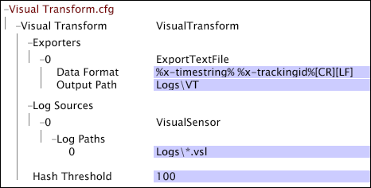

# Exemple de fichier Transform.cfg Data Workbench{#sample-data-workbench-transform-cfg-files}

{{eol}}

Informations sur la spécification des paramètres dans le fichier Transform.cfg en fonction des différents scénarios.

* [Un fichier Transform.cfg simple Insight](../../../../../home/c-dataset-const-proc/c-transf-func/c-config-files-transf/t-ins-transf-file/c-sample-transf-files.md#section-b7e83cafa3a947c597bd09d316930190)
* [Sortie avec des valeurs séparées par des virgules](../../../../../home/c-dataset-const-proc/c-transf-func/c-config-files-transf/t-ins-transf-file/c-sample-transf-files.md#section-03916934ad574efc8695abbae54a1816)
* [Fichiers journaux échantillonnés](../../../../../home/c-dataset-const-proc/c-transf-func/c-config-files-transf/t-ins-transf-file/c-sample-transf-files.md#section-113b3b0c0c7547ea9536bb2f465c0875)
* [Division des fichiers journaux par section de site Web](../../../../../home/c-dataset-const-proc/c-transf-func/c-config-files-transf/t-ins-transf-file/c-sample-transf-files.md#section-2cac205cd3934d31abb6c6ed8780196d)

Dans chaque exemple, le fichier s’affiche sous la forme d’un [!DNL Transform.cfg] dans data workbench.

## Un fichier Transform.cfg de Data Workbench simple {#section-b7e83cafa3a947c597bd09d316930190}

Les éléments suivants [!DNL Transform.cfg] fournit des instructions à lire. [!DNL .vsl] des fichiers [!DNL Logs] et exporter les champs x-timestring et x-trackingid vers un fichier texte stocké dans le répertoire Logs\VT . Comme aucune période de rotation de fichier ni aucun format de nom de fichier de sortie n’est spécifié, chaque fichier contient des données pour un jour calendaire et un nom au format par défaut. [!DNL %yyyy%%mm%%dd%-%x-mask%.txt].

## Sortie avec des valeurs séparées par des virgules {#section-03916934ad574efc8695abbae54a1816}

Les éléments suivants [!DNL Transform.cfg] fournit des instructions à lire. [!DNL .vsl] des fichiers du répertoire Journaux et exportez les champs 0 à 13 vers une valeur délimitée par des virgules ( [!DNL .csv]) stocké dans le répertoire Logs\VT\CSV. Comme aucune période de rotation de fichier n’est spécifiée, chaque fichier contient des données pour un jour calendaire. Les fichiers de sortie sont : [!DNL .csv] fichiers nommés au format [!DNL %yyyy%%mm%%dd%-%x-mask%.csv].

## Exemples de fichiers journaux {#section-113b3b0c0c7547ea9536bb2f465c0875}

Vous pouvez configurer la fonctionnalité de transformation pour créer et gérer une version compacte et à jour de vos fichiers journaux complets. Cela vous permet de tester rapidement les configurations de vos jeux de données, avec des temps de retraitement de secondes ou minutes au lieu des heures nécessaires pour retraiter l’ensemble du jeu de données. L’exemple suivant illustre la configuration de la fonctionnalité de transformation pour ce faire.

Les éléments suivants [!DNL Transform.cfg] fournit des instructions à lire. [!DNL .vsl] à partir du répertoire Journaux et exportez les champs x-timestring et x-trackingid vers un fichier texte stocké dans le répertoire Logs\VT . Le seuil de hachage spécifié filtre certains identifiants de suivi du jeu de données, créant ainsi un jeu de données échantillonné par un facteur 100. Comme aucune période de rotation de fichier n’est spécifiée, chaque fichier contient des données pour un jour calendaire. Les noms des fichiers de sortie sont au format par défaut. [!DNL %yyyy%%mm%%dd%-%x-mask%.txt].

## Division des fichiers journaux par section de site Web {#section-2cac205cd3934d31abb6c6ed8780196d}

Les éléments suivants [!DNL Transform.cfg] fournit des instructions à lire. [!DNL .vsl]à partir du répertoire Journaux et exportez les champs x-timestring et x-trackingid vers un fichier texte stocké dans le répertoire Logs\VT . Transformation de l’expression régulière ( [!DNL RETransform]) prend comme entrée le champ cs-uri-stem et crée un nouveau champ (x-site) qui définit une section du site. Le champ x-site est inclus dans le nom des fichiers texte de sortie, dont chacun contient des données pour un jour calendaire.

