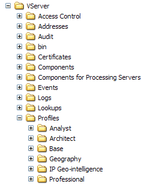

# Installation du profil du service de données{#installing-the-data-service-profile}

Les profils de service de données (Géo-intelligence IP et Géolocalisation IP) sont des profils internes qui fournissent des fonctionnalités supplémentaires à votre application Adobe.

Comme pour tous les autres profils internes fournis par Adobe, ces profils ne doivent pas être modifiés. Toute personnalisation doit se produire dans votre jeu de données, dans vos profils spécifiques au rôle ou dans d’autres profils que vous créez.

Les profils de service de données incluent les fichiers à installer sur un serveur de l’outil de données :

* **Profils\*nom *du profil \Dataset\Log Processing\Traffic\IP.cfg:** Répertorie le champ c-ip à transmettre du traitement du journal à la transformation.
* **Profils\*nom *du profil \Dataset\Transformation\Geography\IPLookup.cfg:** Définit une transformation IPLookup qui produit plusieurs champs de données géographiques à l’aide du fichier de recherche Géo-intelligence IP ou Géolocalisation IP fourni.

Pour plus d’informations sur les fichiers d’inclusion de jeux de données de transformation, voir le Guide *de configuration des jeux de* données.

En outre, chaque profil de service de données vous fournit un fichier de calque de points d’élément nommé [!DNL IP Coordinates.layer]. Ce fichier de calques vous permet de mapper dynamiquement les emplacements de votre jeu de données sur le globe à l’aide d’adresses IP. Une fois l’installation terminée, le calque est stocké dans le dossier Profils\*nom du service de données*\Maps dans le répertoire d’installation du serveur de l’outil de données.

Le [!DNL IP Coordinates.layer] fichier fait référence à la dimension Coordonnées, qui est définie dans le [!DNL Coordinates.cfg] fichier fourni avec le [!DNL Geography] profil et situé dans le dossier Dataset\Transformation\Geography folder. Chaque élément de la dimension Coordonnées défini dans votre jeu de données est mappé sur le globe à l’aide des informations de latitude et de longitude contenues dans cet élément. Pour plus d’informations sur les calques de points d’élément qui utilisent des points dynamiques, voir [Définition de calques de points d’élément à l’aide de points](../../../../home/c-geo-oview/c-wk-img-lyrs/c-elmt-pt-lyrs/c-elmt-pt-lyrs-ref-lkp-files/c-elmt-pt-lyr-file-frmt/c-dyn-pts.md#concept-77ae65bedc3f465489bc135ae7e3c2f3)dynamiques.

>[!NOTE]
>
>Si vous avez installé le service de données Géo-intelligence IP et Géo-localisation IP avant la version 5.1, votre fichier de couche de point d’élément référence un fichier de recherche au lieu d’utiliser des points dynamiques. Chaque fichier de calque fait référence au fichier de recherche des codes géographiques IP et à la dimension des codes géographiques IP. Le fichier de recherche Codes géographiques IP contient une liste de codes géographiques IP (emplacements géographiques basés sur l’adresse IP) ainsi que la latitude et la longitude pour chacun d’eux. Chaque élément d’une dimension de géocode IP défini dans votre jeu de données est mappé sur le globe à l’aide de la latitude et de la longitude répertoriées pour ce géocode IP dans le fichier de recherche des géocodes IP.

Le nom du fichier de calque et des fichiers auxquels il fait référence diffèrent pour chaque service de données :

* Le [!DNL IP Geocodes D.layer] fichier est installé avec le profil IP de géointelligence (Digital Envoy). Ce calque de point d’élément fait référence au fichier de [!DNL IP Geocodes D yyyymmdd.txt] recherche (que vous devez mettre à jour régulièrement) et à la dimension D du géocode IP.

* Le [!DNL IP Geocodes Q.layer] fichier est installé avec le profil de géolocalisation IP (Quova). Ce calque de point d’élément fait référence au fichier de [!DNL IP Geocodes Q yyyymmdd.txt] recherche (que vous devez mettre à jour régulièrement) et à la dimension Q du géocode IP.

Pour plus d’informations sur les calques de points d’élément qui utilisent des fichiers de recherche, voir [Définition de calques de points d’élément référençant des fichiers](../../../../home/c-geo-oview/c-wk-img-lyrs/c-elmt-pt-lyrs/c-elmt-pt-lyrs-ref-lkp-files/c-elmt-pt-lyrs-ref-lkp-files.md#concept-c40bd0890a984112bce831b596827f0f)de recherche.

## Pour installer le profil de géointelligence IP ou de géolocalisation IP {#section-6dff402ffdcb4b31b9bcd0c40a5f7625}

>[!NOTE]
>
>Les instructions d’installation suivantes partent du principe que vous avez installé les outils de données et établi une connexion entre les outils de données et le serveur sur lequel vous installez les outils de données [!DNL Geography]. Si ce n’est pas le cas, consultez le Guide *de l’utilisateur des outils de* données.

1. Ouvrez le dossier Profils à partir du [!DNL .zip] fichier que vous avez reçu d’Adobe.
1. Copiez le dossier Géo-intelligence IP ou Géolocalisation IP dans le dossier Profils du répertoire d’installation du serveur de l’outil de données. Vous voulez finir avec un ...\Profiles\IP Geo-intelligence folder or a ...\Profiles\IP Geo-location on your data workbench server as shown in the following example. Les noms des autres dossiers du [!DNL Profiles] dossier peuvent différer de ceux affichés.

   

1. Procédez comme suit pour mettre à jour le [!DNL profile.cfg] fichier pour chaque profil avec lequel vous souhaitez utiliser le [!DNL IP Geo-intelligence] ou [!DNL IP Geo-location] profil.

   1. Ouvrez le **[!UICONTROL Profile Manager]**.
   1. Cliquez avec le bouton droit de la souris sur la coche en regard de [!DNL profile.cfg] , puis cliquez sur **[!UICONTROL Make Local]**. Une coche pour ce fichier apparaît dans la [!DNL User] colonne.

   1. Cliquez avec le bouton droit de la souris sur la coche nouvellement créée, puis cliquez sur **[!UICONTROL Open]** > **[!UICONTROL from the workbench]**. La [!DNL profile.cfg] fenêtre s&#39;affiche.

   1. Dans la [!DNL profile.cfg]fenêtre, cliquez avec le bouton droit **[!UICONTROL Directories]** et cliquez sur **[!UICONTROL Add new]** > **[!UICONTROL Directory]**.

      Pour ajouter le nouveau répertoire à la fin de la liste des répertoires, cliquez avec le bouton droit de la souris sur le numéro ou le nom du dernier répertoire de la liste, puis cliquez sur **[!UICONTROL Add new]** > **[!UICONTROL Directory]**.

   1. Entrez le nom du nouveau répertoire : [!DNL IP Geo-intelligence] ou moi [!DNL P Geo-location].

   1. Cliquez avec le bouton droit **[!UICONTROL (modified)]** en haut de la fenêtre et cliquez sur **[!UICONTROL Save]**.

   1. Dans la [!DNL Profile Manager], cliquez avec le bouton droit de la souris sur la coche [!DNL profile.cfg] dans la [!DNL User] colonne, puis cliquez sur **[!UICONTROL Save to]** > *&lt;**[!UICONTROL profile name]**>*.

>[!NOTE]
>
>N’enregistrez pas le fichier de configuration modifié dans l’un des profils internes fournis par Adobe (y compris le [!DNL IP Geo-location] profil ou le [!DNL IP Geo-intelligence] profil), car vos modifications sont remplacées lorsque vous installez des mises à jour de ces profils.

