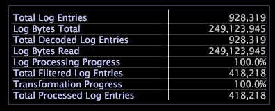

# Légende de traitement{#processing-legend}

La légende de traitement fournit des informations détaillées sur le traitement et la transformation des données d’un serveur particulier, ce qui vous permet de suivre la progression des données en cours de retraitement et de transformation.

Le tableau suivant répertorie les tâches qui peuvent être exécutées à l’aide du [!DNL Processing Legend].

<table id="table_6149250C44B14C44A3CB1CEF68B280C6"> 
 <thead> 
  <tr> 
   <th colname="col1" class="entry"> Pour effectuer cette tâche... </th> 
   <th colname="col2" class="entry"> Procédez comme suit : </th> 
  </tr> 
 </thead>
 <tbody> 
  <tr> 
   <td colname="col1"> 
Pour afficher la taille totale de toutes vos données 
 </td> 
   <td colname="col2"> 
Passez en revue les valeurs des champs  Total entrées du journal et Total  octets du journal. 
 </td> 
  </tr> 
  <tr> 
   <td colname="col1"> 
Pour vérifier si le filtrage fonctionne 
 </td> 
   <td colname="col2"> 
Vérifiez les valeurs des champs Entrées  du journal filtrées totales. Si la valeur est 0, le filtrage ne fonctionne pas et vous devez vérifier votre configuration pour résoudre le problème. 
 </td> 
  </tr> 
  <tr> 
   <td colname="col1"> 
Pour vérifier la progression du traitement du journal 
 </td> 
   <td colname="col2"> 
Vérifiez la valeur du champ  Progression du traitement du journal. Ce pourcentage indique la proportion de retraitement terminée. 
 
Lors du retraitement afin d’affiner votre jeu de données, vous souhaiterez peut-être garder un oeil sur le nombre  total d’entrées de journal décodées par rapport au nombre  total d’entréesde journal filtrées. 
 </td> 
  </tr> 
  <tr> 
   <td colname="col1"> 
Pour vérifier la progression de la transformation 
 </td> 
   <td colname="col2"> 
Vérifiez la valeur du champ  Transformation Progress . Ce pourcentage indique la proportion de la transformation terminée. 
 </td> 
  </tr> 
 </tbody> 
</table>

