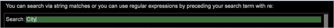

# Gestionnaire de profil{#profile-manager}

Les noms de dossier et de fichier inclus dans votre mise en oeuvre s’affichent sur le côté gauche du Gestionnaire de profils.

Les profils qui constituent votre application sont affichés sous forme de colonnes individuelles dans la section [!DNL Profile Manager]. Ces profils incluent plusieurs profils hérités et un seul profil de travail.

>[!NOTE]
>
>Votre profil de travail (un profil de jeu de données ou un profil spécifique au rôle) est le profil que vous chargez lorsque vous ouvrez Data Workbench.

Les coches (et leurs couleurs) indiquent le ou les dossiers de profils sur le serveur de Data Workbench et les ordinateurs de Data Workbench dans lesquels réside chaque fichier, indiquent s’il existe plusieurs copies d’un fichier et si ces copies multiples ont la même date et heure de modification. Ces fichiers sont synchronisés entre le serveur de Data Workbench et les ordinateurs de Data Workbench lors du téléchargement du profil.

Voici un exemple de [!DNL Profile Manager] pour une mise en oeuvre HBX :

Dans le menu [!DNL Profile Manager], vous pouvez ouvrir n’importe quel autre gestionnaire (par exemple, [!DNL Dimensions Manager] ou [!DNL Reports Manager]), qui affiche uniquement des parties spécifiques de [!DNL Profile Manager]. Vous pouvez également créer de nouveaux gestionnaires de profil. Voir [Création de gestionnaires de profil](../../../../home/c-get-started/c-intf-anlys-ftrs/c-cstm-prof-files-mgrs/c-new-prof-mgrs.md#concept-0021e006523e4d538aaa16322731d9d3).

Une coche en regard d’un nom de fichier dans une colonne spécifique indique qu’un fichier portant ce nom réside dans le dossier nommé dans cette colonne (profil). Lorsque vous vous déplacez vers la droite dans [!DNL Profile Manager], les fichiers sont prioritaires sur ceux situés à gauche, c’est-à-dire que chaque profil hérité repose sur les profils situés à sa gauche dans la balise [!DNL Profile Manager]. Par exemple, si vous disposez d’un fichier portant le même nom et situé au même emplacement dans le profil [!DNL Base] (colonne) et dans le profil [!DNL User] (colonne), le fichier du profil [!DNL User] est utilisé à la place du fichier dans le profil [!DNL Base].

## Rechercher des profils {#section-91f873f1d7ed4fd6a5f3c3ac08cfa623}

Avec Data Workbench 5.5, un champ de recherche a été ajouté pour trouver les profils requis dans la balise [!DNL Profile Manager].

Les types de colonnes suivants apparaissent dans la balise [!DNL Profile Manager] :

* Les colonnes *nom de profil hérité* contiennent des coches pour les fichiers qui résident dans chaque dossier de profil. Les profils hérités incluent les profils internes fournis par Adobe, ainsi que les profils spécifiques à une entreprise ou à un rôle que vous créez et gérez. Dans l’exemple ci-dessus, les profils internes incluent Base, Trafic, Valeur, Marketing, etc. Le profil interne [!DNL Base], qui contient les blocs de création de base et les informations de configuration nécessaires à l’exécution de votre application d’Adobe, est fourni avec chaque implémentation. Les autres profils internes contiennent des éléments (espaces de travail, mesures, dimensions dérivées, etc.) liés à des types particuliers d’informations, tels que le trafic web ou le marketing. Adobe fournit uniquement les profils appropriés au type de données que vous analysez et à votre secteur d’activité.

   >[!NOTE]
   >
   >Par défaut, les profils internes (ceux fournis par Adobe) ne peuvent pas être modifiés. Toute personnalisation doit se produire dans votre jeu de données, dans les profils spécifiques à un rôle ou dans d’autres profils que vous créez. Si vous créez une application et devez modifier un profil interne, vous devez modifier le paramètre Modify Internal Profiles dans le fichier [!DNL Insight.cfg] . Voir [Paramètres de configuration Insight](../../../../home/c-get-started/c-insght-config-param.md#concept-14da97d0756348e885c08ca9e866074b) pour plus d’informations. Avant de procéder, contactez les services de conseil Adobe.

* La colonne *nom du profil de travail*, qui est toujours la colonne du dernier vers le dernier, contient des coches pour les fichiers qui résident dans le dossier du profil de travail actuel. Dans l’exemple ci-dessus, le profil de travail est Jeu de données. Votre profil de travail est soit un profil de jeu de données, soit un profil spécifique au rôle. Les fichiers de ce dossier sont prioritaires sur les fichiers portant le même nom dans tout dossier de profil hérité.
* La colonne [!DNL User], qui est toujours la dernière colonne, contient des coches pour les fichiers et les dossiers qui résident en tant que fichiers locaux dans le dossier User\*nom du profil*. La structure de répertoires du dossier Utilisateur reproduit celle du profil de travail, et chaque dossier User\*nom du profil* contient des copies locales des espaces de travail, des mesures, des dimensions et des fichiers de configuration de ce profil particulier. Ces copies locales ont la priorité sur les fichiers portant le même nom dans tout dossier de profil hérité ou opérationnel. Les fichiers de la colonne [!DNL User] ont été créés et enregistrés uniquement dans le dossier User\*nom du profil* ou ils résident dans un profil interne ou de travail ainsi que dans le dossier User\*nom du profil*. Les fichiers de chaque dossier peuvent ou non être identiques et avoir ou non la même date et heure de modification.

   >[!NOTE]
   >
   >
   >    
   >    
   >    * Pour éviter de modifier votre jeu de données uniquement localement, le serveur de Data Workbench ignore les copies locales du fichier [!DNL profile.cfg] et tous les fichiers du jeu de données ou des dossiers Exporter dans le dossier User\*nom du profil* . Les fichiers ignorés sont identifiés par un arrière-plan rouge dans la colonne [!DNL User] et un avertissement &quot;Ignoré dans le répertoire utilisateur&quot; dans le menu contextuel. Pour implémenter les modifications que vous apportez dans vos copies locales de ces fichiers, vous devez les enregistrer dans votre profil de travail afin qu’elles puissent être synchronisées avec le serveur de Data Workbench. Pour connaître les étapes d’enregistrement des fichiers dans votre profil de travail, voir [Publication de fichiers dans votre profil de travail](../../../../home/c-get-started/c-admin-intrf/c-prof-mgr/t-pub-files-wkg-prof.md#task-a0106e010c834d16bd60eef4721b6af9).
      >    
      >    
   * Un trait d’union (-) au lieu d’une coche dans une colonne identifie un fichier vide (zéro octet). Data Workbench traite les fichiers sans octet comme inexistants, ce qui vous permet de les utiliser pour masquer les fichiers inclus dans un profil à gauche. Voir [Masquage des fichiers à l’aide de fichiers vides (zéro octet)](../../../../home/c-get-started/c-admin-intrf/c-prof-mgr/c-empty-files.md#concept-e776fac9e5904bed8c13b9d5eb17c491).

## Déterminer les versions de fichiers {#section-225d732246b94cbe87acdfa9c881d6af}

Comme mentionné dans la section précédente, les coches dans la balise [!DNL Profile Manager] sont codées par couleur afin que vous puissiez facilement identifier où réside un fichier et si les copies multiples d’un fichier ont été modifiées à différents moments.

Si un fichier ou un répertoire réduit est exactement identique au fichier ou au répertoire à sa gauche, il dispose de la même coche de couleur que le fichier ou le répertoire de cette colonne (profil). S’il diffère d’un fichier ou d’un répertoire à sa gauche ou si le fichier ou le répertoire existe uniquement dans la colonne [!DNL User], la coche est blanche.

La valeur [!DNL Profile Manager] affichée dans l’exemple ci-dessus indique ce qui suit :

* Une coche blanche pour le fichier [!DNL A New Metric.metric] s’affiche uniquement dans la colonne [!DNL User], ce qui indique que vous disposez uniquement d’une copie locale de ce fichier : il n’a pas été publié (ou téléchargé) sur le serveur de Data Workbench pour que d’autres utilisateurs Data Workbench puissent y accéder.

* Les coches du nom de fichier [!DNL Average Score.metric] apparaissent dans les colonnes Films et [!DNL User] . La coche dans la colonne [!DNL User] est de la même couleur que la coche dans la colonne Films , ce qui indique que la copie locale du fichier a la même date et heure de modification que le fichier dans le dossier Films .

* Les coches du nom de fichier [!DNL Average Score Error.metric] apparaissent dans les colonnes Films et [!DNL User] . La coche de la colonne [!DNL User] est blanche, ce qui indique que la copie locale du fichier a une date ou une heure de modification différente de celle du fichier dans le dossier Films .

