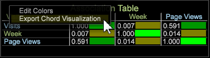

# Visualisation des accords d’association{#association-chord-visualization}

{{eol}}

La visualisation des accords d’association vous permet d’afficher la proportion et l’association entre les mesures, les dimensions et les éléments, en affichant des accords plus grands comme indication d’une association plus forte.

Le tableau des associations compare les valeurs avec le calcul du V de Cramer plutôt qu&#39;en utilisant le coefficient de corrélation de Pearson, comme le montre le tableau suivant : [Matrice de corrélation](/help/home/c-get-started/c-analysis-vis/c-correlation-analysis/c-correlation-analysis.md) et [Corrélation](/help/home/c-get-started/c-analysis-vis/associations-visualization.md) Visualisations (elles peuvent uniquement comparer des mesures, tandis que le tableau et l’accord d’association peuvent comparer des mesures, des dimensions et des éléments). Le accord d’association fournit également une autre vue dans une [Table d’associations](../../../home/c-get-started/c-analysis-vis/associations-visualization.md#concept-9d937dda38174875b32095c6eaf22f2f).

**Pour créer un accord d’association**

1. Dans un espace de travail, cliquez avec le bouton droit de la souris **Visualisation > Analyses prédictives > Ordre de correspondance**.

   Un menu s’ouvre pour vous permettre de sélectionner une dimension étendue dans la liste.

   

   Une fois sélectionné, le tableau d’association vierge s’ouvre avec la Dimension sélectionnée identifiée dans le titre. 

1. **Sélection d’un élément de mesure, de dimension ou de dimension**.

   Cliquez avec le bouton droit de la souris sur la visualisation des accords et sélectionnez **Ajouter une mesure** ou **Ajouter une Dimension**. Sélectionnez des éléments dans le menu à ajouter à l’accord.

   Vous pouvez également faire glisser des mesures et des dimensions à partir du **[!UICONTROL Finder]** en cliquant **[!UICONTROL Ctrl-Alt]** et en faisant glisser des mesures et des dimensions sur l’accord. Ou faites glisser des éléments de dimension directement d’un tableau ouvert vers la visualisation des accords.

1. **Sélection de mesures, dimensions et éléments supplémentaires à associer**.

   Une fois que plusieurs valeurs sont sélectionnées, le graphique s’actualise automatiquement et commence à afficher les données d’association. Continuez à ajouter des mesures si nécessaire pour associer des points de données.

   

   La visualisation des accords affiche la proportion de l’ensemble représenté par la zone de chaque segment. Continuez à ajouter des mesures/dimensions/éléments si nécessaire pour identifier et étudier les relations significatives.

1. **Visualisation des accords**.

   Passez la souris sur chaque valeur de la visualisation pour afficher les relations.

1. **Modifier les paramètres.** Cliquez avec le bouton droit de la souris sur la visualisation des accords pour ouvrir un menu afin de modifier la mesure, la dimension ou les éléments et d’afficher les dimensions sous forme de nombres absolus ou de pourcentages, de supprimer la mesure sélectionnée ou toutes les mesures, de modifier les couleurs et les détails et d’exporter les valeurs vers un tableau d’associations.

**Pour créer un accord d’association à partir d’un tableau d’association :**

1. Ouvrez une **Tableau d’association** visualisation.
1. Cliquez avec le bouton droit et sélectionnez **Exporter la visualisation des accords**. Un diagramme des accords d’association s’ouvre avec les valeurs sélectionnées dans le tableau Association. 

>[!IMPORTANT]
>
>L’exportation d’un tableau d’association à partir d’un diagramme des accords d’association qui contient au moins une mesure entraîne la duplication d’éléments dans les lignes/colonnes du tableau d’association. Pour éviter les éléments dupliqués, créez un tableau d’association et ajoutez les éléments souhaités plutôt que d’exporter les éléments à partir d’un diagramme d’association.
