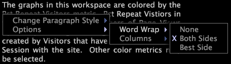

# Annotations de texte{#text-annotations}

Les annotations textuelles sont des fenêtres dans lesquelles vous pouvez entrer du texte arbitraire pour ajouter des informations descriptives ou des commentaires à un espace de travail.

Vous déplacez ou manipulez les annotations de texte dans un espace de travail de la même manière que les autres types de visualisation. Vous pouvez également mettre en forme l’aspect du texte ainsi que le nom, la modification ou l’enregistrement de toute annotation de texte que vous ajoutez à un espace de travail. Les annotations textuelles peuvent également être exportées vers Microsoft Excel et générées et distribuées par [!DNL Report].

Pour plus d&#39;informations sur [!DNL Reports], consultez le *Guide du rapport Insight*.

## Ajouter ou modifier le texte {#section-8ecc44e0eeb24c5990050102013c0aed}

* Cliquez dans le corps du texte pour passer en mode d’édition et commencer à taper.

   >[!NOTE]
   >
   >Les annotations de texte prennent en charge les fonctions de modification de base, notamment la coupe (Ctrl+x), la copie (Ctrl+c), le collage (Ctrl+v), l’annulation (Ctrl+z), la restauration (Ctrl+Maj+z), la sélection de section (clic+glisser) et la sélection de tous les éléments (Ctrl+a). Voir [Utilisation de texte sous Windows](../../../../home/c-get-started/c-wk-win-wksp/c-work-text-win.md#concept-f1222434bf954767808e94b955945c8d).

## Appliquer la mise en forme aux paragraphes {#section-27744c1589134aa3918aa8787429c0dc}

1. Dans le corps du texte, cliquez avec le bouton droit de la souris sur le paragraphe à mettre en forme.
1. Cliquez sur **[!UICONTROL Change Paragraph Style]** > *&lt;**[!UICONTROL text style]**>*.

## Appliquer la mise en forme aux sélections {#section-4032ecbcc0064e5c96504c15b6f481bf}

1. Dans le corps du texte, cliquez et faites glisser pour sélectionner le texte à mettre en forme.
1. Cliquez avec le bouton droit de la souris sur la sélection, puis cliquez sur **[!UICONTROL Change Selection Style]** > *&lt;**[!UICONTROL text style]***.

## Modifier les paramètres d&#39;encapsulage de mot {#section-56948687d47349fc8ba21e108fd13cc1}

Cette option détermine si et comment le texte de l’annotation entoure les visualisations dans l’espace de travail.

* Cliquez avec le bouton droit dans le corps du texte, cliquez sur **[!UICONTROL Options]** > **[!UICONTROL Word Wrap]**, puis cliquez sur l’option de votre choix :

   * **Aucun :** cette option supprime l’encapsulation des mots de cette annotation.
   * **Les deux côtés :** cette option permet au texte de l’annotation d’encapsuler les deux côtés des visualisations dans l’espace de travail.
   * **Meilleur côté :** cette option permet au texte de l’annotation d’encapsuler un seul côté des visualisations dans l’espace de travail.

## Modifier les paramètres de colonne {#section-5cd3f3d63cf64119a2fcec371e33b734}

Cette option contrôle le nombre de colonnes dans lesquelles afficher le texte dans l&#39;annotation.

* Cliquez avec le bouton droit dans le corps du texte, cliquez sur **[!UICONTROL Options]** > **[!UICONTROL Columns]**, puis cliquez sur l’option de votre choix :

   * **Auto :** cette option sélectionne la disposition de colonne la plus appropriée pour la largeur et la longueur du texte.
   * **1-4:** Ces options vous permettent d’afficher le texte en une, deux, trois ou quatre colonnes.

## Exporter vers Microsoft Excel {#section-b239057b822348849fd17a83c3a03c22}

Pour plus d’informations sur l’exportation de fenêtres, voir [Exportation de données de fenêtre](../../../../home/c-get-started/c-wk-win-wksp/c-exp-win-data.md#concept-8df61d64ed434cc5a499023c44197349).
