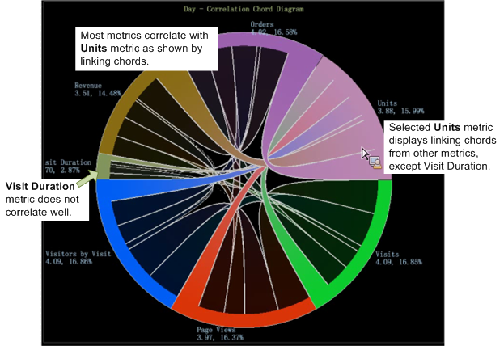

# Visualisation des accords{#chord-visualization}

La visualisation des accords vous permet d’afficher à la fois la proportion et la corrélation entre les mesures, en affichant des accords plus grands comme une indication d’une corrélation plus forte.

La visualisation de corde vous permet d’identifier les corrélations entre les mesures, ce qui vous permet d’ajouter et d’évaluer facilement les corrélations possibles. Il fournit également une autre vue sur toute matrice [de](https://docs.adobe.com/content/help/en/data-workbench/using/client/analysis-visualizations/correlation-analysis/c-correlation-analysis.html)corrélation précédemment créée. A l’aide de la visualisation de corde, vous ne pouvez pas identifier une corrélation positive ou négative entre les mesures, mais seulement qu’il existe une corrélation. Dans certains cas, il est possible d’identifier une relation directe ou inverse en appliquant des mesures de compteur.

1. **Ouvrez la **[!UICONTROL Chord]**visualisation**.

   Dans l’espace de travail, cliquez avec le bouton droit [!DNL Visualization > Predictive Analytics > Chord].

1. **Sélectionnez une dimension dans le menu**.

   Une visualisation vide s’ouvre et vous permet de sélectionner une dimension. Le nom de la dimension s’affiche en haut de la visualisation en accord vierge.

   >[!NOTE]
   >
   >Si une matrice de corrélation est déjà ouverte dans l’espace de travail, vous pouvez également la rendre sous forme de visualisation en corde.

1. **Choisissez les mesures à corréler**.

   Faites glisser des mesures du tableau **[!UICONTROL Finder]** en cliquant sur **[!UICONTROL Ctrl-Alt]** pour les faire glisser du tableau vers le graphique. Une fois que plusieurs mesures sont sélectionnées, le graphique est automatiquement actualisé et commence à afficher les données de corrélation. Continuez à ajouter des mesures si nécessaire pour corréler les points de données.

   

   La visualisation en corde affiche la proportion de l’ensemble représenté par la zone de chaque segment. Continuez à ajouter des mesures en fonction des besoins afin d’identifier et d’étudier les relations significatives.

   

1. **Affichez la visualisation** de Cordes.

   Passez la souris sur chaque mesure dans la visualisation pour afficher les relations. Dans cet exemple, vous pouvez voir une corrélation entre les unités et la plupart des autres mesures (à l’exception de la mesure Durée **de la** visite).

   

   Lorsque vous passez la souris sur la mesure Durée **de la** visite dans la visualisation en corde, vous constatez qu’il existe très peu ou pas de corrélation entre toutes les autres mesures.

   

1. **Modifier les paramètres.** Cliquez avec le bouton droit de la souris sur la visualisation Cordes pour ouvrir un menu pour modifier la dimension, afficher les dimensions sous forme de nombres absolus ou de pourcentages, supprimer la mesure sélectionnée ou toutes les mesures, modifier les couleurs et les détails et exporter les valeurs vers une matrice de corrélation.

   

