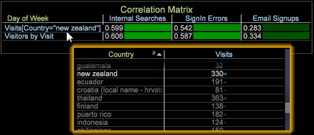

# Matrice de corrélation{#correlation-matrix}

Les corrélations statistiques mesurent des relations significatives pour identifier les opportunités grâce à une exploration avancée des données.

Utilisant le coefficient [de corrélation de](../../../../home/c-get-started/c-analysis-vis/c-correlation-analysis/c-correlation-pearsons.md#concept-5996cb8c89fd4df5b47b7318e7a1d29c)Pearsons, la matrice de corrélation vous fournit des informations pertinentes afin de mieux identifier les étapes suivantes d’une campagne marketing, d’améliorer la conception du site ou de poursuivre l’analyse approfondie des clients pour d’autres dépendances de corrélation.

## Création d’une matrice de corrélation {#section-87ed12ccc1af4196a1b6534e621c4cbb}

La matrice de corrélation compare les mesures sur une dimension dénombrable ou non dénombrable. La matrice peut ensuite être modifiée pour mettre en évidence les corrélations au sein de la visualisation par le biais du choix des couleurs ou pour la rendre sous forme de zone textuelle, de carte thermique ou des deux.

1. Ouvrez une matrice de corrélation.

   Cliquez avec le bouton droit [!DNL Visualization] > [!DNL Predictive Analytics] > [!DNL Correlation Matrix]. Le tableau de dimensions s’ouvre.

   

   Sélectionnez une dimension, telle que [!DNL Time] > [!DNL Day of the Week] dans ce menu. Le tableau de corrélation s’ouvre avec la dimension identifiée dans l’angle de la matrice et la mesure associée placée dans la ligne et la colonne. Pour la dimension Jour de la semaine, **[!UICONTROL Visits]** est la mesure associée.

   

   La corrélation est de 1 000 car vous comparez une mesure à elle-même (ce qui reflète une corrélation parfaite, mais inutilisable).

1. Modifiez l’une des mesures.

   Cliquez avec le bouton droit de la souris et sélectionnez **[!UICONTROL Change Metric]** pour modifier une mesure dans la ligne ou la colonne. Cette opération établit une corrélation entre deux mesures de valeur.

   Dans cet exemple, remplacez la **[!UICONTROL Visits]** mesure de la colonne par **[!UICONTROL Internal Searches]**. Cliquez avec le bouton droit de la souris et sélectionnez [!DNL Metric] > [!DNL Custom Events] > [!DNL Custom Event 1-10] > [!DNL Internal Searches].

   

1. Ajoutez d’autres mesures à la matrice de corrélation.

   Cliquez avec le bouton droit dans une colonne ou une ligne de mesure. Par exemple, dans le menu Mesure, ajoutez [!DNL Metric] > [!DNL Custom Events] > [!DNL Custom Event 1-10] > [!DNL Sign in Error].

   

   La nouvelle mesure s’affiche dans une colonne avec un numéro de corrélation. Vous pouvez ajouter d’autres mesures, par exemple **[!UICONTROL Email Signups]**, pour créer le tableau.

   

   Vous pouvez également ajouter des mesures aux lignes pour les comparer aux mesures des colonnes.

   

1. (Facultatif) Limitez une mesure en ajoutant un élément de dimension.

   Cliquez avec le bouton droit de la souris dans l’espace de travail et sélectionnez **[!UICONTROL Table]**. Dans le tableau de dimension ouvert, appuyez sur Ctrl + Alt et faites glisser l’élément sur une mesure dans une colonne ou une ligne. L’élément apparaît entre crochets en regard de la mesure.

   Par exemple, pour la **[!UICONTROL Visits]** mesure, vous pouvez la contraindre en sélectionnant **[!UICONTROL Country]** comme **[!UICONTROL New Zealand]**.

   

   Notez que lorsque vous sélectionnez un élément de dimension, la corrélation change dans toutes les mesures en fonction de l’élément de dimension sélectionné. Seule la mesure Visite sera restreinte pour la &quot;Nouvelle-Zélande&quot; une fois la fenêtre de dimension fermée.

   >[!NOTE]
   >
   >Si vous modifiez une mesure avec une contrainte de dimension (en cliquant avec le bouton droit de la souris et en la sélectionnant **[!UICONTROL Change Metric]**), l’élément de dimension qui limite la mesure est perdu. Vous devrez à nouveau ajouter l’élément de dimension.

1. Créez un filtre  binaire pour limiter davantage la mesure. Cliquez avec le bouton droit sur la mesure dans le tableau et sélectionnez Filtre binaire dans le menu.

## Planification et analyse des corrélations {#section-cc322da60b7e417ba29e72b0afeb6f79}

Voici les objectifs généraux de création d’une matrice de corrélation.

**Identifier la relation entre deux mesures par rapport à une dimension** spécifique. Dans l&#39;exemple, la matrice a été construite autour de la dimension principale, Jour de la semaine, avec les mesures Visite, Abonnements par courriel et Erreurs de connexion comparées aux événements de mesure Recherches internes, Connexion et Affichage de l&#39;enquête.

**Élaborer des hypothèses pour cibler l&#39;analyse**. Après avoir exécuté une analyse de corrélation, l’étape suivante consiste à rechercher les dépendances et la corrélation des mesures. Par exemple, comprendre que les recherches internes ont un effet sur les abonnements au courriel permet de prévoir cette relation et de modifier les campagnes marketing ou la conception de la navigation sur le site Web.

**Identifiez les mesures afin d’inclure des algorithmes** d’exploration de données plus avancés. Dans la plupart des cas, les mesures clés sont identifiées, car elles affectent plusieurs corrélations. Vous pouvez désormais utiliser ces mesures clés et les appliquer à une analyse supplémentaire de l’exploration de données pour obtenir des informations plus précises.

## Notes sur les fonctionnalités de la matrice de corrélation {#section-ef3626c665ea468a9ecdad624b4132f5}

**Le filtrage et la sélection d’éléments de dimension dans un tableau comparent des valeurs** similaires. Par exemple, l’utilisation de la dimension Jour de la semaine, puis le fait de cliquer dans un élément de cette dimension de base, comme cliquer sur un jour spécifique dans le tableau de dimension Jour de la semaine, génère une correspondance 1 à 100 % qui n’offre aucune corrélation utilisable. Comme la dimension racine était Jour de la semaine, toute sélection dans le tableau de dimension Jour de la semaine modifiera la matrice pour en faire une corrélation individuelle.

Cependant, la corrélation 1 à 1 (lorsqu’une sélection unique est faite de tous les éléments) n’est que le jour donné. Si vous effectuez plusieurs sélections, il ne reste pas nécessairement une corrélation de 1 à 1 et il ne retournera pas toujours une correspondance de 100 % indépendamment de la sélection de 1 ou 1 jour ou plus de la semaine.

**Les corrélations statistiques ne sont pas égales au modèle** de données corrélées, la référence historique des produits Adobe Analytics. La corrélation statistique dans les outils de données est basée sur le modèle [de corrélation](../../../../home/c-get-started/c-analysis-vis/c-correlation-analysis/c-correlation-pearsons.md#concept-5996cb8c89fd4df5b47b7318e7a1d29c)Pearson.

**Afficher la corrélation dans un graphique de dispersion**. Cliquez avec le bouton droit de la souris sur le titre d’un graphique de dispersion et choisissez [!DNL Display Correlation] dans le [!DNL Visualization] menu. La valeur Corrélation s’affichera dans la section supérieure droite du graphique de dispersion.

>[!NOTE]
>
>La matrice de dispersion et de Pearsons affichera &quot;Erreur de calcul&quot; si l’application ne parvient pas à exécuter le calcul de corrélation de Pearsons. Cela est généralement dû à des données insuffisantes, ce qui peut entraîner une tentative de division de l’équation par 0.
