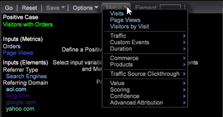

# Création d&#39;un arbre de décision{#building-a-decision-tree}

Configurez un arbre de décision en identifiant un cas positif et en ajoutant des entrées de mesure et de dimension pour évaluer les données et explorer l&#39;arbre de décision.

Pour créer un arbre de décision, procédez comme suit.

1. Ouvrez un nouvel espace de travail.

   Après avoir ouvert un nouvel espace de travail, vous devrez peut-être cliquer sur **Ajouter** > Déverrouiller **** temporairement.

1. Pour ouvrir le Créateur d’arbre de décision, cliquez avec le bouton droit **[!UICONTROL Visualization]** > Analyses **** prédictives > **Classification** > Créateur **d’arbre de** décision.

1. Définissez un cas **** positif.

   Vous pouvez définir une casse positive pour une arborescence de décision en sélectionnant des dimensions dans un Finder ou des éléments de dimension dans un tableau, ou en concevant un filtre dans le filtre de conception. En fait, le cas positif peut être une combinaison de plusieurs sélections dans l’espace de travail, y compris des filtres, des dimensions, des éléments et tous les types de valeurs de visualisation des Outils de données.

   * **Concevez et appliquez un filtre** comme cas positif. Cliquez avec le bouton droit de la souris dans l’espace de travail et sélectionnez **[!UICONTROL Tools]** > **[!UICONTROL Filter Editor]** pour concevoir et appliquer un filtre.

   * Ajoutez **Dimensions** comme cas positif. Dans l’espace de travail, cliquez avec le bouton droit de la souris et sélectionnez **Outils** > **Rechercher** (ou sélectionnez **[!UICONTROL Add]** > **[!UICONTROL Finders]** dans le volet de gauche). Entrez un nom de dimension dans le champ **Rechercher** , puis sélectionnez une dimension.

   * Ajoutez **des mesures** comme cas positif. Cliquez avec le bouton droit de la souris et sélectionnez **Outils** > **Rechercher** ou sélectionnez **[!UICONTROL Add]** > **[!UICONTROL Finders]** dans le volet de gauche pour ouvrir un tableau Mesures. Sélectionnez une mesure comme cas positif.

   * Ajoutez des éléments **de** dimension en tant que cas positif. Cliquez avec le bouton droit de la souris dans l’espace de travail et sélectionnez **[!UICONTROL Table]** pour ouvrir les éléments de dimension, puis sélectionnez l’un des éléments de dimension pour définir la casse positive.

1. Cliquez sur **[!UICONTROL Options]** > **[!UICONTROL Set Positive Case]**.

   La casse positive est définie et vous pouvez la nommer. Le nom s’affiche sous l’ **[!UICONTROL Positive Case]** en-tête dans l’espace de travail.

   >[!NOTE]
   >
   >Lorsque vous définissez la casse positive, l&#39;arbre de décision utilise la sélection actuelle de l&#39;espace de travail, qui peut être définie en tant que Visiteurs (ou tout autre compte à rebours de niveau supérieur défini, mais dans la plupart des cas Visiteurs) qui correspond à la sélection actuelle dans l&#39;espace de travail. Elles se combinent comme un filtre unique pour un seul cas positif (et non pour plusieurs cas positifs).

   Si vous cliquez **[!UICONTROL Set Positive Case]** en l’absence de sélection, le cas positif est effacé.

1. (Facultatif) Sélectionnez **[!UICONTROL Set Population Filters]** pour définir la population de visiteurs à classifier.

   Si aucun filtre de population n’est appliqué, le jeu de formations est tiré de tous les visiteurs (la valeur par défaut est &quot;Tout le monde&quot;).

   >[!NOTE]
   >
   >Cliquez sur **[!UICONTROL Show Complex Filter Description]** pour afficher les scripts de filtrage pour le filtre Cas positif et Population.

1. Ajoutez **des mesures**, des **dimensions** et des éléments de **** dimension comme entrées.

   Vous pouvez sélectionner des entrées en faisant glisser-déplacer depuis les panneaux du Finder ou depuis les tableaux pour des éléments de dimension individuels. Vous pouvez également sélectionner dans le **[!UICONTROL Metrics]** menu de la barre d’outils.

   * Ajoutez **des mesures** en tant qu’entrées.

      Sélectionnez Mesures dans la barre d’outils. Appuyez sur **Ctrl** + **Alt** pour faire glisser une ou plusieurs mesures vers le Créateur d’arborescence des décisions.

      La mesure s’affiche dans la liste **** d’entrée (Mesures) sous la forme d’une entrée avec un code de couleur unique.

      

   * Ajoutez **des dimensions** en tant qu’entrées.

      Dans l’espace de travail, cliquez avec le bouton droit de la souris et sélectionnez **Outils** > **Finder** , puis saisissez le nom de la dimension dans le champ **Rechercher** . Appuyez sur **Ctrl** + **Alt**, sélectionnez une dimension, puis faites glisser la dimension vers le Créateur d’arborescence des décisions.

      La dimension apparaît dans la liste **d’entrée (Dimensions)** avec un code couleur unique.

   * Ajoutez des éléments **de dimension** en tant qu’entrées.

      Dans l’espace de travail, cliquez avec le bouton droit de la souris et sélectionnez un tableau Dimension. Sélectionnez Eléments de dimension, appuyez sur **Ctrl** + **Alt**, puis faites glisser les éléments sélectionnés vers le Créateur d’arbre de décision.

      Les éléments de dimension s’affichent dans la liste **d’entrée (éléments)** avec un code de couleur unique.
   >[!IMPORTANT]
   >
   >Vous pouvez sélectionner jusqu’à quatorze entrées à évaluer. Un message d’erreur s’affiche si trop d’entrées sont ajoutées.

1. Sélectionnez **[!UICONTROL Go]** dans la barre d’outils.

   L’arborescence des décisions se fonde sur les dimensions et les mesures sélectionnées. Les mesures simples, telles que les ajouts au panier, se créent rapidement, tandis que les dimensions complexes, telles que la durée de la visite avec plusieurs points de données, se développent plus lentement avec un pourcentage d’achèvement affiché lors de la conversion. L’arborescence s’adapte et s’ouvre ensuite pour l’interaction de l’utilisateur. Les entrées de dimension et de mesure seront codées par couleur, en fonction des noms de noeud.

   

   Le noeud terminal s’affiche en vert (true) ou rouge (false) si l’arbre a été élagué et s’il existe une prédiction de **True** ou de **False** après les branches élaguées.

   >[!NOTE]
   >
   >L’exemple d’identification est extrait du jeu de données pour que le créateur d’arborescence l’utilise. Les outils de données utilisent 80 % de l’échantillon pour construire l’arborescence et les 20 % restants pour évaluer l’exactitude du modèle d’arborescence.

1. Vérifiez la précision à l’aide du **[!UICONTROL Confusion Matrix]**.

   Cliquez sur **[!UICONTROL Options]** > **[!UICONTROL Confusion Matrix]** pour afficher les valeurs Précision, Rappel, Précision et Score F. Plus près de 100 %, plus le score est élevé.

   La matrice de confusion donne quatre valeurs de précision au modèle à l’aide d’une combinaison de valeurs :

   * Positif réel (AP)
   * Positif prédit (PP)
   * Négatif réel (AN)
   * Négatif prédit (PN)
   >[!TIP]
   >
   >Ces chiffres sont obtenus en appliquant le modèle de notation résultant des données de test de 20 % retenues et déjà connues comme la réponse vraie. Si le score est supérieur à 50 %, il est prédit comme un cas positif (qui correspond au filtre défini). Puis, Précision = (TP + TN)/(TP + FP + TN + FN), Rappel = TP / (TP + FN) et Précision = TP / (TP + FP).

1. **Explorez l&#39;arbre** de décision.

   Après avoir généré une arborescence de décision, vous pouvez afficher le chemin de la prédiction et identifier tous les visiteurs qui répondent aux critères définis. L’arborescence identifie la division d’entrée pour chaque branche en fonction de sa position et de son codage couleur. Si, par exemple, vous sélectionnez le noeud Domaine référent, les noeuds menant à cette division sont répertoriés par code-couleur à gauche de l’arborescence.

   Vous pouvez sélectionner les noeuds feuille pour sélectionner les branches (jeux de règles) de l’arborescence de décision.

   Pour cet exemple : Si la durée de la visite est inférieure à 1, aucune campagne n’existe, au moins une page vue existe, aucune inscription par courrier électronique et au moins une visite a eu lieu. Les projections concernant les critères de cette réunion et la passation de commande sont de **94,73** pour cent.

   

   **Interaction** de l&#39;arbre de décision : Vous pouvez sélectionner plusieurs noeuds dans l’arborescence à l’aide de la touche **Ctrl** standard pour l’ajouter ou de la touche **MajClic** pour la supprimer.

   **Noeuds** codés en couleur : La couleur des noeuds correspond à la couleur des dimensions et des mesures d’entrée, telle qu’elle est affectée par les outils de données.

   Les noeuds vert et rouge vif au niveau de la feuille d’une branche élaguée prédisent que le noeud est True ou False.

   |  Vert brillant | Indique que le noeud est égal à true et que toutes les conditions sont remplies. |
   |---|---|
   |  Rouge brillant | Indique que le noeud est égal à false et que toutes les conditions ne sont pas remplies. |

1. **Enregistrez l&#39;arbre** de décision.

   Vous pouvez enregistrer l’arbre de décision dans différents formats :

   

   * Le langage de balisage prédictif (**PMML**) est un format de fichier XML utilisé par les applications pour décrire et échanger des modèles d’arbre de décision.
   * **Texte** affichant des colonnes et des lignes simples de valeur true ou false, des pourcentages, du nombre de membres et des valeurs d’entrée.
   * Une **dimension** avec des branches correspondant aux éléments de résultat prévus.

