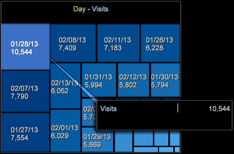

# Carte de densité{#density-map}

La visualisation de la carte de densité affiche les éléments sous forme de rectangles ombragés dans une carte carrée.

Les dimensions des rectangles dépendent des valeurs d’élément, où les valeurs les plus grandes sont représentées par des rectangles de plus grande surface. Similaire à un graphique circulaire, cette visualisation vous permet de voir rapidement quels éléments constituent le pourcentage le plus élevé de la dimension sélectionnée.

Pour créer une carte de densité :

1. Ouvrez un nouvel espace de travail.

   Après avoir ouvert un nouvel espace de travail, vous devrez peut-être cliquer sur **Ajouter** > **Déverrouiller temporairement**.
1. Cliquez sur **[!UICONTROL Visualization]** > **[!UICONTROL Density Map]**.

1. Sélectionnez un **[!UICONTROL Dimension]** dans le menu.

   Par exemple, sélectionnez **[!UICONTROL Time]** > **[!UICONTROL Days]**.

   En revanche, si vous sélectionnez **[!UICONTROL Time]** > **[!UICONTROL Hours]**, vous obtiendrez davantage d’éléments avec des valeurs plus petites qui s’afficheront sous forme de rectangles plus petits.

   >[!NOTE]
   >
   >Vous devez sélectionner une dimension avec plusieurs éléments en fonction de vos besoins. La limite actuelle est de 200 des éléments les plus importants pour chaque dimension.

1. Vous pouvez changement de dimension des vues en ouvrant **[!UICONTROL Visualization]** > **[!UICONTROL Table]** et en sélectionnant les éléments du tableau à afficher dans la carte.

   

   La carte répond aux sélections du tableau.

1. Placer le pointeur de la souris sur de petits éléments affiche leur nom et leur valeur dans le texte qui s’affiche près du curseur de la souris.
1. Pour masquer les éléments, cliquez avec le bouton droit de la souris et sélectionnez **[!UICONTROL Mask]**, puis choisissez une option.

   

   Pour afficher tous les noeuds masqués, sélectionnez **[!UICONTROL Unhide All]**.

1. Mettez en évidence les éléments en cliquant avec le bouton droit de la souris et en sélectionnant **[!UICONTROL Spotlight]**, puis choisissez une option. L’effet de soulignement vous permet de mettre en surbrillance et d’atténuer les éléments d’une plage.
1. Ajoutez une légende de couleur dans l’espace de travail. Vous pouvez identifier les valeurs de la carte à l’aide de la légende des couleurs.

   Vous pouvez ajouter une légende de couleur à l’espace de travail et les noeuds changeront de couleur en fonction de la dimension supplémentaire des données.
1. Modifiez la dimension ou la mesure en cliquant avec le bouton droit sur le titre de la carte et en le sélectionnant dans le menu.

   

1. Ajoutez des légendes en cliquant avec le bouton droit sur une cellule et en sélectionnant **[!UICONTROL Add Callout]**. Vous pouvez sélectionner différents types ou visualisations dans le menu.

   

1. Comme dans toutes les visualisations, vous pouvez cliquer avec le bouton droit au-dessus de la barre de titre pour afficher les commandes de base Fermer, Enregistrer, Exporter vers Microsoft Excel, Commande, Copier, Réduire et Sans bordure afin d’afficher une visualisation sans bordure.

   

1. La carte de densité vous permet de sélectionner et de désélectionner plusieurs éléments similaires à d’autres visualisations :

* Cliquez avec le bouton gauche pour sélectionner un élément.
* Ctrl + clic pour sélectionner plusieurs éléments.
* Tout en maintenant la touche Maj enfoncée, cliquez pour désélectionner un élément.
* Cliquez avec le bouton droit de la souris sur les éléments sélectionnés pour ouvrir un menu. Sélectionnez ensuite **[!UICONTROL Deselect]** ou **[!UICONTROL Deselect All]** pour effacer les éléments sélectionnés.

## Autres options {#section-d77defb012424de4a7ced8e5c93115bc}

Cliquez avec le bouton droit de la souris sur la carte de densité pour ouvrir un menu contenant les options suivantes :

<table id="table_3ADA85031C834792BFD041E186962A41"> 
 <thead> 
  <tr> 
   <th colname="col1" class="entry"> Option </th> 
   <th colname="col2" class="entry"> Description </th> 
  </tr>
 </thead>
 <tbody> 
  <tr> 
   <td colname="col1"> Ajouter Légende </td> 
   <td colname="col2">Ajoutez un texte ou un graphique comme légende dans la visualisation pour identifier ou décrire davantage un élément. 
Vous pouvez également sélectionner une légende de mesure vierge, un tableau, un graphique de ligne ou un graphique de dispersion en fonction de l’élément sélectionné dans la carte de densité. Vous pouvez ensuite ajouter des mesures et des dimensions à ces visualisations vierges si nécessaire. 
 </td> 
  </tr> 
  <tr> 
   <td colname="col1"> Masque </td> 
   <td colname="col2">Les options de masquage vous permettent de masquer les éléments sélectionnés. Cliquez avec le bouton droit de la souris pour afficher les options Masque. 
 Masquer cet élément : choisissez cette option pour masquer un élément unique que vous avez sélectionné. 
 
 Masquer la sélection (Masquer la sélection) : choisissez cette option pour masquer plusieurs éléments sélectionnés. 
 
 Afficher en haut : choisissez cette option pour n'afficher que les 100, 50, 25 ou 10 principaux éléments en fonction des valeurs de la carte de densité. 
 
 Afficher en bas (Show Bottom) : choisissez cette option pour n'afficher que les 100, 50, 25 ou 10 premiers éléments en fonction des valeurs de la carte de densité. 
 </td> 
  </tr> 
  <tr> 
   <td colname="col1"> point phare </td> 
   <td colname="col2"> L’effet de soulignement vous permet de mettre en surbrillance et d’atténuer les éléments d’une plage. Cliquez avec le bouton droit de la souris pour ouvrir un menu d’options. 
 Afficher en haut : sélectionnez cette option pour mettre en surbrillance uniquement les 100, 50, 25 ou 10 principaux éléments en fonction des valeurs de la carte de densité. 
 
 Afficher en bas (Show Bottom) : choisissez cette option pour mettre en surbrillance uniquement les 100, 50, 25 ou 10 éléments supérieurs les plus bas en fonction des valeurs de la carte de densité. 
 </td> 
  </tr> 
  <tr> 
   <td colname="col1"> 
Désélectionner 
 
Désélectionner tout 
 </td> 
   <td colname="col2"> 
 Sélectionnez ces commandes pour désélectionner l’élément actif, le cas échéant, ou désélectionnez tous les éléments sélectionnés. 
 </td> 
  </tr> 
 </tbody> 
</table>
