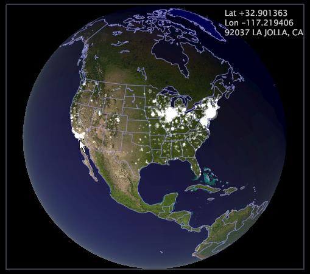

# Globes{#globes}

{{eol}}

Data Workbench peut afficher des images topographiques sur une carte détaillée en trois dimensions (3-D) du monde.

Le globe suivant présente la distribution géographique des clients d’une société.

