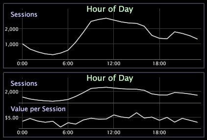

# Ajouter et modifier des mesures{#add-and-change-a-metrics}

{{eol}}

Procédure d’ajout ou de modification d’une mesure.

Les exemples suivants montrent la mesure Sessions affichée sur la dimension Heure de la journée (dans le graphique de la ligne supérieure) et le graphique de la même ligne avec une deuxième mesure, Valeur par session, ajoutée à l’axe de gauche (dans le graphique de la ligne inférieure).

**Pour ajouter une nouvelle mesure**

* Cliquez avec le bouton droit de la souris sur un élément ou le libellé d’une mesure, puis cliquez sur **[!UICONTROL Add Metric]** > *&lt;**[!UICONTROL metric name]**>*. La mesure est ajoutée sous la mesure que vous avez sélectionnée initialement.

**Pour modifier une mesure**

* Cliquez avec le bouton droit de la souris sur un élément ou sur le libellé de la mesure à modifier, puis cliquez sur **[!UICONTROL Change Metric]** > *&lt;**[!UICONTROL metric name]**>*. La nouvelle mesure remplace la mesure d’origine.
