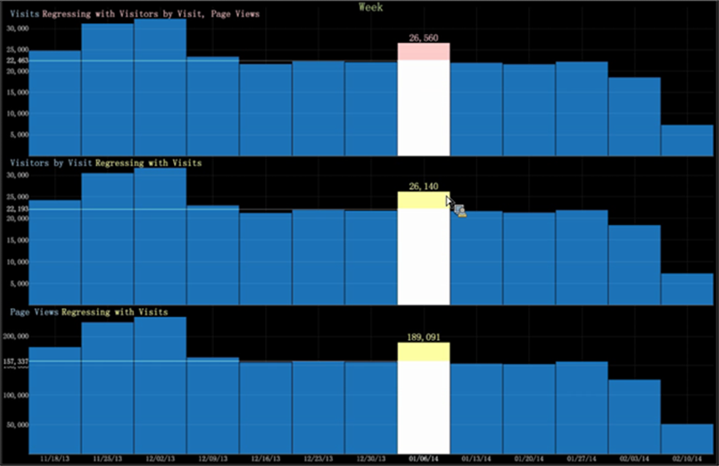

# Graphique d’analyse de régression{#regression-analysis-graph}

Le graphique à barres en Data Workbench comprend désormais une comparaison de régression pour plusieurs mesures sur plusieurs graphiques.

[Les ](https://experienceleague.adobe.com/docs/data-workbench/using/client/analysis-visualizations/graphs/c-graphs.html) graphiques à barres dans Data Workbench vous permettent de transformer des mesures d’un graphique en mesures d’un autre graphique. S’il existe plusieurs graphiques, vous pouvez comparer une mesure (en tant que variable indépendante) à un graphique évaluant d’autres mesures (en tant que variables dépendantes). Cela vous permet de déterminer la force de la relation entre une variable dépendante (la mesure définie en premier) et une série d’autres mesures changeantes (régressions avec la mesure dépendante établie).

L’analyse de régression sur une visualisation graphique permet aux analystes d’exécuter des scénarios &quot;et si&quot;. Par exemple, si les visites atteignent ce niveau, quel impact cette augmentation aura-t-elle sur les recettes ?

**Configuration de l’analyse de régression**

1. Sélectionnez le graphique comme mesure dépendante pour une comparaison de régression.

   Cliquez avec le bouton droit sur le graphique et sélectionnez **Définir comme mesure de base pour la régression**.

   

1. Définissez d’autres graphiques de mesures en tant que variables indépendantes.

   Cliquez avec le bouton droit de la souris sur la mesure et sélectionnez **[!UICONTROL Regress with `<base metric name>`]** pour d’autres mesures.

   

1. Affichez la régression en cliquant avec le bouton droit sur le graphique pour déplacer la barre vers le haut et vers le bas.

   Si vous cliquez avec le bouton droit de la souris sur le graphique pour une valeur spécifique, vous pouvez voir les rapports de régression pour chaque mesure en fonction des valeurs ascendantes ou descendantes.

   

   Par exemple, si mes pages vues passent à 86 041, les autres mesures auront les valeurs suivantes : Visites à 12 183 et Visiteurs à 12 028.

   

   Si les valeurs Visiteurs par visite passent à 26 141, les autres mesures seront Visites à 26 560 et Pages vues à 189 091.
