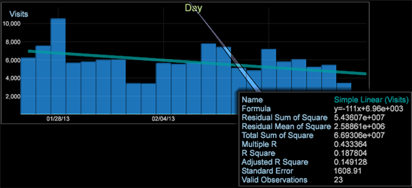

# Lignes de tendance{#trend-lines}

Les lignes de tendances vous permettent de superposer des graphiques pour comparer et interpréter les données.

À l’instar de la visualisation [Graphique de dispersion](https://experienceleague.adobe.com/docs/data-workbench/using/client/analysis-visualizations/c-scat-plots.html), vous pouvez désormais définir des lignes de tendance sur une visualisation graphique afin d’afficher le taux de changement en fonction de lignes linéaires, exponentielles, de puissance ou polynomales. La fonction Ligne de tendance vous permet de superposer des lignes de tendance sur un graphique, le plus souvent sur une dimension de temps.

Par exemple, dans cette comparaison graphique, nous pouvons voir que les tendances Visites sont en hausse, mais Commandes en baisse.

Pour ajouter une ligne de tendance

1. Ouvrez un graphique et cliquez avec le bouton droit sur le nom de la mesure dans le coin supérieur gauche.
1. Cliquez sur **[!UICONTROL Trend Lines]** et sélectionnez l’une des options.

   

   Vous pouvez sélectionner la ligne de tendance à afficher sur le graphique comme **Linéaire simple**, **Exponentiel**, **Puissance** ou **Polynomial**. Le polynomial crée une ligne de tendance de régression polynomiale. Une ligne linéaire simple crée une ligne de tendance sous forme de taux de changement le long de la ligne de régression. Exponentiel calcule une ligne de tendance comme y = b*exp( a*x ) et Puissance comme y = b*x`a`.

   La tendance sera calculée et rendue sur le graphique. Une légende s’ouvrira, affichant des informations détaillées sur l’équation de tendance.

   
