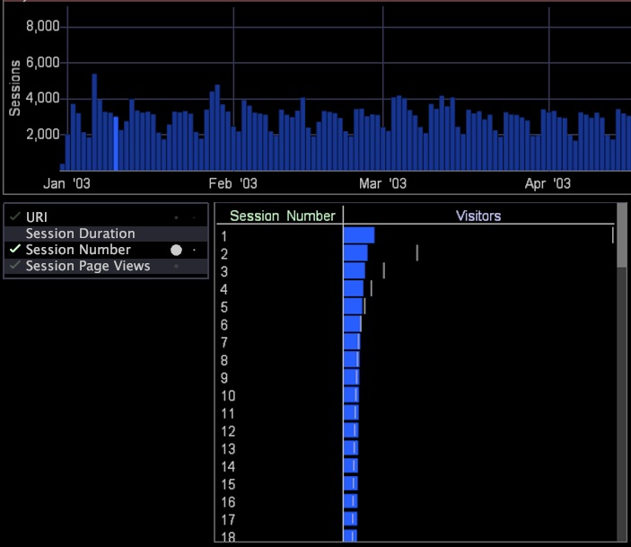

# Mesures statistiques{#statistical-measures}

{{eol}}

Pour faciliter les statistiques, Data Workbench fournit trois mesures statistiques dans la visualisation d’analyse guidée.

>[!NOTE]
>
>Bien que les mathématiques puissent vous aider à vous faire une idée des corrélations dans vos données, le contexte entourant les données doit également être pris en compte.

* **Chi Sq** est un test de signification statistique qui contrôle l’aspect de la coche dans la visualisation. Mathématiquement, c&#39;est une probabilité que nous puissions rejeter l&#39;hypothèse nulle, qui indique que les différences observées entre les deux groupes peuvent être expliquées par variation aléatoire. En pratique, si la valeur de Chi Sq p est inférieure à près de 100 %, nous pouvons ignorer la corrélation, quelle que soit sa force mesurée (comme décrit dans les sections statistiques U et V suivantes).
* **U, statistique** est une mesure de la force de la corrélation statistique. Mathématiquement, il vient d&#39;une branche des mathématiques appelée la théorie de l&#39;information et est étroitement lié au concept d&#39;information mutuelle entre les distributions des deux groupes. Vous pouvez également considérer cela comme la compressibilité d’un groupe, étant donné un schéma de codage optimal pour l’autre groupe. En pratique, cette mesure fonctionne très bien dans le cas courant d’une dimension avec de nombreux éléments contenant peu de visiteurs. La mesure varie de 0 (faible) à 1 (forte).
* **Statistiques V** est également une mesure de la force de la corrélation statistique. Mathématiquement, il est lié à la statistique V de Cramer, qui ne diffère que par une étape de normalisation visant à améliorer la symétrie de la mesure par rapport à l’inversion de sélection. En pratique, cette mesure fonctionne relativement bien avec de nombreux types de dimensions et est liée à une mesure statistique couramment utilisée. La mesure varie de 0 (faible) à 1 (forte).

>[!NOTE]
>
>Les statistiques U et V ont été sélectionnées pour se compléter l&#39;une l&#39;autre, les unes pour détecter les types de corrélations auxquelles l&#39;autre pourrait ne pas répondre aussi fortement.

À l’aide de cette visualisation comme guide, vous pouvez ajouter d’autres visualisations à votre espace de travail afin de fournir plus d’informations sur vos données en fonction de la sélection.

Les éléments suivants [!DNL Site] L’exemple contient un graphique à barres qui présente les sessions des jours de janvier, février, mars et avril. Notez qu’un jour de janvier est sélectionné.

La visualisation de l’analyse guidée dans le coin inférieur gauche de l’espace de travail indique que la dimension Numéro de session fournit des informations utiles sur le jour sélectionné.

En examinant le graphique à barres Numéro de session dans le coin inférieur droit de l’espace de travail, vous pouvez constater que les données de la session numéro 2 sont beaucoup plus faibles que la référence. Nous pouvons donc conclure que, en pourcentage, moins de secondes sessions ont eu lieu le jour sélectionné que d&#39;habitude. Pour afficher un graphique à barres pour l’une des dimensions répertoriées dans la visualisation d’analyse guidée, sélectionnez simplement la dimension en cliquant dessus avec la souris.
