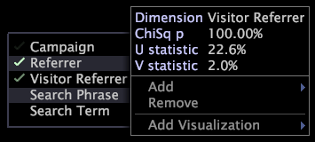

# Affichage du menu Dimension{#display-the-dimension-menu}

Cette section décrit la procédure à suivre pour afficher des informations ou des options pour une dimension.

1. Dans la visualisation de l’analyse guidée, cliquez avec le bouton droit de la souris sur le nom d’une dimension.

   

   >[!NOTE]
   >
   >Si un nom de dimension s’affiche en rouge, il n’est pas défini dans votre jeu de données.

1. Affichez les informations statistiques sur la dimension, décrites plus haut dans cette section.
1. (Facultatif) Cliquez sur l’une des options suivantes :

   * **[!UICONTROL Add]** pour ajouter une autre dimension.
   * **[!UICONTROL Remove]** pour supprimer la dimension sélectionnée.
   * **[!UICONTROL Add Visualization]** pour ajouter une visualisation pour la dimension sélectionnée.

