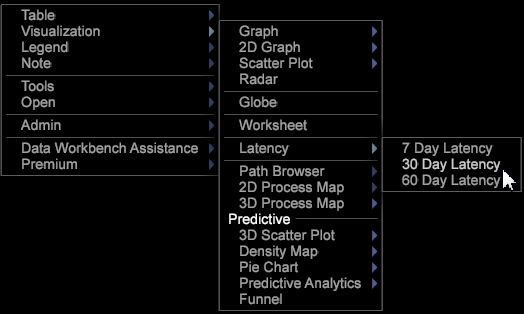

# Analyse de latence{#latency-analysis}

La visualisation Latence vous permet d’analyser le comportement des clients latents dans un nombre défini de jours avant ou après l’apparition d’un événement après une campagne ou un autre type d’événement ou période.

La **[!UICONTROL Latency]** visualisation vous permet de définir une mesure pour identifier le comportement avant, pendant ou après un événement afin de déterminer son effet sur le comportement des clients. Vous pouvez, par exemple, identifier l’efficacité d’une campagne marketing en affichant les recettes une semaine après la survenue d’un événement. Vous pouvez également présenter le comportement du client une semaine avant l’événement comme une ligne de base pour voir l’effet d’un événement sur le comportement.

A l’aide de la visualisation Latence, vous pouvez modifier la dimension Heure du jour, de l’heure, de la semaine ou d’une autre période, en une dimension de visite, de clic publicitaire, d’accès ou d’une autre dimension dénombrable.

**Configuration de l’analyse de latence**

1. Ouvrez un espace de travail et cliquez avec le bouton droit de la souris [!DNL Visualization] > [!DNL Latency].

1. Dans le menu, sélectionnez le nombre de jours à analyser pour les événements de latence. 

1. Cliquez avec le bouton droit sur l&#39; **[!UICONTROL Latency]** étiquette pour ouvrir le menu.

   * A l’aide de cette **[!UICONTROL Set Countable]** option, définissez une dimension dénombrable, telle que la visite, le clic publicitaire, l’accès, etc.
   * A l’aide de cette **[!UICONTROL Set Countable (Time)]** option, définissez une dimension d’heure telle que le jour, l’heure, la semaine, le jour de la semaine et l’heure du jour.
   

1. Modifiez la visualisation Latence.

   Cliquez avec le bouton droit de la souris sur l’ **[!UICONTROL Latency]** en-tête pour sélectionner les options de menu afin de modifier les compteurs, les dimensions, le nouveau libellé ou d’autres paramètres.

