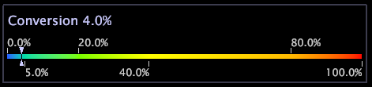

# Légendes de couleur{#color-legends}

Les légendes des couleurs permettent de visualiser le code couleur par des mesures telles que Conversion et Rétention. Elles peuvent être utilisées dans presque tous les espaces de travail.

Le lien entre les mesures de l’entreprise et la couleur facilite considérablement la détection des anomalies, des exceptions et des tendances. Lorsqu’une légende de couleur est activée dans un espace de travail, cliquez avec le bouton droit de la souris dans la légende pour sélectionner la mesure à coder en couleur. Les visualisations dans cet espace de travail sont ensuite codées par couleur en fonction de la mesure affichée dans la légende des couleurs. Vous pouvez basculer entre les mesures utilisées pour colorier toutes les visualisations dans l’espace de travail actuel.

>[!NOTE]
>
>Si vous ne sélectionnez pas de mesure dans la légende des couleurs, toutes les visualisations apparaissent en bleu.

## Activation ou modification d’une mesure {#section-694234fc79fd44c2a2ea2f677f74b3dc}

* Cliquez avec le bouton droit de la souris sur le nom de la mesure et cliquez sur la mesure souhaitée.

   

