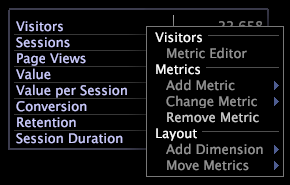

# Légendes des mesures{#metric-legends}

{{eol}}

Les légendes des mesures vous permettent d’afficher les mesures de base liées à votre profil et les statistiques liées au jeu de données (ou à la sélection actuelle, le cas échéant).

Les légendes des mesures dans votre application d’Adobe affichent les mesures pertinentes pour votre jeu de données, comme dans l’exemple suivant : [!DNL Site] légende des mesures.

Les légendes des mesures sont en fait un cas particulier d’une visualisation de tableau. Par conséquent, les mêmes fonctionnalités disponibles pour les tableaux sont disponibles pour les légendes des mesures. Voir [Tableaux](../../../../home/c-get-started/c-analysis-vis/c-tables/c-tables.md#concept-c632cb8ad9724f90ac5c294d52ae667f).

## Ajouter une mesure {#section-6655470bf06c4d2b82f7a01784552d1e}

* Dans la légende de la mesure, cliquez avec le bouton droit sur le nom d’une mesure, puis cliquez sur **[!UICONTROL Add Metric]** > *&lt;**[!UICONTROL metric name]**>*.

## Suppression d’une mesure {#section-c0da3396b2d44b9b899b7a0e7d747d94}

* Dans la légende de la mesure, cliquez avec le bouton droit sur le nom de la mesure à supprimer, puis cliquez sur **[!UICONTROL Remove]**.

## Exporter vers Microsoft Excel {#section-03b07062fb43422c902ff65cb66bbd27}

Pour plus d’informations sur l’exportation de fenêtres, voir [Exportation des données de fenêtre](../../../../home/c-get-started/c-wk-win-wksp/c-exp-win-data.md#concept-8df61d64ed434cc5a499023c44197349).

## Exporter vers un fichier TSV {#section-51a0a6f9cd05448caf149ddc927aa665}

Pour plus d’informations sur l’exportation de fenêtres, voir [Exportation des données de fenêtre](../../../../home/c-get-started/c-wk-win-wksp/c-exp-win-data.md#concept-8df61d64ed434cc5a499023c44197349).
