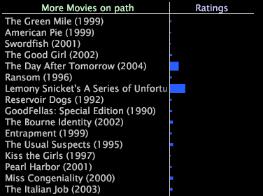

# Afficher d’autres éléments dans les chemins{#view-more-elements-in-paths}

Vous pouvez choisir d’afficher davantage d’éléments dans le chemin.

Dans la plupart des cas, votre navigateur de chemins n’est pas assez grand pour afficher tous les éléments de la séquence.

* Cliquez **[!UICONTROL More]** dans la partie inférieure gauche de la visualisation pour afficher les éléments précédents dans le chemin.
* Cliquez **[!UICONTROL More]** dans la partie inférieure droite de la visualisation pour afficher les éléments suivants dans le chemin.

En cliquant sur Plus dans la partie inférieure gauche ou inférieure droite de la visualisation, vous ouvrez un tableau qui répertorie les éléments précédents ou suivants dans le chemin. Le tableau montre également la valeur de la mesure associée pour chaque élément.

