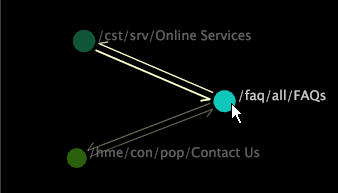

# Sélectionner un noeud{#select-a-node}

La sélection d’un noeud en cliquant dessus réduit les autres noeuds de sorte que vous puissiez plus facilement voir les flèches vers et depuis le noeud mis en surbrillance.

Il vous permet également de déplacer les noeuds sélectionnés en tant que groupe dans la visualisation.

>[!NOTE]
>
>La sélection d’un noeud en cliquant dessus ne filtre en aucune manière les données.

**Pour sélectionner un noeud unique**

* Cliquez sur le noeud pour le sélectionner et mettez en surbrillance les flèches pointant vers le noeud et en dehors.

   

**Pour ajouter un autre noeud ou groupe de noeuds à votre sélection**

* Ctrl+clic sur un noeud ou Ctrl+glisser sur plusieurs noeuds.

**Pour supprimer un noeud ou un groupe de noeuds de votre sélection**

* Tout en maintenant la touche Maj enfoncée, cliquez sur un noeud ou faites glisser le curseur sur plusieurs noeuds.

