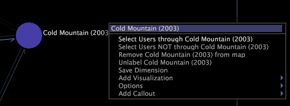

# Effectuer une sélection d’une cartographie des processus{#make-a-selection-from-a-process-map}

{{eol}}

Vous pouvez effectuer des sélections dans des mappages de processus pour créer des filtres qui incluent ou excluent des données associées à un noeud particulier.

Effectuer une sélection dans une cartographie des processus implique la dimension de groupe de la carte, qui détermine comment les éléments de la dimension de base (c’est-à-dire les noeuds de votre carte) sont regroupés pour former les connexions entre les noeuds.

>[!NOTE]
>
>Vous pouvez modifier la dimension de groupe par défaut pour une cartographie des processus. Voir [Configuration des cartographies des processus](../../../../home/c-get-started/c-intf-anlys-ftrs/t-config-proc-maps.md#task-4a95730b18a14bc790a77c013832b2d6).

Lorsque vous effectuez une sélection en fonction d’un noeud dans une cartographie des processus, vous sélectionnez tous les éléments de la dimension de groupe qui ont impliqué ce noeud. Pour mieux comprendre le rôle de la dimension de groupe, prenez en compte les exemples suivants :

* Les films peuvent être regroupés par les spectateurs qui les ont évalués. Chaque visionneuse est un élément de la dimension Utilisateur, de sorte que la dimension Utilisateur correspondrait à la dimension de groupe pour la cartographie des processus. Lorsque vous effectuez une sélection à partir d’un noeud pour un film particulier, vous créez un filtre qui affiche les données des utilisateurs qui ont évalué ou non ce film.
* Les pages du site web peuvent être regroupées selon les sessions au cours desquelles elles ont été consultées. Chaque session est un élément de la dimension Session, de sorte que la dimension Session correspondrait à la dimension de groupe pour la cartographie des processus. Lorsque vous effectuez une sélection à partir d’un noeud pour une page spécifique, vous créez un filtre qui affiche les données des sessions pendant lesquelles cette page a été consultée ou non.

**Pour effectuer une sélection**

1. Cliquez avec le bouton droit sur n’importe quel noeud dans une cartographie des processus.
1. Cliquez sur l’une des options suivantes pour effectuer une sélection en fonction du noeud :

   * **[!UICONTROL Select]*** **[!UICONTROL group dimension name +s]*** **[!UICONTROL through node name]**: Filtre les données pour inclure tous les éléments de la dimension de groupe qui ont traversé le noeud en filtrant toutes les sessions qui n’ont pas traversé le noeud.

   * **[!UICONTROL Select]*** **[!UICONTROL group dimension name +s]*** **[!UICONTROL NOT through node name]**: Filtre les données afin d’inclure tous les éléments de la dimension de groupe qui n’ont pas traversé le noeud en filtrant toutes les sessions qui ont traversé le noeud.

Lorsque vous effectuez une sélection dans une cartographie des processus 3D, le noeud pour lequel la sélection est effectuée est entouré. Des évaluations s’affichent autour de chaque barre pour vous aider à comparer les valeurs de mesure avec et sans la sélection. Voir [Présentation des Benchmarks](../../../../home/c-get-started/c-vis/c-ustd-benchmks.md#concept-c7b0f4102e92458096f8c4765cbe2914).

