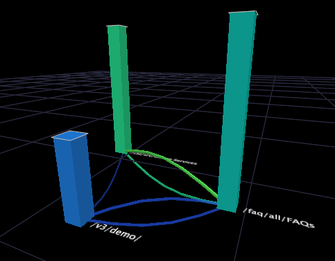

# Types des cartographies des processus{#types-of-process-maps}

{{eol}}

Informations sur les différents types de mappages de processus.

## Cartes des processus 2D {#section-ea7fbdb80b1b44aebcd9e4090b6540bf}

Les mappages de processus bidimensionnels offrent une vue bidimensionnelle de l’activité entre les éléments de dimension. La taille d’un noeud dans une cartographie des processus 2D est proportionnelle à la valeur de la mesure associée à ce noeud. En outre, l’épaisseur et l’intensité d’une flèche entre deux noeuds sont proportionnelles à la moyenne des valeurs de la mesure pour ces noeuds.

Dans une carte de processus 2D, vous pouvez effectuer l’une des tâches suivantes :

* Sélectionner, déplacer, supprimer et étiqueter les noeuds
* Effectuer des sélections
* Enregistrement des dimensions
* Créer d’autres visualisations
* Activation des liens de couleur
* Affichage des quantités de mesures
* Ajouter des légendes

La carte de processus 2D de l’exemple suivant affiche des noeuds correspondant aux noms des films. Chaque nom de film est un élément de la dimension Film, qui est défini dans un jeu de données constitué de données de film. La dimension Film est la dimension de base de cette cartographie des processus.

Dans l’exemple, la taille de chaque noeud ainsi que l’épaisseur et l’intensité de chaque flèche sont proportionnelles à la mesure Évaluations , qui est un décompte des évaluations reçues par un film. Par conséquent, un film avec un grand noeud, tel que *Fête de l&#39;Indépendance*, a plus d’évaluations qu’un film avec un petit noeud, tel que *Horizon Événement*. Vous pouvez également constater que davantage de visionneuses de films sont notées. *Fête de l&#39;Indépendance* before *Cold Mountain* plutôt que de noter les mêmes films dans l&#39;ordre inverse. Notez que les flèches n’indiquent pas que les visionneuses sont notées. *Fête de l&#39;Indépendance* et ensuite notée *Cold Mountain* immédiatement après, ou inversement. Les spectateurs ont peut-être fait passer d&#39;autres films entre les deux, mais ces films ne sont pas visibles sur cette carte.

## Mappages de mesures 2D {#section-a9b846fc71224058918fbc378315effe}

Les cartes de mesures bidimensionnelles sont un type de carte de processus 2D qui positionne les noeuds en fonction de la valeur d’une mesure spécifique. Dans de nombreux cas, la mesure utilisée avec la carte de mesures 2D est Conversion ou Rétention. Les cartes de conversion et de rétention vous aident à comprendre les étapes des processus de vos canaux orientés vers les clients qui influencent la conversion et la rétention des clients.

>[!NOTE]
>
>La mesure que vous utilisez avec une carte de mesures 2D doit être exprimée en pourcentage.

Dans une carte de mesure de conversion, les noeuds avec 0 % de conversion sont tracés à gauche du graphique et les pages avec 100 % de conversion sont tracées à droite. L’activité entre les noeuds s’affiche, ce qui permet de voir facilement quelles étapes d’un processus entraînent une augmentation ou une diminution de la conversion et quelles étapes entraînent l’abandon. Une analyse de conversion de processus est un moyen efficace de comparer des processus ou de comparer différentes mises en oeuvre d’un même processus.

De même, les cartes de rétention affichent les éléments avec une rétention de 0 % à gauche du graphique et les éléments avec une rétention de 100 % à droite. Vous pouvez afficher le taux de rétention de chaque noeud sur la carte, ce qui vous aide à déterminer les éléments qui influencent les clients à renvoyer.

>[!NOTE]
>
>Vous ne pouvez pas déplacer les noeuds sur les plans de mesures 2D horizontalement. Les cartes de mesures sont conçues pour positionner les noeuds de gauche à droite en fonction de leurs valeurs de mesure.

## Cartes des processus 3D {#section-80acb63ea0994af1af7faef3c6264e51}

Les mappages de processus tridimensionnels offrent une vue tridimensionnelle de l’activité entre les éléments de dimension. La hauteur d’une barre dans une cartographie des processus 3D est proportionnelle à la valeur de la mesure associée à ce noeud. Comme pour les mappages de processus 2D, l’épaisseur et l’intensité des connecteurs entre deux noeuds sont proportionnelles à la moyenne des valeurs de la mesure pour ces noeuds. Dans une carte de processus 3D, vous pouvez effectuer l’une des tâches suivantes :

* Sélectionner, déplacer, supprimer et étiqueter les noeuds
* Effectuer des sélections
* Enregistrement des dimensions
* Créer d’autres visualisations
* Activation des liens de couleur

La cartographie des processus 3D dans l’exemple suivant montre les noeuds correspondant aux pages d’un site web. Chaque page est un élément de la dimension Page, qui est défini dans un jeu de données constitué de données de trafic web. La dimension Page est la dimension de base de cette cartographie des processus.

Dans l’exemple, la hauteur de chaque barre ainsi que l’épaisseur et l’intensité de chaque connecteur sont proportionnelles à la mesure Sessions , c’est-à-dire le nombre de sessions au cours desquelles les pages ont été consultées. Par conséquent, une page avec une barre haute, telle que /faq/all/FAQ, a été consultée pendant plus de sessions qu’une page avec une barre courte, telle que /vs/demo. Notez que les connexions entre deux pages n’indiquent pas qu’une page a été vue immédiatement avant ou après une autre au cours d’une session donnée. D’autres pages ont peut-être été consultées au cours de la même session, mais elles ne sont pas affichées sur cette carte.
