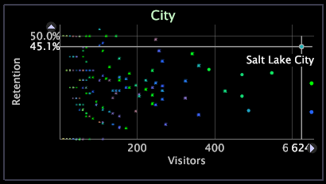

# Tracés de dispersion 2D{#d-scatter-plots}

Les diagrammes de dispersion représentent les éléments d’une dimension de données (telle que Page ou Ville) sur une grille dans laquelle les axes x et y représentent différentes mesures.

Les diagrammes de dispersion peuvent s’avérer utiles lorsque vous essayez de comprendre la relation entre un grand nombre d’éléments disparates, selon deux mesures différentes. Dans l’exemple suivant, le graphique de dispersion montre chaque ville en fonction du nombre de visiteurs et du taux de rétention correspondant.

Le graphique de dispersion vous permet de voir rapidement les valeurs aberrantes. Salt Lake City, par exemple, présente un taux de rétention par visiteur supérieur à la moyenne.

Des diagrammes de dispersion peuvent également être utilisés pour montrer la cohérence des données. Dans l’exemple suivant, le graphique de dispersion montre le nombre de visiteurs ayant des sessions d’une durée particulière.

La taille de chaque point du graphique de dispersion est déterminée par la mesure du rayon. La mesure de rayon par défaut diffère pour chaque application Adobe. Par exemple, [!DNL Site]la mesure du rayon est basée sur les sessions par défaut. Vous pouvez modifier la mesure de rayon pour que les points de vos tracés de dispersion représentent n’importe quelle mesure disponible. Pour connaître les étapes à suivre, voir [Modification des mesures](../../../home/c-get-started/c-analysis-vis/c-scat-plots.md#section-fd80576d583c430cb469daf12e39aa2a) de rayon La couleur des points dépend de la légende de couleur qui est ouverte dans l’espace de travail. Pour plus d’informations sur les légendes de couleur, voir Légendes de couleur.

## Sélectionner des points {#section-4b4d45f39b884d54bb7407b3b2f4ea50}

**Pour sélectionner un seul point**

* Cliquez sur le point.

**Pour ajouter un autre point ou groupe de points à votre sélection**

* Ctrl+clic sur un point ou Ctrl+glisser sur plusieurs points.

**Pour supprimer un point ou un groupe de points de votre sélection**

* Tout en maintenant la touche Maj enfoncée, cliquez sur un point ou faites glisser le curseur sur plusieurs points.

## Modification des dimensions {#section-796cd962ef3f476caa89d99083782ed1}

* Cliquez avec le bouton droit sur l’étiquette de la dimension en haut du graphique, puis cliquez sur **[!UICONTROL Change Dimension]** > *&lt;**[!UICONTROL dimension name]**>*.

## Modification des mesures {#section-44b8be9215cd4039b1eeb98ae1b31445}

**Pour modifier la mesure affichée sur l’axe x ou y d’un graphique de dispersion**

* Cliquez avec le bouton droit de la souris sur l’étiquette de la mesure à modifier, puis cliquez sur **[!UICONTROL Change Metric]** > *&lt;**[!UICONTROL metric name]**>*.

## Modification des mesures de rayon {#section-fd80576d583c430cb469daf12e39aa2a}

**Pour modifier la mesure de rayon d’un graphique de dispersion**

Cliquez avec le bouton droit sur l’étiquette de la dimension en haut du graphique, puis cliquez sur **[!UICONTROL Change Radius Metric]** > *&lt;**[!UICONTROL metric name]**>*.

