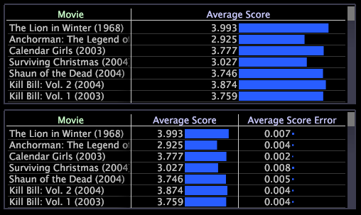

# Ajout et modification d’une mesure{#add-and-change-a-metric}

Informations sur l’ajout et la modification de mesures.

**Pour ajouter une nouvelle mesure**

* Cliquez avec le bouton droit sur l’étiquette ou sur un élément de la mesure, puis cliquez sur **[!UICONTROL Add Metric]** > *&lt;**[!UICONTROL metric name]**>.* La mesure est ajoutée à droite de la mesure que vous avez sélectionnée à l’origine.

   

L’exemple suivant montre la mesure Note moyenne par dimension Film (dans le tableau supérieur) et le même tableau avec une seconde mesure, Erreur de score moyen, ajoutée au tableau.

**Pour modifier une mesure**

* Cliquez avec le bouton droit de la souris sur l’étiquette ou sur un élément de la mesure à modifier, puis cliquez sur **[!UICONTROL Change Metric]** > *&lt;**[!UICONTROL metric name]**>*. La nouvelle mesure remplace la mesure d’origine.
