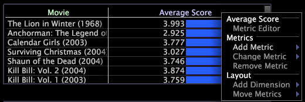

# Ajouter et modifier une mesure{#add-and-change-a-metric}

Informations sur l’ajout et la modification de mesures.

**Pour ajouter une nouvelle mesure**

* Cliquez avec le bouton droit sur le libellé ou sur un élément de la mesure, puis cliquez sur **[!UICONTROL Add Metric]** > *&lt;**[!UICONTROL metric name]**.* La mesure est ajoutée à droite de la mesure que vous avez sélectionnée initialement.

   

L’exemple suivant montre la mesure Note moyenne par dimension du film (dans le tableau supérieur) et le même tableau avec une seconde mesure, Erreur de note moyenne, ajoutée au tableau.

**Pour modifier une mesure**

* Cliquez avec le bouton droit sur le libellé ou sur un élément de la mesure que vous souhaitez modifier, puis cliquez sur **[!UICONTROL Change Metric]** > *&lt;**[!UICONTROL metric name]***. La nouvelle mesure remplace la mesure d’origine.
