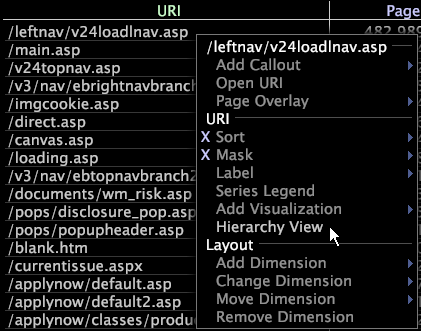
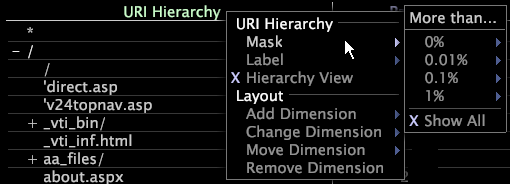

# Appliquer les vues de hiérarchie{#apply-hierarchy-views}

Les vues Hiérarchie sont disponibles uniquement lors de l’utilisation du site ou de l’application HBX.

La vue Hiérarchie affiche les pages d’un site web organisé hiérarchiquement par nom de fichier et triées par ordre alphabétique. Bien qu’utile pour l’analyse elle-même, la vue de hiérarchie peut également être utilisée pour configurer des visualisations avancées comme des mappages de processus. Pour plus d’informations sur les mappages de processus, voir [Cartes de processus](../../../../home/c-get-started/c-analysis-vis/c-proc-maps/c-proc-maps.md#concept-880aee224404429785b733a4e80d275e).

>[!NOTE]
>
>Si votre jeu de données a été configuré pour s’exécuter sur plusieurs serveurs d’une grappe, pour que cette fonctionnalité fonctionne correctement, votre administrateur système doit désigner la machine qui fonctionnera comme votre serveur de normalisation Central. Pour connaître les étapes à suivre, reportez-vous au chapitre Fichier de configuration de traitement du journal du *Guide de configuration des jeux de données*.

**Pour activer ou désactiver la vue hiérarchique**

* Dans n’importe quelle visualisation de page ou d’URI, cliquez avec le bouton droit de la souris sur un élément ou le libellé de la dimension de page, puis cliquez sur **[!UICONTROL Hierarchy View]**.

   

   Un X s’affiche en regard de l’option lorsque la valeur [!DNL hierarchy view] est principale.

   La hiérarchie est organisée en sections de site web et en pages à l’aide d’une arborescence. Les sections (noeuds) peuvent être développées ou condensées à l’aide du symbole + ou - situé en regard du nom de la section. Les pages individuelles ne sont pas accompagnées d’un symbole + ou -.

   

## Masquage des éléments de Dimension dans une vue hiérarchique {#section-e477c469934846da8d807f92fc2f3ed1}

Le masquage consiste à sélectionner un sous-ensemble de vos données ou un sous-ensemble des éléments d’une dimension. Vous masquez ou masquez les éléments que vous ne souhaitez pas inclure dans l’analyse. À l’aide des options de menu [!DNL Mask] pour les vues de hiérarchie, vous sélectionnez le pourcentage minimum d’une mesure qu’un élément doit afficher dans la visualisation.

**Pour masquer les données à l’aide de l’option  [!DNL Mask] de menu**

1. Cliquez avec le bouton droit de la souris sur un élément ou le libellé de la dimension, puis cliquez sur **[!UICONTROL Mask]**.

   

1. Sous Plus que, cliquez sur le pourcentage approprié, puis cliquez sur la mesure à masquer.

Si, par exemple, vous cliquez sur 0,1 %, puis sur Pages vues, vous masquez (masquez) tout élément dont le nombre total de pages vues est inférieur à 0,1 % et affichez tout élément dont le nombre total de pages vues est supérieur à 0,1 %. Si vous cliquez sur 0 %, vous masquez tous les éléments avec une valeur de 0 (zéro) pour la mesure sélectionnée.
