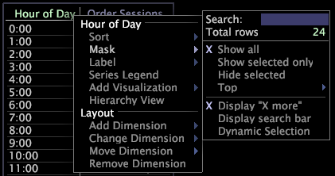
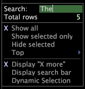

# Masquer les données{#mask-data}

Le masquage désigne la sélection d’un sous-ensemble de vos données ou d’un sous-ensemble des éléments d’une dimension.

Vous masquez ou masquez les éléments que vous ne souhaitez pas inclure dans l’analyse.

Les outils de données proposent deux méthodes pour masquer les éléments de dimension. La première méthode utilise les options disponibles dans le [!DNL Mask] menu. A l’aide des options [!DNL Mask] du menu, vous pouvez utiliser la souris pour sélectionner les éléments à afficher ou à masquer, ou vous pouvez afficher les éléments de premier rang lorsque vous triez les données par mesure. La seconde méthode de masquage des éléments de dimension utilise une recherche.

**Pour masquer des données**

1. Cliquez avec le bouton droit de la souris sur un élément ou sur l’étiquette de la dimension souhaitée, puis cliquez sur **[!UICONTROL Mask]**.

   

1. Cliquez sur l’une des options suivantes :

   * **[!UICONTROL Show all]**
   * **[!UICONTROL Show selected only]**
   * **[!UICONTROL Hide selected]**
   * **[!UICONTROL Show top > 5, 10, 25, 50, 100]** ou des éléments affichés **[!UICONTROL 500]** triés par mesure
   * **[!UICONTROL Show top > All Positive]** pour afficher uniquement les valeurs supérieures à zéro (0)
   * **[!UICONTROL Display “X more”]** pour afficher le nombre d’éléments masqués
   * **[!UICONTROL At least one >]***&lt; **[!UICONTROL countable dimension name]**>*(disponible uniquement lorsque vous travaillez avec une dimension Denormal)

      Lorsque vous travaillez avec une dimension Denormal, cette option vous permet de masquer une dimension par une dimension dénombrable. Lorsqu’il est sélectionné, le tableau affiche uniquement les éléments qui comportent au moins un élément de la dimension dénombrable que vous avez sélectionnée. Le tableau affiche jusqu’à 1 023 éléments.

>[!NOTE]
>
>Dans la mesure où Adobe [!DNL Platform] traite les données dans un ordre aléatoire, lorsqu’au moins un masquage génère plus de 1 023 éléments, les éléments les plus courants et les plus volumineux ont plus de chance d’être inclus dans le tableau.

Lorsque vous masquez par Afficher en haut ou Au moins un, l’ordre dans le tableau correspond par défaut aux valeurs affectées par la sélection à ce moment-là. Si vous modifiez ultérieurement la sélection, l’ordre ne change pas par rapport à l’ordre d’origine, sauf si le tableau est réutilisé ou si vous activez la sélection dynamique. Lorsque vous cliquez sur **[!UICONTROL Mask]** > **[!UICONTROL Dynamic Selection]**, le tableau est réutilisé chaque fois que vous modifiez la sélection.

**Pour masquer des données à l’aide d’une recherche**

* Vous pouvez masquer les données à l’aide de l’une des options de recherche suivantes :

   * Cliquez avec le bouton droit de la souris sur un élément ou sur l’étiquette de la dimension souhaitée, cliquez sur **[!UICONTROL Mask]**, puis, dans la [!DNL Search] zone, tapez l’expression à rechercher.

      

   * Cliquez avec le bouton droit de la souris sur un élément ou sur l’étiquette de la dimension souhaitée, cliquez sur **[!UICONTROL Mask]** > **[!UICONTROL Display search bar]**, puis, dans la zone de recherche qui s’affiche dans la cellule d’étiquette de la dimension, tapez l’expression pour laquelle vous souhaitez effectuer une recherche.

      

      Lorsque vous saisissez une expression de recherche, les outils de données mettent à jour la dimension pour refléter les correspondances.

Pour limiter davantage le masquage lors d’une recherche, utilisez l’une des méthodes suivantes :

* Vous pouvez taper &quot;re:&quot; dans la [!DNL search] zone ou la barre pour que la phrase recherchée soit interprétée comme une expression régulière. Vous pouvez utiliser n’importe quelle syntaxe associée aux expressions régulières dans votre phrase de recherche. Pour plus d’informations sur les expressions régulières, voir l’annexe Expression régulière du Guide *de configuration des jeux de* données.
* Vous pouvez taper le symbole $ comme premier caractère dans votre chaîne de recherche pour rechercher les expressions qui commencent par la chaîne que vous avez saisie, ou comme dernier caractère pour rechercher les expressions qui se terminent par la chaîne que vous avez saisie.
* Vous pouvez saisir un espace comme premier caractère dans votre chaîne de recherche pour rechercher les mots d&#39;une phrase qui commencent par la chaîne que vous avez saisie ou comme dernier caractère pour rechercher les mots d&#39;une phrase qui se terminent par la chaîne que vous avez saisie.

Vous trouverez ci-dessous des exemples de différentes manières de masquer un tableau à l’aide de la chaîne &quot;on&quot; dans une recherche :

* La saisie de &quot;on&quot; affiche chaque expression contenant la chaîne &quot;on&quot; n’importe où dans l’expression : &quot;banque **** en ligne&quot;, &quot;**** contactons les acheteurs&quot;, &quot;**des pièces de monnaie en or** &quot;, &quot; **** des banques en ligne&quot;, &quot;des **** options en or&quot; et &quot;**des milliards d&#39;argent&quot;.**
* La saisie de &quot;$on&quot; affiche chaque expression commençant par la chaîne &quot;on&quot; :

   &quot;**** banque en ligne&quot; et &quot;**paiement en ligne**&quot;.

* La saisie de &quot;on$&quot; affiche chaque phrase se terminant par la chaîne &quot;on&quot; :

   &quot;**lingots** d&#39;argent&quot; et &quot;**option** d&#39;or&quot;.

* La saisie de &quot;on&quot; affiche chaque expression contenant un mot commençant par la chaîne &quot;on&quot; :

   &quot;**** banque en ligne&quot; et &quot;banque **** en ligne&quot;.

* La saisie de &quot;on&quot; affiche chaque phrase contenant un mot se terminant par la chaîne &quot;on&quot; :

   &quot;**des pièces de monnaie en or** &quot; et &quot;**des milliards** d&#39;argent&quot;.

* L’utilisation de &quot;on&quot; affiche chaque phrase contenant la chaîne &quot;on&quot; sous la forme d’un mot :

   &quot;**on** line banking&quot; et &quot;bank **online** &quot;.

