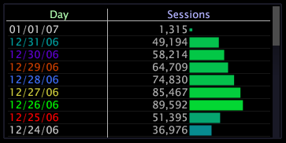

# Activer une légende de série{#enable-a-series-legend}

Les éléments d’une dimension peuvent être codés par couleur sous la forme d’une série, de sorte que chaque élément puisse être suivi plus facilement sur d’autres visualisations dans l’espace de travail.

**Pour activer ou désactiver une légende de série**

* Cliquez avec le bouton droit de la souris sur un élément ou l&#39;étiquette de la dimension à coder en couleur, puis cliquez sur **[!UICONTROL Series Legend]**.

   Lorsque la légende de la série est principale, un X apparaît en regard de l’option de menu et les éléments de la dimension apparaissent en alternance des couleurs.

   
